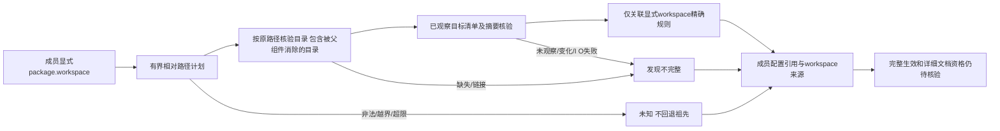

# Cargo 显式工作区文档声明来源

对应既有OpenSpec 7.1/15.3/15.6，不改变57语言四核心、32grammar与平台/宿主的完整验收目标，不授予生产资格。

本批补齐项目内便携相对package.workspace引用，包括点、父目录与尾部分隔符。纯Rust/TOML路径计划有256KiB清单、4096字节路径、64组件预算；逐项保留原始遍历目录，再核对普通目录与最终普通清单、同次manifest_sha256。`missing/../shared`不能直接消掉缺失目录；目录/清单链接、不在当前观察范围的目标、I/O失败和字节变化不消费规则。越出项目、绝对/非便携引用、非法类型及根包同时声明workspace返回未知，不读取外部文件，不回退祖先。相对来源与工作区定义只构成候选关联，成员归属/排除/通配/源码属性/组优先级及实际目标覆盖仍须原Cargo核验。

官方依据：[package.workspace覆盖祖先查找](https://doc.rust-lang.org/cargo/reference/manifest.html#the-workspace-field)、[成员lint继承](https://doc.rust-lang.org/cargo/reference/workspaces.html#the-lints-table)。本实现不运行工具、添加规则或改写用户清单；未知配置不是源码违规，零诊断不是详细注释或修复关闭。

公开非祖先引用测试先RED：之前显式引用一律unresolved；接通后只取得shared/Cargo.toml的allow声明，不借用根forbid。既有祖先测试中显式指向根的断言按新增已实现行为更新为根forbid，最近祖先三种反例仍保持。缺失路径和链接的两个新测试初版错误期待detect exit0，正确核验现有partial exit3及结构化报告后通过，未改变CLI退出协议或放宽完整检查。纯路径和发现端口单元覆盖类型/路径/角色冲突、组件预算、目标摘要变化、读取失败、目录/清单链接和未观察目标；无法解析的绝对/非便携路径继续保留缺口。

真实已有Clippy的[默认证据](evidence/cargo-documentation-explicit-workspace-native.json)与[WASM证据](evidence/cargo-documentation-explicit-workspace-native-wasm.json)记录工具版本、CLI摘要和原Cargo事件。三种路径`../shared`、`.././shared/`、`./skip/../../shared`均指向同一shared工作区，在竞争祖先forbid下，显式warn获得1条warning，显式allow获得0条；原源码与成员清单字节不变。两配置重复开发语料不计独立精度；这些oracle不证明CodeGuard已经完整调度/复检workspace原生检查。

默认/WASM六个相关CLI目标各107通过/7条件忽略；原生显式对照条件需明确选择已有Cargo，不安装/下载。本批父任务不勾选，66完成/288待完成，正式grammar资格0/32。完整有效配置、绝对/非便携引用、成员/源集/所有目标、详细行为契约、配置稳定任务、原工具workspace公开闭环/可信关闭、独立精度与平台/宿主/发布仍开放。上一提交6bd3b71的CI37513221175在固定插件审计来源checkout失败，后续质量检查跳过；插件远端main仍f09c074e，不绕过该门禁。

默认/WASM三个发现端口单元各3通过，适配器Cargo相关3单元通过；真实显式oracle两配置各1条件测试显式通过，共12次原Cargo运行，12份实际发现报告通过既有discovery协议，474历史schema字节保持。默认/WASM全工作区全目标严格Clippy、分层、定向格式和OpenSpec strict通过。本批不改变协议字段/版本或签发资格，历史实际证据不覆盖。
