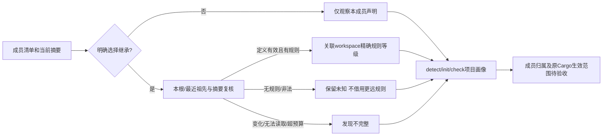

# Cargo workspace 文档规则候选来源关联

对应既有 OpenSpec 7.1/15.3/15.6，完整成员/规则/目标生效模型和生产资格继续开放。

继承成员声明必须恰为 `[lints] workspace = true`；未选择继承保持本成员直接声明观察。对选择继承的成员，从自身向上在项目范围内最多观察64级Cargo清单，每份候选最多256KiB，与本次清单SHA-256再次核对；最近的workspace定义决定候选来源。无规则或非法最近清单不能借用更远的规则；I/O失败、链接、消失、新增未观察清单、字节变化或超预算保留原未知结果并标发现不完整。显式package.workspace暂保留专用未解析状态，不猜测祖先。配置引用继续指向成员清单，指引单列workspace清单；报告manifest_sha256绑定两份来源。

官方依据：[工作区lint继承](https://doc.rust-lang.org/cargo/reference/workspaces.html#the-lints-table)、[原清单规则与priority](https://doc.rust-lang.org/cargo/reference/manifest.html#the-lints-section)。关联是静态候选，不证明members/exclude/globs/路径依赖自动成员、源码属性/组优先级或本机版本/全部目标生效；configuration始终unknown，裸章节和零原生诊断不能满足详细内容规范。

新公开继承测试先RED，原因是成员未获得任何workspace声明。接通后未选择继承反例、最近workspace覆盖/没有规则/非法清单、显式指向其它workspace均通过。新增并行测试暴露旧测试目录仅使用PID造成互相覆盖，已按PID+进程内序号隔离；两个失败记录保留。第一次原生oracle已经完成断言，但相对证据输出路径相对crate目录不存在，改用绝对输出路径重跑通过，不修改原生断言。一次误选bin单元目标实际0项，随后改用lib准确执行，不计作通过证据。

真实已有Clippy的[默认证据](evidence/cargo-documentation-workspace-native.json)及[WASM证据](evidence/cargo-documentation-workspace-native-wasm.json)保留版本、CLI摘要与原Cargo JSON事件：workspace warn时继承成员1诊断、未继承成员0诊断；allow时二者0诊断。两配置各4次原Cargooracle，是重叠开发回归而非独立精度语料；原源码字节不变，不代表CodeGuard公开原生workspace调度或完整文档验收。四份实际发现报告通过既有discovery协议，474历史schema字节不变；旧直接声明/原生证据不覆盖。

默认/WASM六个相关CLI目标各104通过/6条件忽略；祖先身份变化、读失败、链接、新清单与预算故障单元两配置各1通过；已有工具的workspace对照两配置各显式1通过。父任务不勾选，66完成/288待完成，正式grammar资格0/32；完整生效配置、详细契约、配置稳定任务、原工具完整workspace复检/可信关闭、独立精度和平台/宿主/发布待完成。

定向Rustfmt、分层、OpenSpec strict及双配置全工作区全目标Clippy -D warnings验证；Clippy首次要求将返回None的let-else写为问号，按原义修正后两配置通过，未禁用规则。适配器根包继承/非法workspace等级与旧畸形边界两单元通过；本批不签发生产资格。
