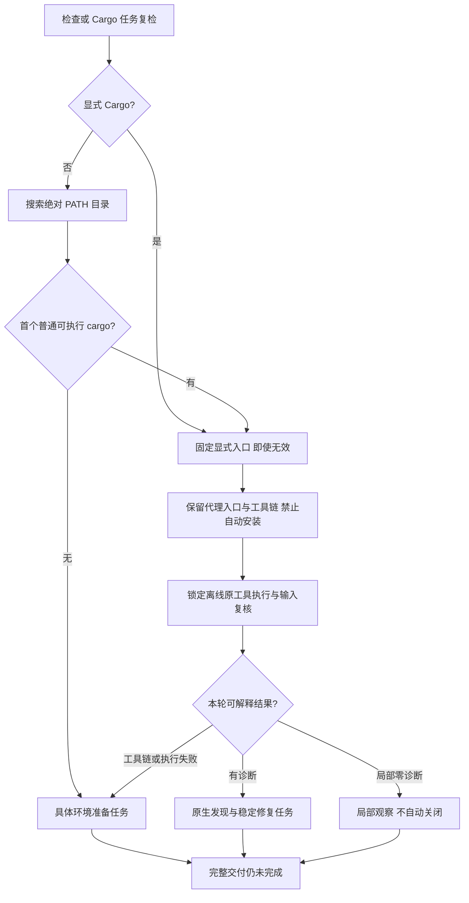

# Cargo 自动发现与禁止隐式安装验收

日期：2026-10-04。规格事实源：`introduce-rust-codeguard-cli` 的 native-tool-adapters / syntax-precheck。关联 7.1、9.3、14.5、14.6、14.10。本项关闭已安装工具被错误报告未选择的局部缺陷，不代表全部原生工具准备、完整 Rust 覆盖或父任务完成。

## 原问题与实际行为

原实现只有 `--cargo-tool` 时才运行原生 Clippy/rustdoc/check；PATH 中已安装 Cargo 仍被报告 `cargo_tool_not_selected`。子进程还丢失调用方 `RUSTUP_TOOLCHAIN`，Cargo 离线选项没有独立禁止 rustup 自动安装。

当前三个检查和原工具任务复检共用私有 Cargo 选择函数：显式请求固定保留；没有显式请求才从 PATH 绝对目录选首个普通可执行入口。空目录、相对目录和不可执行入口跳过，选择后失败不寻找下一个工具。聚合检查固定本轮入口，解析后字节身份继续验证，但不把最终代理名称改为 rustup。

所有 Cargo 子进程继承 `RUSTUP_TOOLCHAIN` 并固定 `RUSTUP_AUTO_INSTALL=0`；调用方设置1不能覆盖。官方 [rustup 环境变量](https://rust-lang.github.io/rustup/environment-variables.html) 说明默认自动安装和单独关闭开关，[Cargo 代理](https://rust-lang.github.io/rustup/concepts/index.html) 说明名称分派。这不是完整工具链身份认证、有效配置解析或进程沙箱。

## TDD 与真实工具

- 原实现运行新受控目标：2 passed / 5 failed，失败覆盖三检查自动发现、公共comments/build、首选工具执行失败、PATH过滤及稳定任务复检；显式坏工具和真正缺工具两个反例通过。
- 初次实现后6 passed / 1 failed。剩余失败是新测试误用 `verification_result`；实际公开协议返回 `observation=still_present`。按既有协议修正断言，没有修改产品结果或弱化判定。
- 七个受控代理测试确认最终入口名cargo、继承原工具链、强制关闭自动安装；同一原生finding在连续扫描中复用ID，task verify写入still_present事件。
- 两个需要已安装工具的测试在普通回归中显式ignored；本机单独运行全部九项，9 passed / 0 failed / 0 ignored。真实版本和工具字节见归档。
- 真实已安装stable工具链从PATH运行三检查，保留Clippy needless_return及文档诊断；空rustup目录和不存在的自定义工具链返回环境失败，未创建工具链；空PATH仍报告工具准备未完成。
- 旧缺工具夹具现在只在该测试子进程固定空PATH，避免根据开发机是否安装Cargo得出不同结果；显式原工具测试继续保留原PATH。

## 实际报告与边界

[原始反馈及终端输出](evidence/cargo-native-discovery-2026-10-04.json) 保存实际已安装工具、重复扫描、task verify/task show、缺自定义工具链和空PATH三种情况。重复检查新增Clippy finding为0；复检仍明确任务问题存在、来源local_unverified和交付not_evaluated。报告版本不改，未从可编辑记录导入工具选择或门禁权威。

主要实现：[Cargo选择](../../crates/codeguard-cli/src/cargo_tool_selection.rs)、[Clippy原生观察](../../crates/codeguard-cli/src/rust_lint_scan.rs)、[文档检查](../../crates/codeguard-cli/src/rust_comments_command.rs)、[构建检查](../../crates/codeguard-cli/src/rust_build_command.rs)、[聚合入口](../../crates/codeguard-cli/src/check_command.rs)。目标测试：[Cargo自动发现](../../crates/codeguard-cli/tests/cargo_native_discovery.rs)。

完整Cargo workspace/features/targets、配置闭包、工具链可信身份、跨平台、所有语言工具自动发现、可信任务关闭及实际宿主仍缺。未改变grammar或公开npm/插件制品；Erlang既有RED草稿保留。完整目标和父任务继续开放，最终回归、schema和日志摘要在实际完成后追加。

## 最终验证

- 默认全工作区/all-targets：218组，1220 passed / 0 failed / 112 ignored，进程退出0。
- 受影响WASM CLI library+九集成目标：10组，143 passed / 0 failed / 24 ignored，退出0；显式真实Cargo九项目标9 passed / 0 failed / 0 ignored，退出0。各组有重叠，不合计为独立测试量。
- 默认及WASM全工作区/all-targets Clippy `-D warnings`通过；格式、分层、OpenSpec strict及两份架构文档命名通过。
- 201 schema元定义、六实际完整报告通过；18个伪造权威/交付/未知版本变体被拒，旧schema原件未修改。修改文档本地链接核验通过，最终链接数以最终日志为准。
- 最终实际捕获来自同一WASM二进制，开始和结束SHA-256一致；实际Cargo版本 `cargo 1.98.1 (797e8a9bc 2026-08-05)`，已安装 `stable-aarch64-apple-darwin`。具体二进制与入口摘要见归档。
- 捕获助手第一次误要求task show返回3；实际查询成功应返回0，未据查询成功推断质量通过。修正助手预期后重新完整捕获；schema助手第一次未登记本地相对ref，补充离线registry后全部验证，没有改产品schema。
- 没有运行受既有Erlang RED影响的完整WASM suite或重复358例语料；不据本批测试资格认定grammar、独立精度、多平台、实际宿主或发布完成。

RED、测试期望修正及验证失败日志均保留：

| 日志 | SHA-256 |
|---|---|
| `/tmp/codeguard-cargo-discovery-red.log` | `e5a021da6445865998b516014f6a048e0ac8c1b87aa1b1a163abab245a1195d5` |
| `/tmp/codeguard-cargo-discovery-green.log` | `bb70963923f986947823251c7a3cb7db5b653d8feb0f6508ea2b4a53543ac60b` |
| `/tmp/codeguard-cargo-discovery-targets.log` | `b4e11be769962044978a185e0ae5e93bc5408fb54b81fe798fa8ce092795cf9b` |
| `/tmp/codeguard-cargo-discovery-real.log` | `ecb8d1b6e60db4d5fcb6195e775e79ea34adc3ff79fd478069472f75dfd131cf` |
| `/tmp/codeguard-cargo-discovery-workspace.log` | `75ba24f1280e4a1ae99d6231541f7217e0ea0ae487a2f2aaf7fe110c860de6f8` |
| `/tmp/codeguard-cargo-discovery-default-clippy.log` | `399b33ef9bbbb4da13bbb43882b9cb54788875c36c7248f54da20fba12e8d3bb` |
| `/tmp/codeguard-cargo-discovery-feature-tests.log` | `3717a9f0a108a96bb44809e24399a926df908b963040b1433ca1aedf1ffc8a57` |
| `/tmp/codeguard-cargo-discovery-feature-clippy.log` | `45506c47765ceb162c2c401068b9eee1fd76c3528e3d51b42678322183e16432` |
| `/tmp/codeguard-cargo-discovery-capture.log` | `bf25b1098004422de403a68e905a27db242259468c10c276c51353d2f180b92c` |
| `/tmp/codeguard-cargo-discovery-capture-final-feature.log` | `0c7018ca327e6a690188e00bc810ae718e6198e65b562e0d5c35bb37341bb0fd` |
| `/tmp/codeguard-cargo-discovery-protocol-validation.log` | `d38428e5f3e3ebc13c3c43a43dfc0f4c24e34e917c32af96dd711190c4ec0000` |
| `/tmp/codeguard-cargo-discovery-protocol-validation-final.log` | `78590f5d49e27052a883aa3453e21481abc9cad919298ebbe01ecda5568f6d49` |
