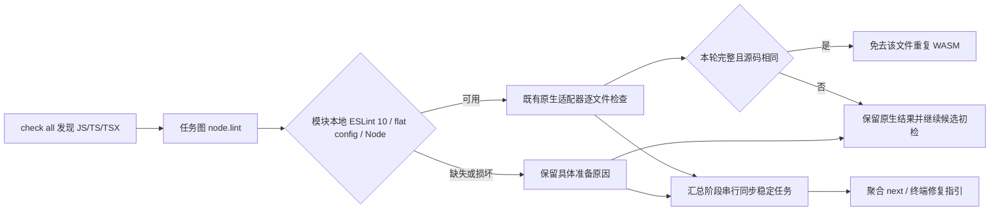

# check all 的模块本地 ESLint 与修复任务

关联：同一 OpenSpec `introduce-rust-codeguard-cli` 的 7.3、14.6、14.10。此文件集中维护这项接线的证据；不以局部编排测试代替真实 ESLint、完整语言覆盖或宿主验收。

## 已实现路径

- Node 优先采用 `--node-tool`；否则观察 PATH。ESLint 和配置按源码最近的项目清单选择，搜索不能越过受检目录。
- 重用既有原生版本/输入/报告检查；原生违规保留，忽略、fatal、输出异常均不得作为免初检依据。
- 已初始化工作区复用原有发现、环境任务和 next；原生阶段不争抢工作台同步锁。未初始化工作区不会因这项接线自动初始化。
- `check_feedback` 0.35.0 与 `check_aborted` 0.12.0 增加 `native_results.node_lint`；历史 0.34.0/0.11.0 原样归档。JSON Schema 保持自包含。
- 默认构建也执行 ESLint；WASM feature 只控制后续语法兜底。

## 验收行为

`crates/codeguard-cli/tests/check_all_eslint.rs` 使用受控 Unix 工具响应，验证：

1. 发现并执行模块工具，保留 `no-debugger` 原生 finding，两轮同步复用稳定任务，聚合 `next` 可读。
2. 混合模块中已完成的原生文件免去重复 WASM，另一模块的破损 TypeScript 继续提供疑似位置。
3. 原生忽略消息不算完成语法检查，仍进行 WASM 初检。
4. 缺 flat config 明确报告配置选择问题，不启动工具或要求无依据修改源码。
5. 选择子目录为检查根时不越界执行祖先项目的工具。
6. 原生超时受全局预算约束，任务和整体保留未完成。
7. 仅发现源码但未观察到本地 ESLint 时不创建阻断性安装任务，不抢占已有 npm 修复任务；配置明确损坏的准备任务仍保留。

另有 `check_eslint_scan` 单元测试覆盖源码变化、路径错配及未完成原生结果不能免检。已有 `check_all_partial_contract` 继续验证取消、原生输出保留、源码/配置变化、并发预算和协议封闭性。

## 本轮验证与边界

- 定向 WASM 聚合测试：7/7 通过；相同源码免检单元测试 1/1 通过。
- 既有聚合契约：18 通过、3 个真实工具环境测试忽略；忽略不计通过。
- `cargo clippy -p codeguard-cli --all-targets --features wasm-precheck -- -D warnings` 通过。
- 165 份 Schema 定义有效，实际 CLI 聚合 JSON 通过 Draft 2020-12；旧协议与伪造覆盖状态被拒。
- 32 份候选路由所在测试文件：9/9 通过，包含单个混合项目和分批项目；既有 TypeScript 原生优先与语法任务测试 14/14 通过。
- `cargo test --workspace --all-targets`：1102 通过、0 失败、105 忽略，进程退出 0。忽略项要求额外真实工具环境，不计通过。
- 最终 Clippy（包含 WASM、all-targets、`-D warnings`）、fmt、分层检查、OpenSpec strict、中英文架构文件名及修改文档的本地链接检查通过。

本轮未找到现成 ESLint 安装，没有安装或升级工具。受控响应不是实际 ESLint 精度验收。pnpm 符号链接包、旧版 ESLint、复杂配置选择、完整修复关闭/复发和真实 Claude/Codex/Gemini 对话仍未验收；S14 父任务保持未完成。本次修改尚未发布 npm。
