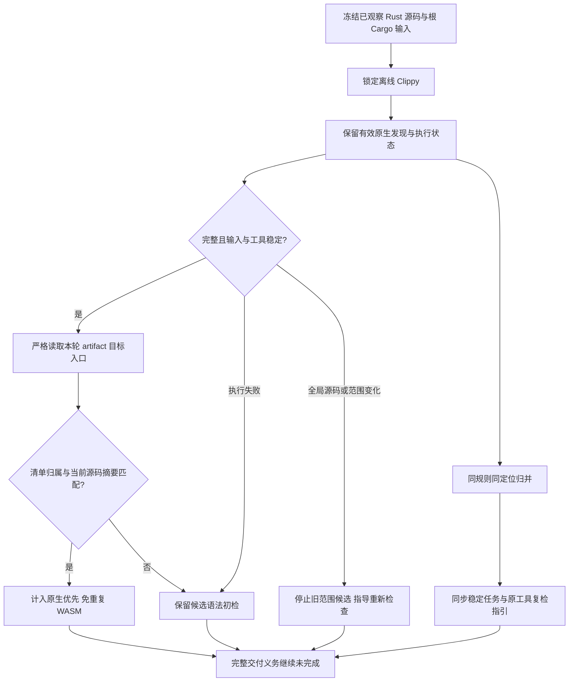

# Rust 原生优先与重复问题归并验收

日期：2026-10-04。规格事实源仍为 `introduce-rust-codeguard-cli` 的 native-tool-adapters / syntax-precheck；对应 7.1、9.3、14.6、14.10。本次实现两项实际缺陷修复，不代表这些父任务或全部语言验收完成。

## 原问题与结果

1. `check all` 执行 Clippy 后仍重复解析 Rust 目标入口。现在只对成功、稳定输入下的非缓存 `compiler-artifact` 目标入口传递进程内覆盖，并在 WASM 阶段重验启动前源码摘要。
2. 同一库源码按普通和测试目标编译时，Clippy 重复告警被分配不同序号 finding。现在同文件、规则、行、列归并，保留 error 优先级；不同位置仍是不同问题，重复扫描更新原任务。

Cargo 的 artifact 说明提供目标入口身份，不等于整个目录或全部模块已参与解析：[Cargo 机器报告](https://doc.rust-lang.org/cargo/reference/external-tools.html)。本次没有据 all-targets、目录存在或 dep-info 的输入清单猜测语法覆盖；条件排除、未证明模块和其它清单目标继续初检。真实 .d 观察也保留在临时检查记录，没有把其中 include 字节依赖当作已解析 Rust 源码。

覆盖不序列化、不从 `.codeguard/reports/` 恢复，也不改变报告 schema 或审批权威。重复 JSON 键、结束后事件、无结束记录、异常退出、fresh artifact、未知目标类型、错清单/入口和输入/工具变化不能授予覆盖。默认不含 WASM 的构建不解析覆盖机器流；原有公开 Clippy API 和强制告警复检仍保持返回契约。

## 实际公开反馈

[完整原始字段和终端输出](evidence/rust-native-preferred-2026-10-04.json) 包含三种实际 CLI 情况和真实原生重复扫描。真实版本为 `clippy 0.1.98 (48a229ceae 2026-09-01)`；工具来自已安装 `/opt/homebrew/opt/rustup/bin/cargo`，没有下载或安装。

| 情况 | Clippy finding | 原生优先文件数 | Rust 候选文件 | 交付 |
|---|---:|---:|---|---|
| 真实库/二进制检查 | 1，needless_return | 2 | child.rs、excluded.rs | incomplete |
| 真实重复扫描 | 同一 ID；新增 finding 0 | 2 | 同上 | incomplete |
| 未选择 Cargo | 0；准备未完成 | 0 | 四份 Rust 源码 | incomplete |
| 受控工具在有效诊断后 exit 101 | 1；执行未完成 | 0 | 四份 Rust 源码 | incomplete |

`excluded.rs` 中损坏语法在每种情况均保留候选恢复节点；本轮库/二进制入口没有遮蔽条件排除文件。真实任务详情、终端原生覆盖计数、问题 ID 和重复同步 `new_findings=0` 一起存档。`synced_partial` 是现有 Clippy 局部覆盖状态，实际 `failed_reports=0`，不能改称完整项目同步或交付通过。受控异常输出只证明契约，不属于语言精度样本。

## TDD 与边界

- 两项原生免重复解析测试先失败：完成目标及保留原告警的 `native_preferred_count` 均为 0。
- 稳定任务测试先失败：两个相同告警输出两个 finding；不同级别/位置反例先失败：4 项而不是 2 项。
- 修复后专用目标 10 passed / 0 failed / 1 ignored；真实原生用例此前显式运行 1 passed，本批归并后的真实公开捕获又验证同一诊断只有 1 项。
- 当前字节绑定 unit 已实际运行；它拒绝同一路径的新字节作为原生覆盖。其它目标回归及最终工作区结果在下面补录。
- 初次配置变化反例误期望重新执行四份候选；新增 clippy.toml 同时改变了聚合发现范围，实际应保留 `source_or_scope_changed` / not_run。修正此测试期望，没有放开旧范围扫描。
- 初次任务状态断言误写 synced；既有 Clippy 契约为 synced_partial。修正为该明确值，并断言 failed_reports=0；没有以宽松状态列表掩盖失败。
- 默认 Clippy 曾发现覆盖字段在无 WASM 构建中未读取；现在按特性编译覆盖数据和提取逻辑，默认全目标 Clippy 已通过。最终特性与默认回归仍按实际日志追加。

主要实现：[输入绑定](../../crates/codeguard-cli/src/rust_lint_inputs.rs)、[原生观察](../../crates/codeguard-cli/src/rust_lint_scan.rs)、[本轮目标覆盖](../../crates/codeguard-cli/src/rust_native_syntax_coverage.rs)、[聚合路由](../../crates/codeguard-cli/src/check_syntax_candidates.rs)。测试：[原生优先和稳定任务](../../crates/codeguard-cli/tests/check_all_native_preferred_rust.rs)。

## 剩余范围

没有自动合并或关闭历史重复任务，没有建立完整符号/跨文件重命名身份。未证明全部 Cargo workspace/features/targets、生效配置、MSRV、跨平台和真实宿主；没有修复 Erlang/VB.NET grammar 差异或重新发行 npm 包。原有 Erlang RED 草稿保持未提交，S07/S09/S14 父任务及总体目标继续未完成。

## 最终验证结果

- 默认 workspace/all-targets：217 组，1213 passed / 0 failed / 110 ignored，进程退出0。新增原生优先集成目标仅在 WASM 构建中执行，默认回归不充当其运行证据。
- 本批 CLI library 与八个受影响 WASM 集成目标：9 组，105 passed / 0 failed / 7 ignored，进程退出0；另显式真实 Cargo 目标 1 passed / 0 failed / 0 ignored。重叠结果不相加，忽略项不算原生验收。
- 默认和 WASM 两种构建的全工作区/all-targets Clippy `-D warnings` 均退出0；fmt、分层、OpenSpec strict、双语架构文件命名通过。
- 201 份 schema 元定义、四份实际完整反馈及任务详情通过；10 类伪造交付/权威/状态/覆盖变体被拒。旧 schema 字节不改；本轮修改文档707条本地链接已核验。
- 已知 Erlang RED 的完整 WASM suite 未运行，也未重跑完整358例语料。本批没有改变任何 grammar 字节或资格，完整目标仍未完成。

以下日志按实际执行留存；RED和错误测试期望的失败日志保留，不被 GREEN 覆盖：

| 日志 | SHA-256 |
|---|---|
| `/tmp/codeguard-rust-native-preferred-red.log` | `710fd79769aa29c5473c2b689094e6e2625e99b48fef1a9dff0b0cd14edeec24` |
| `/tmp/codeguard-clippy-target-dedup-red.log` | `1fbec21768eb5b26cef49ddf09cf52e74f2bee9ab4ac96fd0463487376e57738` |
| `/tmp/codeguard-clippy-level-dedup-red.log` | `3117b99a06baa7dde6aae7758ca7b02c85c81b12e97c1eafb4971f3aefa51c23` |
| `/tmp/codeguard-rust-native-preferred-default-clippy.log` | `7b6cef270f464788c13d9d10dc6b276d75f322d0bc39c944427f2d36f8caaedc` |
| `/tmp/codeguard-rust-native-preferred-target.log` | `fe0194c6a4c2d8b38818a26a4dffd06c26faf06938635b07aa82eb5d26fa9e82` |
| `/tmp/codeguard-clippy-target-dedup-green.log` | `1441054e86c16be6e8518758988ab4b58f2ad27ce8073eb351a49c8f1a01f816` |
| `/tmp/codeguard-rust-native-preferred-workspace.log` | `4b1e28d24e400549a3a6f252a8b322c87bd23d441ac18ac125818b50da417e14` |
| `/tmp/codeguard-rust-native-preferred-final-feature-tests.log` | `b31e7c16ba955c7c0ae43e281ac33a055f1f814de22918b958d963357e58b06c` |
| `/tmp/codeguard-rust-native-preferred-real-final.log` | `ef2c06875d59fbf5d09a7396262cb05518d76a234075eba4e4a2c79c36b54b70` |
| `/tmp/codeguard-rust-native-preferred-feature-clippy.log` | `f40ee05c086407ffc6231b967173400cdfbdbf43a2bdd1c8cf41c4d5995b127b` |
| `/tmp/codeguard-rust-native-preferred-default-clippy-final.log` | `6e633af0ed61a99cebcf5e9e41e62c8440a261c0b7697179196b4e235b72afd7` |
