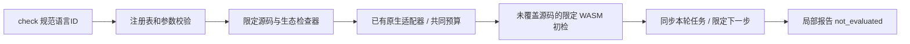

# 注册表语言的统一项目检查入口

对应已有 OpenSpec `introduce-rust-codeguard-cli` 2.1、2.3、9.7、14.10/14.19。这里只验收统一选择和已有能力接线，不勾选完整命令、策略、全语言适配或发行父任务。



## 行为

57个规范语言ID均可进入check；未知ID及不相干的显式工具参数在进程、持久化前拒绝。按选定语言调度已有原生服务、源码快照、类别候选和WASM。JavaScript/TypeScript共享npm构建根，缺工具或适配器保持明确缺口。下一步只选适用检查器或本轮稳定语法任务，不借历史中其它语言任务扩展修改范围；坏历史仍校验，不能以过滤绕过事实完整性。

既有all/Java反馈继续原版本；新增其它语言的反馈0.45、内部故障反馈0.14采用独立schema。所有既有241份schema原字节保持。局部交付固定not_evaluated，空项目和未接入能力不能签发allow。默认二进制仍明示WASM不可用；WASM二进制只观察选定范围。语言别名未登记、完整adapter/DAG/义务、宿主和发行仍未完成。

## RED与实际验收

原入口拒绝非Java语言：57-ID入口及混合项目Python测试先失败。实现后覆盖57-ID空目标、错参无写入、混合项目Python不调度Java/Rust、C的WASM不解析非法Python、历史Python任务存在时C仍返回本轮C任务及原next视图协议。

默认相关三目标45 passed / 0 failed / 10 ignored；受影响WASM六目标首次42 passed / 0 failed / 3 ignored。后补next/历史/关闭服务相关四目标40 passed / 0 failed / 4 ignored，其中新选择目标5 passed / 1 ignored；这些与前一组有重叠，不累加当成独立覆盖。最终修改后的新选择目标5 passed / 0 failed / 1 ignored，含另一语言历史任务反例。

本机已安装Ruff0.16.8显式实测1 passed / 0 failed / 0 ignored：混合Python/Java项目的选定Python检查保留F401，执行节点均为Python，Java原生结果为null。使用显式60秒预算，4.86秒是整个局部链路观察，不作为性能达标。实际反馈保存于[原生报告](evidence/python-language-selection-2026-10-05.json)。没有安装工具或提升策略/grammar权威。

开发期6项schema检查读取56种新增选择的真实CLI反馈、限定WASM及已同步next、实际Ruff报告；拒绝allow、错语言原生结果和错语言类别投影。此辅助Python不进入Rust运行时。

```bash
cargo test --locked --offline -p codeguard-cli --features wasm-precheck --test check_language_selection
CODEGUARD_RUFF_BIN=/absolute/path/to/ruff cargo test --locked --offline \
  -p codeguard-cli --features wasm-precheck --test check_language_selection \
  real_ruff_scoped_check_retains_native_finding -- --ignored --exact
```

CI增加WASM选择目标。公开npm0.1.4和插件锁没有升级，32grammar仍是未完成发行验收的候选；不能把57-ID可进入检查称为57语言检测器已验收。

最终检查：最新默认选择目标3 passed/1 ignored、WASM选择目标5 passed/1 ignored；默认与WASM workspace/all-targets Clippy `-D warnings`均通过。fmt、分层、OpenSpec strict、6项实际协议验收及已修改文档的本地文件链接通过。241历史schema原字节保留，预先Erlang差分草稿摘要不变。没有重跑完整默认工作区suite，旧全套结果不作为本批证明。
