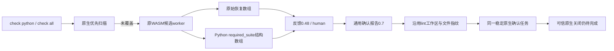

# 聚合check的Python结构证据与任务接线

对应OpenSpec14.4、14.7、14.9、14.10、14.11、14.17、14.19，父任务继续未完成。延续[单文件lint接线](python-structure-lint-task.md)，将候选结构观察接入统一入口，不将结构规则伪装为原始ERROR/MISSING。

存在结构观察时升级聚合反馈到0.48；没有结构观察时保留原有版本选择。每项记录独立 `structural_observation_count` 和最多8条可读结构锚点；原始recoveries及计数保持原值，不因结构规则添加恢复节点。结构记录保留basis、rule_id/version、固定配置摘要、父节点及原始零基字节坐标；仅Python整文件、零偏移适用，不将嵌入片段坐标误当整文件。

持久化采用通用确认报告0.7，稳定指纹与单文件lint一致。同步前核验当前源码、grammar、规则配置、语言、原始坐标、固定字段和记录预算；组合原始/结构计数不能超过128。0.7仅接受Python整文件非空结构记录；历史0.1/0.3及原生报告版本不修改。原始无定位恢复的旧路径不受影响。

TDD：新增聚合任务测试首次因旧0.45而非0.48失败；修复后check python与check all均保留原始恢复0及结构计数1，引用已有lint确认任务；改成合法pass后旧任务仍open。实际公开反馈和持久确认报告通过封闭新schema，旧消费者拒绝。伪造固定规则摘要和越界坐标两份报告均同步失败、不新增blocker；human显示实际结构规则与原生确认要求。

此增量没有重新生成Python grammar、覆盖历史FN2报告或新增语言认证；可信原生关闭、独立语料验收、真实宿主及完整交付门禁继续未完成。开发期Python协议助手不进入产品运行时。

编辑Hook使用同一聚合扫描器，因此一起升级：结构观察存在时局部反馈0.8、外层执行反馈0.17；独立结构计数为正时 `next_action=require_native_lint_confirmation`，不能因原始恢复0降为推荐安装。Claude兼容事件JSON的对话摘要单列结构计数和固定规则ID，仍保持有界、不阻断宿主和交付未评估。这是源构建命令与兼容事件回放，不能代替实际宿主安装验收或默认插件发布。

验证收口：聚合新目标1通过、语言选择回归5通过/1忽略、Hook任务回归16通过；新增Claude兼容摘要断言后单独目标再1通过，不重复合计。实际Ruff语言选择另显式1通过，保留原生F401反馈。实际聚合/Hook/持久确认封闭协议与伪造导入助手1通过；助手发现并修复新Hook协议引用旧反馈和错误要求非空Zig对象的问题，新0.17仅约束结构编辑观察路径，历史schema不修改。默认/WASM严格workspace/all-targets Clippy、OpenSpec strict、269份schema元定义有效及266份历史schema字节不变、1575处本地链接检查通过。受保护Erlang草稿未改变。本次尚未证明远端CI完成、跨平台或真实安装宿主验收。
