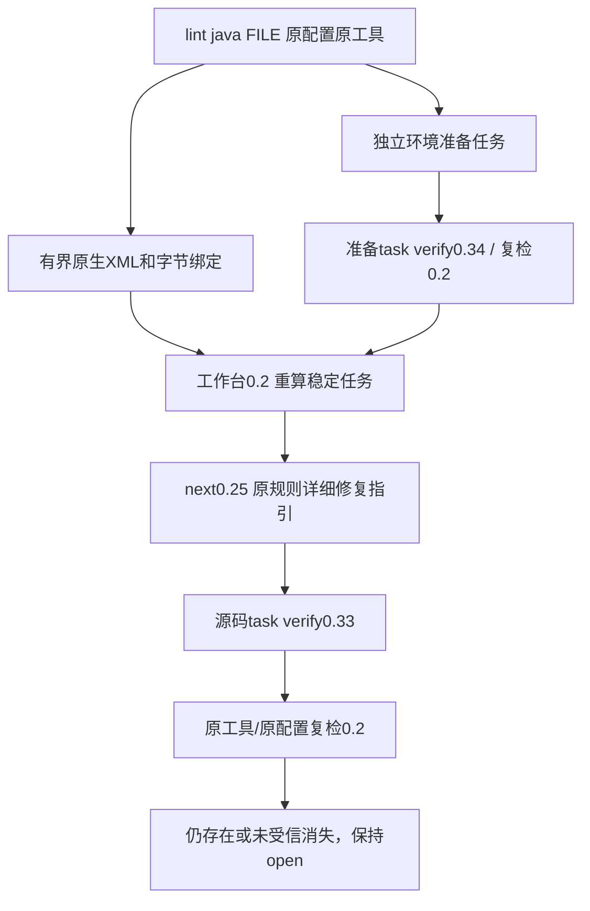

# Checkstyle详细描述模块与局部修复协议验收

对应OpenSpec `introduce-rust-codeguard-cli` 6.3/15.3/15.6。实现沿用同一native-tool-adapters规格；不是全部Java文档或逐语言生产资格。

## 已实现及原生依据

| 原模块 | 原配置保留 | 修复方向 |
|---|---|---|
| JavadocStyle | checkEmptyJavadoc/checkFirstSentence/checkHtml、endOfSentenceFormat、scope/excludeScope、12种官方tokens | 详细用途、首句/HTML及空描述 |
| NonEmptyAtclauseDescription | 五种标签javadocTokens、violateExecutionOnNonTightHtml | 参数/返回/异常/弃用的实际说明 |
| SummaryJavadoc | period、forbiddenSummaryFragments、JAVADOC根token、violateExecutionOnNonTightHtml | 实际用途摘要、原句末与禁用片段 |

按固定10.21.4官方源码核对：[JavadocStyle](https://github.com/checkstyle/checkstyle/blob/checkstyle-10.21.4/src/main/java/com/puppycrawl/tools/checkstyle/checks/javadoc/JavadocStyleCheck.java)、[NonEmptyAtclauseDescription](https://github.com/checkstyle/checkstyle/blob/checkstyle-10.21.4/src/main/java/com/puppycrawl/tools/checkstyle/checks/javadoc/NonEmptyAtclauseDescriptionCheck.java)、[SummaryJavadoc](https://github.com/checkstyle/checkstyle/blob/checkstyle-10.21.4/src/main/java/com/puppycrawl/tools/checkstyle/checks/javadoc/SummaryJavadocCheck.java)、[AbstractJavadocCheck](https://github.com/checkstyle/checkstyle/blob/checkstyle-10.21.4/src/main/java/com/puppycrawl/tools/checkstyle/checks/javadoc/AbstractJavadocCheck.java)。没有移植原检查实现；Rust只接收原生诊断，原XML照常交给工具。首句/摘要语法是否通过由原工具判定，不能据静态选项推断覆盖充分。

合法配置绑定测试先RED，三个模块旧适配均被拒绝；新增模块与模块内原参数后GREEN。完整/短名/Check后缀、自定义source及原severity保留。跨模块属性、未知token、未知包名、共享source、未知版本仍拒绝。Summary合法空period/正则及JAVADOC根token通过；Java无效正则不由Rust替代解释，后续原生失败仍属于未完成检查。

## 路径和契约



局部反馈0.5、工作台/源码复检/准备复检0.2、修复简报/预览0.25、源码预览0.33/准备预览0.34独立新增。旧1/4/6协议及450份历史schema不扩大。导入拒绝含新增类配置却伪装工作台0.1，复检容器与scan协议配对；环境恢复产生的新源码任务的包裹首次证据可原工具复检。

## 已执行的证据边界

[受控XML进程](evidence/checkstyle-detailed-descriptions-fixtures-2026-10-06.json)覆盖三个模块通过公开lint→任务→next→原任务存在→源码修改后局部消失，原事实均open。夹具为测试时使用已有rustc编译的XML运输程序，**不是Java或Checkstyle**，不证明真实诊断语义、合法反例或精度。另[受控恢复](evidence/checkstyle-detailed-descriptions-recovery-2026-10-06.json)验证环境阻塞→恢复未受信→新任务包裹首次报告→原工具运输复检；没有自动关闭环境任务。

原详细描述类被移除、同source换成旧模块时，新增公开复检先RED：外层0.2/scan0.1使事件无法持久化。修正容器与scan版本配对后GREEN；[规则移除复核](evidence/checkstyle-detailed-descriptions-rule-review-2026-10-06.json)保留review_required和复检事件，原事实仍open，不能当成修复消失。

真实工具条件测试 `actual_checkstyle_detailed_modules_preserve_source_tasks_and_repaired_absence` 尚未执行。本轮在既有.m2/.cache及/private/tmp未发现Checkstyle JAR，未安装下载。历史Checkstyle其它规则已有实际记录，不代替本批新增模块验收。

初次公开聚合测试误以为check java一定选择Checkstyle，实际先选择更高优先级P3C准备任务；保留原调度，未改优先级来迎合测试。该实际0.58反馈另被旧schema拒绝：Javadoc未配置reason为不允许的not_configured。新增公开断言先RED后改为已有javadoc_checker_not_configured，状态仍未配置，未伪造原检查已运行。新0.70可消费选中详细Checkstyle的next，但当前只有[构造序列化边界](evidence/checkstyle-detailed-descriptions-aggregate-constructed-2026-10-06.json)，不是实际0.70路由验收。

458份schema元定义、30份受控报告、1份构造0.70反馈、7类伪造与7个旧消费者拒绝通过；450历史schema逐字节不变，详见[协议证据](evidence/checkstyle-detailed-descriptions-schema-2026-10-06.json)。真实新增模块报告验证数为0，不能从JSON合法性升级资格。

默认CLI七目标59通过、0失败、33个工具条件忽略；适配器六目标30通过、0失败。WASM四目标38通过、0失败、21条件忽略，与默认重叠不累计。默认/WASM全工作区全目标严格Clippy、定向格式、分层、OpenSpec strict及diff检查通过。未执行受保护Erlang草稿，也未修改或提交它。

## 仍未完成

真实三个模块原工具正反例、参数/标签/继承/HTML/Unicode/record各变体、完整原项目配置/源集/工具闭包、Checkstyle项目自动发现与聚合原生执行、独立误报评测、可信关闭/复发重开及宿主/平台/发布仍未完成。6.3/15.3/15.6不勾选；Rust任务66完成/288待完成，正式WASM资格仍0/32。

已推送4d65d33的CI37474538789实测MSRV成功，gate在固定插件审计源检出阶段失败，其余质量步骤跳过，不能称CI通过。本批继续草稿PR，不合并、不发布npm/插件/市场，不绕过固定源审计。

已有原工具条件具备后（尚未运行）：

```bash
CARGO_PROFILE_TEST_DEBUG=0 cargo test --offline --locked -p codeguard-cli \
  --test checkstyle_detailed_descriptions \
  actual_checkstyle_detailed_modules_preserve_source_tasks_and_repaired_absence -- --ignored --exact
```

`CODEGUARD_JAVA_BIN`及`CODEGUARD_CHECKSTYLE_JAR`必须指向已有绝对工具路径；该测试不自动安装工具。
