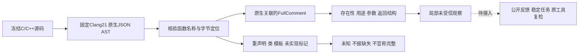

# C/C++原生函数文档结构观察 / Native function documentation structure

对应introduce-rust-codeguard-cli的8.26、8.29、15.3、15.6。新增Rust适配器parse_clang_documentation_ast，直接解释原Clang AST中的FunctionDecl、FullComment、ParamCommandComment及返回说明，而非通过源码正则猜测注释关联。公开comments/check、稳定任务、原工具复检尚未接入此结构报告；它是可复用底层能力，不改变当前原生警告协议，不签发生产资格。

The Rust adapter interprets original Clang function/comment associations, distinguishing absent comments from empty or missing purpose/parameter/return descriptions. Public comments/check, tasks and verification have not yet connected this structural report. Existing warning protocols remain unchanged; this increment grants no production qualification.

输入最多1MiB、AST最多8MiB，JSON解析深度限制和声明/注释遍历预算保持有界。定位必须精确匹配冻结源码函数名；文件/宏来源、矛盾参数索引或不合法结构拒绝。AST未带FullComment时记录documentation_comment缺失；空注释分别保留purpose、parameter:NAME及适用return缺失。明确void无返回要求，typedef/复杂返回类型保持unknown；无名参数不猜名称。非空只表示结构存在，不证明准确性、异常或行为契约。

Input/source association and bounded traversal are mandatory. A missing FullComment records absence; empty comments preserve missing components. Void returns are not applicable, aliases/complex types and unnamed parameters stay unknown. Nonempty text is not evidence of correctness, errors, side effects or behavior.

重声明的文档继承、copydoc/copybrief等引用、未实现内联/HTML/其它命令保持未知，不生成缺失描述结论；类、模板、变量等未适配声明列入unresolved_declaration_kinds。当前仅单文件函数子集，不能宣称全部对象覆盖。LLVM不保证跨主版本AST JSON兼容；调用者仍需原工具版本、字节与源码前后稳定性核验，解析器自身不提供这些证明。

Redeclarations and unimplemented comment references/markup remain unknown. Unsupported declarations are listed explicitly; all-object coverage is not claimed. LLVM does not guarantee JSON AST stability between major versions; callers still need original-tool identity and before/after input checks. [LLVM JSONNodeDumper](https://clang.llvm.org/doxygen/JSONNodeDumper_8h_source.html).

先RED：缺少适配器接口。结构测试进一步RED于copydoc被误判用途缺失及CR定位；补齐不确定性和换行处理。真实原生oracle又证明LFCR为两次换行而非CRLF式一次，随后按原Clang行列修正，未放宽原生对比断言。

Tests first failed on the missing API, then on copydoc uncertainty and CR positioning. The native oracle subsequently disproved the initial LFCR assumption; positions were corrected to match Clang without weakening the oracle assertions.

验收范围：默认/WASM各30份真实AST观察，含无注释但零原生警告、空注释、只写用途、完整中英文、brief/void、空参数、无名参数、typedef、重声明、copydoc及四种换行。它们属于开发样例，非独立holdout。结构0.1为新封闭schema；全部488份历史schema保持。

Evidence covers 30 native observations per build mode: absent/empty/partial/complete descriptions, Chinese text, void, unnamed parameters, aliases, redeclarations, copydoc and newline forms. These are development cases, not an independent precision corpus.

- [默认原生AST](evidence/clang-documentation-structure-native.json)
- [WASM构建原生AST](evidence/clang-documentation-structure-native-wasm.json)
- [封闭结构协议](../../schemas/clang-function-documentation-structure-v0.1.schema.json)
- [适配器反例](../../crates/codeguard-adapters/tests/clang_documentation_ast_contract.rs)

父任务不勾选：完整详细注释、项目配置/头文件/宏、公开任务闭环、独立精度、五平台与发行仍未完成；57×4核心全部blocked，grammar资格0/32，OpenSpec66完成/288未完成不变。

Parent tasks remain open. Full detailed documentation, project context, public repair integration, independent precision, platforms and releases are pending. All 228 core obligations remain blocked, grammar qualification is 0/32, and OpenSpec remains 66 done/288 pending.

实际验证：六项结构反例、既有规则与SARIF两项回归通过；默认/WASM各一项真实集成测试覆盖30份AST；两种构建的严格Clippy通过；488份历史schema字节不变、60份真实观察有效、9个伪造结果拒绝。[协议回归证据](evidence/clang-documentation-structure-schema.json)。CLI公开接线仍未完成，这些结果不勾选父任务。

Verified: six structural tests plus two existing adapter regressions; one native integration test per build mode with 30 AST observations; strict Clippy in both modes; 488 historical schemas unchanged, 60 native observations valid and nine forged reports rejected. Public CLI wiring remains pending.

后续公开接线：原comments入口现可反馈结构（未绑定0.5、已绑定0.6），check/结构任务及复检仍待实现。本文前述底层验收为294690b历史检查点；当前状态见[公开结构反馈](c-family-comments-structure-cli.md)。

Follow-up: explicit comments now exposes structure in0.5/0.6 feedback. Check and structural task integration remain pending. The preceding foundation evidence is the294690b checkpoint; see the public feedback record for current status.
