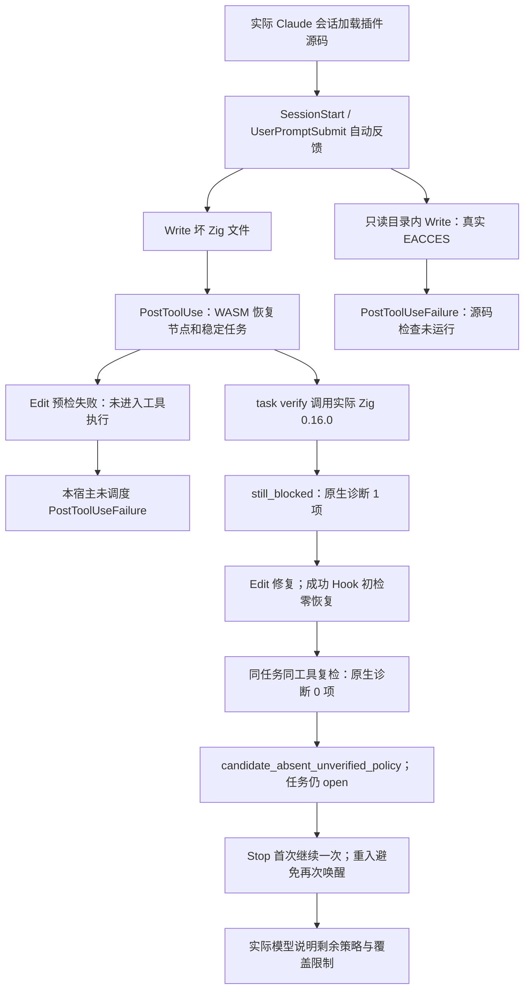

# Claude 实际宿主：保存、失败写入与原生修复复检

日期：2026-10-04。延续同一 OpenSpec 11.2、11.4、11.17、14.10、14.11、14.19；插件侧对应 `2026-10-04-rust-lifecycle-default` 的 2.4。完整宿主、可信关闭和发布父任务保持开放。

## 实际运行身份

本机 Claude Code **2.1.273** 会话内加载插件源码 `dec5f9d`，从固定 npm registry 制品准备独立临时缓存。实际执行的是插件锁定的 **0.1.4**、源码 `1cd458f6e01a44a74388243e964e3f45290ac18e`，不是当前开发二进制，也不是市场安装。包和二进制分别由原 manager 的摘要、成员、许可与平台校验核对；不修改全局运行时、插件设置或仓库文件。

两次会话关闭 skills、MCP、用户/项目/本地设置来源与会话持久化，只在子进程继承已有认证环境；不公开认证设置或环境值。首次仅开放 Read/Write/Edit；第二次另开放限定在同一 runtime manager `exec` 前缀的 Bash，没有权限绕过。内置 CLI 没有被交给模型重写或开发；模型仅操作私有验收夹具并观察真实宿主事件。

## 实际路径与结果

| 验收范围 | 实际观察 | 边界 |
|---|---|---|
| 成功保存 | Write/Edit/重复 Write 自动触发 PostToolUse；坏源码 1 个恢复节点，修复后 0 个 | WASM 是候选；零恢复不关闭旧任务 |
| Edit 预检失败 | 找不到 old_string，工具结果为错误，文件未改；没有失败 Hook | 不能用它声称 PostToolUseFailure 已验收 |
| 真正写入失败 | 私有只读目录触发 EACCES，目标文件未创建；真实失败 Hook 返回“源码检查未运行” | 不输出原始文件系统错误作为模型指令，不扫描失败目标 |
| 原生复检 | 宿主 Bash 调用固定 manager，实际 Zig 0.16.0 `ast-check`；前后结果为 `still_blocked` / `candidate_absent_unverified_policy` | 同一任务，输入/工具身份稳定；仍无可信关闭授权 |
| 稳定任务 | 两次会话复用 `CG-B-6c3dda0684454f604dc4b43c0942deca`，最终仅一张任务、finding 为 open | 没有手改 `.codeguard` 记录 |
| Stop | 各会话首次结束返回待办继续指引，第二次避免重复唤醒 | 未证明所有权限恢复、无限编辑或多宿主情形 |
| 对话可见 | 实际模型收到自动 Hook 并说明诊断 1→0、任务仍开放、交付未评估 | 不以 stdout 存在替代对话证据 |

两次共 **14 个 Rust 生命周期反馈**，另有第二次 Bash 引发的 **4 个 legacy PreToolUse**，全部宿主 Hook outcome=success、exit=0。后者是现有 Python Git 兼容入口，不是 Rust 保存检查的 fallback，也不证明 Git 门禁已迁移。两次宿主进程均退出 0；模型报告费用约 0.248796 / 0.207339 USD。这是两次窄范围观察，不是性能分布或 p95 验收。

原始私有 stream/debug 不入仓。[公开证据](evidence/claude-host-prepared-runtime-2026-10-04.json)保留原始 stdout/stderr 摘要、固定输入身份、逐字节安全 Hook 响应与脱敏最终模型回复；原生结果仅投影允许字段，单独标明规范化 JSON 摘要和真实保存的 native report 摘要，不冒充原始完整报告。公开证据 SHA-256：`4888ee5d724e89b2857fd58ec1e02a66339eb7daf000b36ab4a24f48156b6543`。

## 实测发现的指导缺陷与源码修正

已发布 0.1.4 的新 Zig 确认任务及首次 `next` 称“原生确认 adapter 尚未接入”，但同一二进制的 `task verify --zig-tool` 确实支持并执行了原生复检。首次模型据此判断不能复检。这是会诱发无进展的错误指引，不是缺少 Zig。

当前开发源码的可读任务已经不再断言 adapter 缺失，本批修正首次 `next` / `task show`：从摘要与消费记录已绑定的原候选报告选择实际 Zig 0.16.0、OTP 28、Apple Swift 6.4 确认能力，给出对应工具参数，明确“本地工具是否就绪尚未核验，先核对已有工具，缺失再准备”。查询不执行或安装工具，不从任务 Markdown/历史数据接受可执行路径，不凭候选授权源码修复。无 adapter 的语言仍需要能力决策；原报告被改后不发布新能力指引。后续实际原生历史继续优先，不被首次提示覆盖。

新增正例先在 Zig 首次 `needs_decision` 和缺参数上失败，再实现；既有 schema、原生执行范围、批准策略与任务关闭条件不变。源码回归终态追加在本 change 的 verification；这项修正未包含在本次真实宿主执行的锁定 0.1.4 中，不能声称用户已收到更新。

当前开发二进制的[独立 CLI 捕获](evidence/fresh-native-confirmation-guidance-2026-10-04.json)保留实际首次 `next` / `task show`、程序前后摘要和对应 Hook 重放。它显示已接入 Zig 0.16.0、工具就绪尚未核验及 `--zig-tool` 参数，没有原生复检历史、任务仍 open。该捕获明确是 CLI 消费宿主形状的输入，不是把开发二进制装入实际宿主；不得与上面的锁定 0.1.4 实测混为同一版本验收。

仍缺：市场安装后的真实调用、默认插件可信策略和授权关闭、原生优先完整语言覆盖、Git/CI 完整义务、权限拒绝/恢复矩阵、Codex/ZCode/Kimi 实测、精度与平台资格。总体目标保持未完成。

首次原生确认指引使用 `repair-brief-preview` 0.7.0，明确绑定语言、受支持工具版本、工具选择参数以及 `tool_readiness: not_evaluated`。聚合检查对应 `check-feedback` 0.40.0；`task show` 外层动作与内层复检参数一致。占位路径必须由智能体核对实际已安装工具后替换，不代表工具已就绪或原生检查已执行。历史协议保持原定义，不放宽旧消费者。

## 开发修正终态验证

首次 adapter 指引、无定位约束、原报告篡改拒绝、task show 外层动作及新协议均先保留失败记录，再复检。最终 WASM Hook/next 两目标 22 passed、0 failed、0 ignored；另外五目标 44 passed、0 failed、5 ignored。默认 next/status 两目标 11 passed、0 failed、0 ignored，与 WASM 同名契约重叠，不相加。5 个条件原生用例未执行，不声称通过。默认及 WASM 全工作区全目标 Clippy `-D warnings`、fmt、分层和 OpenSpec strict 通过；210 schema 元定义、208 份历史字节一致性及 13 项开发协议回归通过，705 个本地文档链接有效。

实际捕获的 0.7/0.40 报告摘要为 `b2e075726ca089eec796c4df49da31342939a4106c603dda2dcfe1f84607dde9`。旧 0.3 不合法 9 参数报告只作为[失败留档](evidence/fresh-native-confirmation-guidance-schema-red-2026-10-04.json)，不是被接受的协议。捕获脚本首次将 check timeout 写成不支持的等号参数而失败；按现有独立参数形式修正后完成，不修改产品参数接口。

固定开发验证日志身份：

- `codeguard-fresh-native-actions-final.log`：SHA-256 `fdbb06fa82d859d2abea1502fd828907bf5c494835c9c6b9b0904267f87c10cc`。
- `codeguard-fresh-native-final-followup.log`：SHA-256 `87abf83a2422ac47aa3e20ac69ba5e4bf2ab4248d3a30039c22d321ec9fe350c`。
- `codeguard-fresh-native-default-final.log`：SHA-256 `53f610787ff216a3eda535971b0f43ada940d3e53fb79f022c349826f2a4b5d1`。
- `codeguard-fresh-native-default-clippy.log`：SHA-256 `3f4f473f87e105bc575ba7411497688575f6722b437c807c18edd88e57494041`。
- `codeguard-fresh-native-wasm-clippy.log`：SHA-256 `d09ed10f5b1441be541f398bdfa85087c25fa6ce035c02a238431eed6abf74f1`。
- `codeguard-fresh-native-show-action-red.log`：SHA-256 `bbe905522b3ba62df645228aee49bb0818df7d6d1f9696d5c60309958da81c28`。
- `codeguard-fresh-native-protocol-red.log`：SHA-256 `82bebb7318bd83c39c67746b464d63666d8e468855f3a97e377abc0705d6ed51`。

未运行本批完整默认/WASM suite 或独立精度语料，也未改变 grammar、插件锁、公开 npm 包和可信关闭策略。已成功的 4d620f7 远端 CI 是前一提交证据；本批远端验证按新提交另行核验。
