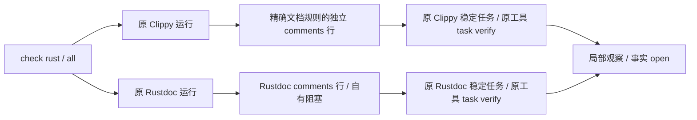

# Rust 聚合注释检查保留双原生义务

对应原 OpenSpec 7.1/15.3/15.6，不新增变更或授予生产资格。

`check rust/all` 原先只把 Rustdoc 局部探针归入 comments，原 Clippy 的 Errors/Panics/Safety 诊断虽有稳定任务却没有注释分类。反例先暴露该缺口；现保留原 Rustdoc 行，另加入精确三规则的 Clippy 行，两者状态独立。没有再执行一次 Clippy，也不重写文档语义。零发现或未知相似规则不会建立已启用的详细契约结论。

受控进程用例覆盖三个精确规则、原生失败后的已知发现、两个未知/其他 lint 规则，验证两义务不互相覆盖；夹具不算真实 Clippy 语义。实际已有Clippy分别生成三种诊断，公开 check rust 的双行与原 finding 身份保持；真实报告另存[evidence](evidence/clippy-documentation-aggregate-native.json)，不覆盖上一批历史证据。第一次新增测试读取了错误字段，修正为已有 category_candidates 后得到缺Clippy义务的目标RED；未改生产协议以迁就测试。

协议沿用既有类别数组及可表示的检查器/状态，没有新增字段、放宽历史schema或改批准映射。完整 comments rust 文档入口、空正文/参数/返回/用途准确性、间接行为与全构建组合仍待实现和原生验收。零诊断不关闭任务；完整57语言四核心、独立精度、可信闭环与平台/宿主/发行继续未完成，66完成/288待完成、正式grammar资格0/32。

验证：默认五目标31通过/4条件忽略，WASM32通过/4忽略；加入Rustdoc失败而Clippy保持独立局部观察反例后，相关目标单独复核。真实已有Clippy两配置各显式1通过，新WASM证据另存[evidence](evidence/clippy-documentation-aggregate-native-wasm.json)。44份实际报告通过原协议，474历史schema原字节保持；无新协议字段或资格批准。
