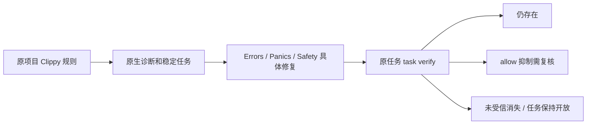

# Clippy 文档契约的原任务修复指引

对应现有 OpenSpec 7.1、15.3、15.6，不授予 Rust 文档生产资格。

原生规则来源：[Clippy 文档规则源码](https://github.com/rust-lang/rust-clippy/blob/master/clippy_lints/src/doc/mod.rs)。当前本机实际版本为 Clippy0.1.98 (48a229ceae 2026-09-01)，版本与 CLI 制品摘要保存在 [实际证据](evidence/clippy-documentation-native.json)。在线源码可能变化，本次边界结论来自本机实测。

| 原生规则 | 修复指引 | 仍需验证 |
|---|---|---|
| clippy::missing_errors_doc | Errors 中说明实际错误类型和触发条件 | 隐式错误、说明内容准确性 |
| clippy::missing_panics_doc | Panics 中说明实际触发条件 | 间接 panic、调用链覆盖 |
| clippy::missing_safety_doc | Safety 中说明调用前置条件与责任 | 条件是否充分、实现是否兑现 |

仅精确原生 checker/rule 匹配获得指引；相似前缀或其他检查器不套用。普通 Clippy 调用保持原项目规则，不隐式启用 pedantic；force-warn 仅用于原任务已有规则的抑制对照。不得改变 API 或删除 unsafe 来迎合检查。



## 原生测试与边界

新真实工具测试首先失败：Errors finding 已存在，但 next 仅为通用根因调查；指引补齐后执行三组缺章节、重复扫描、仍存在、allow 抑制、空章节、详细说明修复，共18份观察，另有未选 pedantic 的真实零诊断反例。空章节标题均被原生接受，所以本批次只证明原生任务及修复指引链，**不能证明详细内容合格**。三个原事实均保持 open。测试初版生成了文档后的空行，导致原生 empty_line_after_doc_comments 优先成为 next；修正测试输入后保留真实规则选择，没有改变产品排序。

[测试入口](../../crates/codeguard-cli/tests/rust_clippy_documentation.rs)明确要求已有工具，不安装：

```bash
CODEGUARD_TEST_CARGO=/absolute/path/to/existing/cargo \
CARGO_PROFILE_TEST_DEBUG=0 cargo test --offline --locked -p codeguard-cli \
  --test rust_clippy_documentation -- --ignored
```

当前 comments rust 仍调用 Rustdoc 的 missing_docs/broken_intra_doc_links，未合并 Clippy 文档契约；用途/参数/返回、空正文识别、私有项、workspace/features/targets、宏与间接行为、独立误报/漏报语料、可信策略/关闭/复发及五平台/宿主仍待实现和验收。7.1/15.3/15.6 不勾选；正式 WASM 资格仍0/32，父任务66完成/288待完成。

## 本批验证

默认五个受影响目标30通过/4条件忽略，WASM31通过/4忽略；新原生测试两种构建各显式1通过，与普通测试和独立精度语料不混计。精确checker/rule单元1通过。两次验收计划回归发现新增来源引用/摘要映射不全，补齐原scan及测试来源后恢复，不放宽计划契约。474份历史schema保持原字节；实际默认/WASM报告按原封闭协议检查。WASM另存[真实证据](evidence/clippy-documentation-native-wasm.json)。
