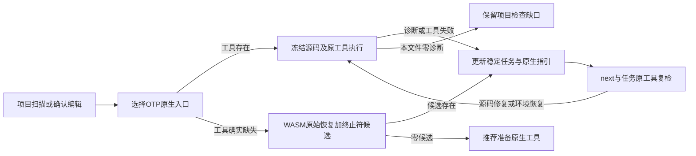

# Erlang 终止符候选的项目与编辑修复链路

对应同一OpenSpec introduce-rust-codeguard-cli 9.x、14.6/14.10/14.11/14.19。原32grammar及rulepack字节不变；新增版本 check_feedback0.55、syntax_confirmation_observation0.14、hook_execution_feedback0.28（局部fast0.16），旧schema不修改。

项目入口复用已实现的原生优先服务，并把固定Erlang直接form结构候选接到共享工作进程和持久导入。编辑Hook新增OTP入口自动发现及显式 --erl-tool；只检查确认编辑指定的erl/hrl文件，所选工具失败不执行WASM，缺工具才执行候选。无WASM默认构建仍保存缺工具的环境任务；不自动安装。

实际RED先落在项目漏失结构候选。接线后发现项目的原生缺工具任务会先于候选生成，两者沿用同一稳定ID，已有任务正文保留；测试改为核对首次证据和后续观察而非要求覆盖用户文档。编辑首次生成候选时，任务文档包含独立函数终止符规则、允许范围、步骤、复检、历史和关闭条件。四类伪造导入（grammar摘要、规则摘要、越界位置和错误版本）均拒绝。源码修复后零候选不关闭历史任务。

已消费的0.14原报告依靠原marker摘要和任务身份读取历史，不拿旧位置验证新源码；首次导入仍严格校验当前源码/规则/grammar/坐标。改变原报告会与原marker失配。task show在源码改变后仍提供OTP原工具参数；缺工具复检记录incomplete事件，历史任务保留open。

模拟Claude Write事件通过CLI得到有界摘要及 codeguard.erlang.form_terminator，输入content不回显。这不是实际宿主运行证据。补齐固定结构ID白名单后摘要才显示规则；未放宽任意工具文本或指令。

实际已安装OTP28专用测试：编辑坏源码获得原生诊断及任务；原工具复检仍观察问题；修复源码后编辑/复检均零诊断且同ID，全部跳过WASM；任务仍open，未自批关闭、门禁或语言资格。显式错误erl反例保留原生版本阻塞，不换工具或回退WASM。

schema实测发现native-only新反馈缺少三个必需的旧语言可空字段；为0.16补齐字段，而非放宽schema。最终报告及版本拒绝证据见evidence/erlang-form-workbench-2026-10-06.json。初次测试的事件名/timeout和wrapper字段误用均为fixture修正，未当作产品缺陷消账。

原始parser的十项漏检历史保留，组合终止符候选不冒充ERROR/MISSING。358例完整回放和独立精度、版本/预处理覆盖、可信关闭、真实宿主及发行仍待验收，资格保持0/32，父任务保持开放。受保护Erlang草稿未执行或提交。

确认0.14报告的checker/reason明确为syntax.native_confirmation/native_syntax_confirmation_needed；实测纠正了schema复制时残留的ESLint身份。四种导入伪造在Rust读者拒绝，四种schema矛盾与旧消费者拒绝新版本分别校验。WASM全目标严格Clippy指出重复分支，合并等价条件后终态通过，未关闭规则。

最终验证：受控新目标3 passed / 0 failed / 1条件忽略，已安装OTP28目标显式执行1 passed / 0 failed / 0 ignored；18份受控输出（含1份模拟对话）及6份实际OTP输出通过对应协议验证，4种schema篡改和旧消费者拒绝新版本，372份schema元定义通过。两组捕获在执行测试时记录同一程序SHA-256，证据不读取后续构建可能替换的target/debug程序。

受影响WASM七目标回归先前50 passed / 0 failed / 7条件忽略；最后可空字段修正后新目标3项及真实OTP1项重新通过。最终默认三个目标42 passed / 0 failed / 4条件忽略；默认与WASM全目标严格Clippy通过，随后仅捕获摘要的测试辅助变化经目标Clippy复检通过。计数有重叠，不相加。日志分别为本机 /private/tmp/cg-erlang-workbench-bound-fixtures.log、cg-erlang-workbench-bound-otp.log、cg-erlang-workbench-default-tests.log 与 cg-erlang-workbench-bound-clippy.log；OpenSpec strict、crate分层及diff检查通过。远端CI独立核验，不能由本地结果代替。
