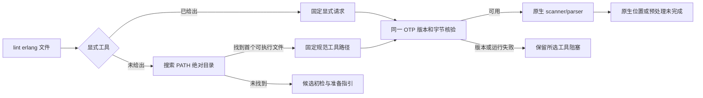

# Erlang 原生工具自动发现与版本化选择反馈

日期：2026-10-04。对应现有 OpenSpec 8.134、14.5–14.9、14.17、14.19；单文件局部实现，不勾选全项目父任务。

## 行为

```bash
codeguard lint erlang sample.erl --timeout 10s --format=json
codeguard lint erlang sample.erl --erl-tool /absolute/path/to/erl --format=json
```

未指定工具时，只从调用进程 PATH 的绝对目录选择首个普通可执行 `erl`，固定其规范路径，然后复用既有受控 OTP 28 版本与字节核验、stdin 原生 forms 解析和共同 deadline。空/相对目录、目录本身及不可执行文件不会作为自动工具；符号链接解析为规范可执行文件。选择只发生一次，所选工具不支持 OTP 28、运行失败或返回异常时不换用后面的同名工具或 WASM。显式请求优先，错误或相对请求仍给出原生阻塞，不改用 PATH。

确实未找到工具时保持 `native.status=not_run`、`erlang_tool_not_found_on_path`，WASM 构建附加既有候选；默认构建给出 `wasm_feature_not_built`。候选的已知终止符漏检仍在。本轮没有下载工具、改 PATH、执行项目启动文件、展开宏或执行项目源码。



## 协议与实际示例

[erlang_lint_feedback 0.2.0](../../schemas/erlang-lint-feedback-v0.2.schema.json)新增 `tool_selection`：输入尚未达到选择阶段为 null；否则 `source=explicit/path/not_found`，`executable` 为已定位的规范绝对路径或 null。PATH 选择必须有路径；未找到不能携带工具路径或原生执行证据；完成或有诊断必须有可定位工具、OTP 28 及工具摘要。历史 [0.1.0 Schema](../../schemas/erlang-lint-feedback-v0.1.schema.json)字节不变。

双语技术方案的完整 JSON 示例来自实际 PATH 选择的缺句点报告，仅把源文件路径投影为 `sample.erl`，不是编造状态或工具摘要。human 输出也显示工具选择来源。复检可按 `tool_selection.executable` 固定 `--erl-tool`；任务复检与 Hook 当前仍要求显式路径，本轮不声称已实现项目全自动调度。

## 验证

- TDD RED：新自动发现目标 0 passed、5 failed、1 ignored，旧实现只给 WASM/缺工具反馈，没有选择来源和原生优先。
- 默认构建的两个目标文件：15 passed、0 failed、2 ignored。
- 五个相关 WASM 特性目标：52 passed、0 failed、6 ignored；覆盖自动/显式选择、PATH 首项版本不支持、空/相对/不可执行输入、链接、原生阻塞、复检与 Hook 回归。
- 已有真实 OTP 28 自动发现用例：1 passed。未传 `--erl-tool`，缺句点由原生解析定位到 2:8，不启动 WASM。
- 已有真实 OTP 启动/宏/parse_transform 范围用例：1 passed，7 个样例保持原字节且项目 `.erlang` 不执行。
- 6 份实际报告、2 份完整双语例子通过 0.2 Draft 2020-12；13 个伪造整体 clean/allow/权威/覆盖或矛盾工具选择的变体被拒；183 个 Schema 元定义有效，0.1 原件逐字节一致。
- CLI WASM 特性全目标 Clippy `-D warnings` 通过。全工作区终态另行追加，忽略项不算通过。

| 日志 | SHA-256 |
| --- | --- |
| `/tmp/codeguard-erlang-discovery-red.log` | `e125e46c9dfd387c3d26f0732bcee435c035b429ab4c5e25c42be34d6f2facda` |
| `/tmp/codeguard-erlang-discovery-green.log` | `6d0e5ce2ae85615b1e0ee3c18e3dd0bd1bec723fb872043aade1ccc36787f905` |
| `/tmp/codeguard-erlang-discovery-feature.log` | `09bec3d752a93d4988d84609640b0f4271f2945e43924b8137f06517a840173c` |
| `/tmp/codeguard-erlang-discovery-real.log` | `a7ddad1300345af9cc9b518deaf6573781221cc31d82d715feb460c9cb92f8cf` |
| `/tmp/codeguard-erlang-discovery-real-scope.log` | `4154ed6bd2ec19a1e8c0da4ff685b3ed20090b2b01df34a6191956807fbea1fc` |
| `/tmp/codeguard-erlang-discovery-schema.log` | `7496bfb7ec583e34e72272d99d6df40003229d1e7e85acaf88df66c3582c6df0` |
| `/tmp/codeguard-erlang-discovery-clippy.log` | `58a5123b73e1a8655cb4509a87d4252fbff43e03c58fb98e6aead93075656e8e` |

## 未完成范围

Erlang 项目多模块、预处理/include、comments/CVE/security、原生 finding 的稳定任务生命周期、自动 task/Hook 工具选择、可信关闭、实际宿主、多平台和公开发行仍缺。launcher 摘要不是整个 OTP VM/stdlib 的供应链证明。所有结果保留 `coverage_proven=false`、`authority=local_unverified` 和 `delivery_decision=not_evaluated`，不自动关闭任务。公开 npm 0.1.4 没有本轮自动发现能力。

上一轮的 [37 例 grammar 终止符修复](erlang-source-forms-rebuild.md)仍是独立的 RED 草稿，待生成器下载授权和实际重建；本轮自动原生选择没有修好原 WASM，也不以本轮目标通过替代那组失败测试。


最终默认全工作区终态：206 组、1137 passed、0 failed、107 ignored，退出 0；`/tmp/codeguard-erlang-discovery-workspace.log` SHA-256 `e0b40be56639a4f83008281e3bc017bf47366c4d4597650b1133de9671a26f1b`。这是默认特性回归，不覆盖单独保留的 37 例 WASM grammar RED 草稿；相关特性目标及显式 OTP 验收分别见上文。
