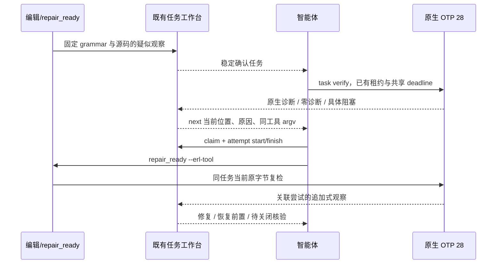

# Erlang 确认任务的原生复检与修复指引

日期：2026-10-04。对应既有 `introduce-rust-codeguard-cli` 的 SP10、S09、11.17、14.10–14.11。记录局部实现与验收，不替代全语言或真实宿主验收。

## 可执行流程

```bash
codeguard init . --apply
# 源码确认编辑事件生成稳定的 Erlang 语法确认任务。
codeguard next . --format=json
codeguard task verify TASK_ID . --erl-tool /absolute/path/to/erl --format=json
# 查看 next 的原生位置，按 scope 修复，并通过 claim/attempt 记录尝试。
codeguard next . --format=json
codeguard task verify TASK_ID . --erl-tool /absolute/path/to/erl --format=json
```



## 实现边界

- 调用与 `lint erlang` 同一 OTP 28 scanner/parser，固定 cwd、禁用项目 `.erlang`，源码只从 stdin 输入；不编译项目或执行宏/parse_transform。摘要绑定 erl 启动器，不声称绑定整个 OTP VM 与 stdlib 供应链。
- 原任务的 workspace/文件/语言/grammar 与报告身份核对，工具错语言或相对路径在租约和启动前拒绝；不为另一语言调用 Python 或 PATH 工具。
- 原生错误进入当前修复指引。源码或工具改变会使旧指引失效；只有已观察为 OTP 28 且当前摘要一致的工具可复用。
- `next` 带具体原因、报告引用和位置。OTP 的列是 Unicode scalar 字符列，JSON 明示 `native_column_unit=unicode_scalar`；不能用字节列解释非 ASCII 源码。
- `repair_ready` 摘要直接包含原生位置与原因；仅对已保存且已消费的报告返回真实引用。保存失败或引用无法重新核对时为 null，不链接虚构文件。
- 宏/include/条件编译保持 `erlang_preprocessing_unresolved`，诊断数组为空，指导恢复项目原生预处理/编译上下文。无工具明确给出 OTP 28 准备步骤。
- 复检保留 ready-to-verify 尝试关联和调用者租约；失败也记录，两次无进展进入既有具体决策预算。原生零诊断为 `candidate_absent_unverified_policy`，任务仍 open，不能自批白名单或完整交付。

## 协议与历史兼容

| 输出 | 新版本 | schema |
|:---|:---|:---|
| Erlang 原生任务观察 | 0.2.0 | [syntax-task-recheck-v0.2](../../schemas/syntax-task-recheck-v0.2.schema.json) |
| Erlang task verify 外层 | 0.13.0 | [task-verification-preview-v0.13](../../schemas/task-verification-preview-v0.13.schema.json) |
| 已复检 Erlang next | 0.4.0 | [repair-brief-preview-v0.4](../../schemas/repair-brief-preview-v0.4.schema.json) |
| Erlang repair_ready Hook | 0.8.0（内层摘要 0.2.0） | [hook-execution-feedback-v0.8](../../schemas/hook-execution-feedback-v0.8.schema.json) |

Zig 与其他检查器输出版本保持不变；历史 schema 未改写。尚未复检的通用任务仍使用原 0.3.0 简报。当前源码与公开 npm 0.1.4 分开：后者没有此次扩展，也没有声明插件/宿主已激活这些源代码。

## 测试与实际证据

初始测试因未支持 `--erl-tool`、缺工具反馈错误以及错语言在租约后才拒绝而 RED：0 passed / 6 failed / 1 ignored，`/tmp/codeguard-erlang-task-red.log`。后续两项 RED 分别暴露 Hook 未投影原生证据与错误的“字节列”标签，日志为 `/tmp/codeguard-erlang-hook-evidence-red.log` 和 `/tmp/codeguard-erlang-column-red.log`。

当前特性目标覆盖真实 WASM 稳定任务、原生协议替身、诊断/零诊断/预处理、陈旧输入、尝试/租约、两次无进展、语言错参及报告导入。严格导入用 10 个反例逐项拒绝未知协议、错语言/规则/版本、越界位置、伪造预处理完成和交付通过；替身不冒充原生 OTP。

显式本机 OTP 28 目标测试实际检查坏函数、最终句点遗漏及修复后的同一文件，1 passed / 0 failed；此用例证明所列任务路径，不是全语言精度评测。另以实际 CLI 捕获缺工具、坏源码、缺句点、修复、宏、陈旧 next 和 repair_ready 输出，证据位于 `/tmp/codeguard-erlang-task-observations/`。

16 份新协议实际报告（含内层观察）通过 schema；15 个伪造权威/通过、错误工具版本/规则/原因/坐标单位及宿主阻断变体被拒。初版 0.4 schema 继承了旧版本限制，实际报告暴露后已修正新 schema；历史 schema 保留。开发校验器前期的本地资源别名配置失败没有计为产品 RED 或验收通过。

最终回归与源码提交证据在下方追加。

## 实际 Hook 完整示例

以下是原生 OTP 的真实 repair_ready 输出；任务和运行 ID 属于临时验收工作区，引用不是目标项目现存文件。

```json
{
  "delivery_decision": "not_evaluated",
  "execution": "task_verification",
  "host_blocking_verified": false,
  "local_feedback": {
    "authority": "local_unverified",
    "checker_id": "syntax.native_confirmation",
    "delivery_decision": "not_evaluated",
    "event_persisted": true,
    "native_column_unit": "unicode_scalar",
    "native_confirmation_reason": "erlang_native_syntax_diagnostics",
    "native_confirmation_ref": {
      "report_ref": ".codeguard/reports/syntax-native-88734-1791066158885814000.json",
      "report_sha256": "f529b3d472381a5d7cdf2d655d1d18a0000264d1e71ecb45856c17a01fd9ec45",
      "run_id": "syntax-native-88734-1791066158885814000"
    },
    "native_confirmation_status": "diagnostics_observed",
    "native_diagnostic_positions": [
      {
        "column": 4,
        "line": 2,
        "rule_id": "erlang.syntax.error"
      }
    ],
    "observation": "still_blocked",
    "reason": null,
    "report_type": "hook_task_verification_summary",
    "scan_report_available": true,
    "schema_version": "0.2.0",
    "task_id": "CG-B-b2b940bb04fde9437c1c303ca785c1ca"
  },
  "plan": {
    "action": "verify_task",
    "host_blocking_claimed": false,
    "may_claim_delivery": false,
    "requires_git_snapshot": false,
    "scope_resolution_reason": null,
    "soft_result_reuse_candidate": false,
    "target_paths": [],
    "task_id": "CG-B-b2b940bb04fde9437c1c303ca785c1ca"
  },
  "reason": null,
  "report_type": "hook_execution_feedback",
  "schema_version": "0.8.0",
  "soft_result_reused": false
}
```

## 未完成范围

Erlang grammar 的原始句点漏检仍在；尚缺完整项目 lint/预处理/注释检查、原生 finding 生命周期、Erlang 可信关闭与复发、自动工具发现、实际安装宿主、发行与平台/精度验收。受保护关闭 SDK 仍只支持限定 Zig。8.134、S09、11.17、14.10–14.11 和总体目标不勾选。


## 已完成的局部回归与保留的失败记录

- 最终八组相关特性回归：84 passed、0 failed、17 ignored；`erlang_syntax_task_verify` 的 9 项常规用例通过，原生 OTP 用例另行显式运行 1 passed，不把 ignored 算通过。日志 `/tmp/codeguard-erlang-task-delivery-related.log`。
- 不带 WASM 的默认构建能复检特性构建生成的同一工作台：OTP 原生 completed、event_persisted=true、candidate_absent_unverified_policy，首次任务仍 open；实际 JSON 为 `/tmp/codeguard-erlang-task-observations/default-build-verify.json`。
- CLI 全目标 WASM Clippy -D warnings、fmt、crate 分层、OpenSpec strict、历史四份 schema 字节比较和修改文档链接检查通过；新增两份完整双语示例和默认构建输出也通过 schema，合计 20 份报告/示例。182 份 schema 元定义有效，15 个伪造变体被拒。
- 首次全工作区运行没有通过：Maven 两项身份变更夹具在共享 2 秒截止前没取得版本结果，返回 version_timed_out（7 passed、2 failed、3 ignored）。独立重跑原测试 9 passed / 0 failed（0.45 秒）。只把这两项非超时测试预算对齐同文件的普通 20 秒预算；原生退出成功及精确身份变更断言保留，独立 100ms 超时测试仍在，产品超时逻辑未修改。修正后目标组 9 passed / 0 failed / 3 ignored，目标 Clippy 通过；最终全量结果必须以新日志为准，不能用目标成功覆盖首次失败。
- `/tmp/codeguard-erlang-task-delivery-related.log`：SHA-256 `1565dc4eef8d7b2a25c8c4b92876307b458da7071947e1d6fc095b5f97963d77`。
- `/tmp/codeguard-erlang-task-final-real.log`：SHA-256 `5b9c4f8c92e41b205b2c307eae160bcc5fa6895423f7765df90c8fdfb257edb7`。
- `/tmp/codeguard-erlang-task-clippy-final.log`：SHA-256 `e1d5b414e046951b2390918f5163c244326d4be22b793c5ec023728980d7ee3f`。
- `/tmp/codeguard-erlang-task-workspace-final.log`：SHA-256 `97e7c0f810b94738e57e9ae5bd75832e643be4225a94cac252e9c4c7530d918d`。
- `/tmp/codeguard-erlang-task-maven-final.log`：SHA-256 `e4774d0960e10b14b8268f68b57dc27aeebc2d41b185ff5e5d4f73ac5e71cd58`。


最终全工作区终态：2026-10-04，`cargo test --workspace --all-targets --locked --offline` 205 组、1132 passed、0 failed、106 ignored，退出 0；日志 `/tmp/codeguard-erlang-task-workspace-corrected.log` 的 SHA-256 为 `d81ec1374f9c3de8c521b57d4cb7e200d945abffeca28b26b699c17450238e52`。首次失败日志保留，不改写为通过。已完成代码审阅、Clippy、fmt、分层、严格规格和文档链接/示例校验；源码新提交的远端 CI 与公开发行仍需分别核验。
