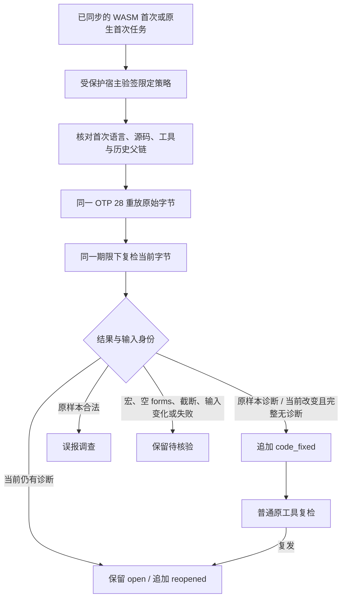

# Erlang 限定语法任务的关闭与复发

日期：2026-10-04。对应现有 OpenSpec 9.7、9.10、9.11、12.7、14.10、14.11。完整父任务保持未完成。

## 执行路径



源码 SDK `verify_erlang_task_resolution` 复用已有服务。Erlang 策略 1.1.0、证据 0.2.0，收据/事件继续 0.1.0；旧 Zig 类型别名保持可用，旧 schema 原件未修改。原生首次 grammar=null；批准策略绑定真实原生规则/工具，内部规则摘要使用批准策略实际字节。首次工具改变、grammar 缺字段/伪造或重算跨语言历史在原生执行前拒绝。

## TDD 和证据边界

- 新 SDK 入口缺失的 RED：`/tmp/codeguard-erlang-resolution-api-red.log`。
- 原生首次策略 null 被拒绝的 RED：`/tmp/codeguard-erlang-native-first-resolution-red.log`；修正后同一行为 GREEN：`/tmp/codeguard-erlang-native-first-resolution-green.log`。
- 重算跨语言历史的 RED：`/tmp/codeguard-erlang-history-language-red.log`；旧行为先接受历史再执行原生，最终返回 reconciliation，缺少首次语言的提前绑定校验。
- 受控协议覆盖关闭、幂等、复发、再次关闭、原样本反证、宏/空 form/截断/错误输出、签名/版本/语言/工具身份、并发源码变化及既有 lease/attempt 交接。工具脚本验证编排，不计真实原生精度。
- 已安装 OTP 28 的显式测试分别覆盖 WASM 首次和真实原生首次；签名信任根仍为测试夹具，不计实际宿主授权接线。

## 复现

```bash
CARGO_PROFILE_TEST_DEBUG=0 cargo test --locked --offline -p codeguard-cli --features wasm-precheck \
  --test erlang_task_resolution_service --test task_resolution_service \
  --test erlang_syntax_task_verify --test erlang_native_workbench --test syntax_task_verify -- --test-threads=2
CODEGUARD_ERL_BIN=/absolute/path/to/installed/erl CARGO_PROFILE_TEST_DEBUG=0 \
  cargo test --locked --offline -p codeguard-cli --features wasm-precheck \
  --test erlang_task_resolution_service real_otp28_original_fixed_and_recurrent_source_resolution -- --ignored --exact
```

SDK 测试宿主二进制同样受 256 MiB 制品上限约束，因此禁用测试调试信息；不扩大产品预算。

## 未完成范围

默认插件/公开 CLI 的受保护策略提供者、实际宿主自动关闭、其它检查器、全项目 lint/预处理/类型/安全/CVE、独立 holdout、完整门禁、多平台和硬 I/O 截止仍缺。工具摘要固定 launcher，不能代替 OTP 标准库/运行环境供应链证明。本批不修 grammar 的 10 个终止符漏检，也不提升任何 grammar 的资格，不发布 npm 或修改插件锁。

## 实际验证

- 五组相关 WASM 特性回归：47 passed / 0 failed / 5 ignored。新 Erlang SDK 单组 9 passed / 1 ignored；旧 Zig SDK 9 passed / 1 ignored。真实工具测试另行显式运行，不把 ignored 算通过。
- 已安装 OTP 28：1 passed / 0 failed / 0 ignored，测试内部覆盖两种首次来源各自关闭与重开。共享服务的已安装 Zig 0.16.0 兼容回归另 1 passed / 0 failed / 0 ignored。
- 200 份 schema 元定义、67 份实际导出的策略/收据/证据/事件、12 类伪造/矛盾证据反例校验通过。schema 校验不证明批准来源，跨语言/原始工具/哈希归属由 Rust 集成反例验证。
- fmt、crate layering、OpenSpec strict 与本批文档局部链接检查通过；默认全量及 Clippy 在执行后追加，不引用旧版本结果。

实际 [原生首次关闭收据](evidence/otp28-native-first-resolved-2026-10-04.json)、[grammar=null 对照证据](evidence/otp28-native-first-resolved-2026-10-04-evidence.json)、[复发收据](evidence/otp28-native-first-reopened-2026-10-04.json) 保留原始输出；同目录保存对应策略和父链事件。原始源码与私有原报告不导出，不凭此公开 packet 恢复可信宿主或自动关闭。

## 日志身份

- `/tmp/codeguard-erlang-resolution-api-red.log`：SHA-256 `77f0a0edf80489759a3e87f12beeacad34637981944e7270fad5854f82b17efb`。
- `/tmp/codeguard-erlang-native-first-resolution-red.log`：SHA-256 `e4618869ba09c06f2f02e8281c4d4f570979562a316b02237b7db52c7137a13f`。
- `/tmp/codeguard-erlang-native-first-resolution-green.log`：SHA-256 `20abf256d73e712eb298347c3207256e2ed43480e1e71801385650cdb4fa2aa1`。
- `/tmp/codeguard-erlang-history-language-red.log`：SHA-256 `7dade625ed77148fd9eff98d35318d11cb9e8d73a64c786d1d4f47879d616b48`。
- `/tmp/codeguard-erlang-resolution-final-feature.log`：SHA-256 `5b9535e4de882afaebf240a963fcdebf1739825425cef3e99971bf5f8725e6ab`。
- `/tmp/codeguard-erlang-resolution-real-otp28.log`：SHA-256 `80301693c9b584e52ee73177f0031af244a8c0b0ccfc6a716b7956526a0f4f7c`。


## 最终工程回归

- `CARGO_PROFILE_TEST_DEBUG=0 cargo test --workspace --all-targets --locked --offline`：214 组，1193 passed / 0 failed / 109 ignored，退出 0。未执行的真实环境目标不计通过；WASM 全特性整套未运行，已知 Erlang grammar RED 草稿仍未提交。
- `CARGO_PROFILE_TEST_DEBUG=0 cargo clippy --workspace --all-targets --features wasm-precheck --locked --offline -- -D warnings`：退出 0。
- fmt、分层、OpenSpec strict、修改文档链接、schema 与实际归档 packet 校验通过；旧 198 schema 未修改。
- 默认全量不能证明 grammar 漏检已修复、真实宿主接线或公开发布。新提交 CI 独立核验，不借旧 head 成功。
- `/tmp/codeguard-erlang-resolution-real-zig-regression.log`：SHA-256 `0d8546fbe8fc8519587952939c03a4cf79b4f875cf883bda8f0c51b79524bcd3`。
- `/tmp/codeguard-erlang-resolution-default-workspace.log`：SHA-256 `17972c87a975d0b0206f642531269d9451e558afa87f68c56858efa5dcbbaf0e`。
- `/tmp/codeguard-erlang-resolution-clippy.log`：SHA-256 `9bbb27f856a6ef7a85bb8e9561b8c1f15549ba195a095bba0f88a58534c00b89`。
- `/tmp/codeguard-erlang-resolution-schema.log`：SHA-256 `9c164eb9910d7e4f6b1a029b41b43ebe0c5f2183d971bd9b45ee4bb4df26eafd`。
- `/tmp/codeguard-erlang-resolution-links.log`：SHA-256 `ecca321cc462abad8438314bbd1466160f5e351eb20ef60d40096ecd75b816f7`。
