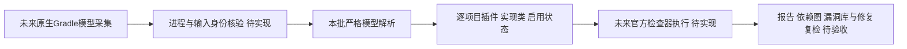

# Gradle 原生配置模型解析基础

对应现有 `introduce-rust-codeguard-cli` 的 native-tool-adapters / Gradle checker model observation，以及6.x、8.x、15.5。本批实现Rust解析契约，尚未实现原生模型采集与公开命令接线；测试输入是受控JSON，不是Gradle进程结果。实现先于本批测试，不声称完成RED→GREEN。

模型保留Gradle版本、根/子项目身份、项目目录、构建目录、已观察插件ID、任务实现类与启用状态。OWASP可选任务必须同时具有原生插件ID、启用状态及准确官方Analyze/Aggregate基类身份；仅名称相似、禁用任务、未应用插件或未经归一化的装饰类都不能获得该身份。返回空集合只表示该模型没有适用任务，不代表全部漏洞检查器不存在。

严格解析拒绝重复JSON字段、未知字段、重复项目或任务、越界/别名路径、缺失父项目、未解析版本、超出预算和未覆盖composite build。范围限制为1MiB模型、128项目、每项目64相关任务；失败应保持环境/配置未解析，不能生成源码违规。

四项模型测试覆盖子项目范围、官方身份组合、禁用与同名伪装、重复字段、路径别名、未知字段/协议/版本及输入预算。全适配器默认回归51组216通过、0失败、8条件忽略；其中包含上述四项，不重复累加。适配器全目标Clippy `-D warnings`、分层检查、OpenSpec strict及diff检查通过。本批不授予Gradle生产资格，不修改父任务勾选，不改变32语法候选的正式资格0/32。

下一步采集必须实际运行用户项目Groovy/Kotlin配置，绑定选定源集、工具制品、脚本和运行结果；只观察部分文件时明确范围不完整。模型采集失败不能退回正则并宣称插件已配置。随后分别验收Maven/Gradle的Javadoc、开发规范及漏洞路径，缺少原生插件或缓存仍为环境阻塞。
