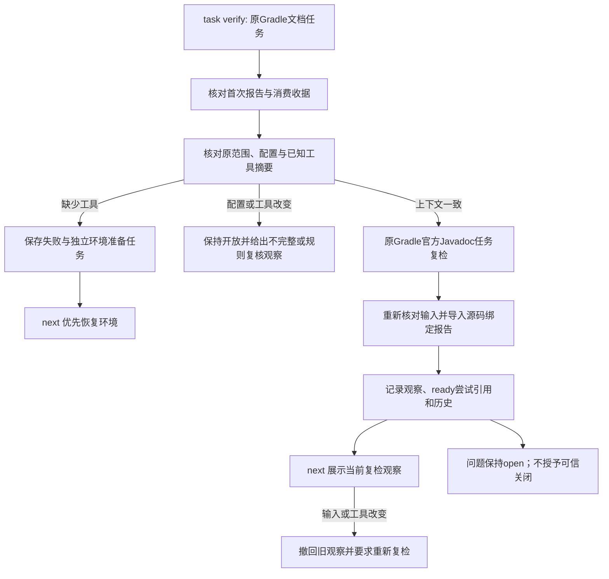

# Gradle Javadoc 公开原任务复检验收

对应 OpenSpec `introduce-rust-codeguard-cli` 的 15.3 / 15.6。本批完成公开复检及智能体失败恢复接线，属于局部原生观察验收，不代表 Java 文档规范或全部语言生产验收完成。内部服务基线见 [此前验收](gradle-javadoc-task-recheck-service.md)。

## 公开行为

```bash
codeguard task verify CG-<原问题身份> . \
  --gradle-bundle /absolute/path/to/gradle-8.10.2 \
  --java-home /absolute/path/to/jdk21 \
  --format json
```

原选定文件集合来自首次已消费报告，不能通过本次参数扩大、缩小或换成其它检查器。构建配置及已知工具摘要改变时不执行原生扫描。Java 文件允许修复，执行前后重新核验输入。已有租约可借用，复检结束后仍由原持有人持有。



## 分类和报告

| 原生结果 | 原任务观察 | 行为 |
|---|---|---|
| 同一问题身份、文件和规则仍存在 | `still_present` | 保留源码任务及原工具复检指引 |
| 同文件同规则出现另一问题身份 | `rule_coverage_requires_review` | 原任务需复核，新问题独立导入；不能把新问题当成原问题 |
| 未再报告原问题 | `candidate_absent_unverified_policy` | 保留开放事实，不将零诊断当作完整文档合规 |
| 缺工具、故障、上下文不完整 | `incomplete` | 保留失败证据；缺工具更新独立准备任务 |
| 原构建配置改变 | `rule_coverage_requires_review` | 扫描前停止，明确要求政策复核 |

协议为 `task_verification_preview 0.29.0`、`repair_brief_preview 0.23.0`、`check_feedback 0.66.0`；内层原生/工作台/复检协议仍为 0.1。旧 schema 不修改。报告保留 `authority: local_unverified`、`delivery_decision: not_evaluated`、`task_verify_status: local_observation_only`。完整原始报告链接在下方，不以删字段示例冒充可直接消费的协议。

输入变化后 `next` 隐去旧 `verification_observation`，改为 `verification_invalidated_reason: gradle_inputs_changed_or_unavailable`。新问题即使首次证据来自复检包裹报告，也可据其原范围执行公开复检。普通 Java 历史查询保留 Gradle 指引，不伪称再次运行了 Gradle。

## 已执行验证

公开 check java/all 的既有条件测试也在当前源码显式运行 1 passed，另包含首次、重复及修复后的三次原生检查，三个聚合反馈均为0.66；不把它与原任务条件测试的五次观察混为一次执行。

真实已有工具：Gradle 8.10.2、Microsoft JDK 21.0.12；只使用本机现有分发，不安装。公开原任务条件测试显式运行 1 passed，包含首次 2 条诊断、原问题复检 2 条、修复原问题后新增方法 1 条、新方法独立复检 1 条、全部注释修复后 0 条。分别验证原身份仍存在、新身份需复核、新任务可复检和未受信消失；输入变化撤回旧观察。记录见 [真实原任务报告](evidence/gradle-javadoc-public-task-native-2026-10-06.json)。

受控夹具另验证缺工具的失败事件及 ready 尝试引用、重复源码修复被拒绝、独立环境任务优先、参数串用/重复/相对路径拒绝、原报告/事实/范围/摘要伪造拒绝、工具身份不匹配不执行及后续工具变化撤回观察。这些夹具不声称运行真实 lint。记录见 [受控失败报告](evidence/gradle-javadoc-public-task-failures-2026-10-06.json)。现有租约回归另覆盖无进展预算为 2、重复失败转入决策和租约保护；本批失败复检后的源码任务已非 actionable，第二次源码尝试应被拒绝，不能强行启动以凑两次尝试。

默认六个目标：47 passed、0 failed、6 条工具条件测试忽略。WASM 构建四个 Gradle 目标：23 passed、0 failed、6 条条件测试忽略。两种构建重叠用例不相加；条件测试的真实执行单列。默认及 WASM 全目标 Clippy、分层、OpenSpec strict、定向格式与差异检查通过。协议验证见 [校验结果](evidence/gradle-javadoc-public-task-schema-2026-10-06.json)：423 份元定义、25 份当前报告、伪造反例和旧消费者拒绝；420 份已有 schema 逐字节保持。

本批测试曾发现同文件新问题被误判原问题仍存在，以及缺工具未生成新的环境准备观察，先失败后修复并重跑通过。一次尝试测试错误地要求失败复检后继续非可执行源码动作，已改为验证拒绝；一次 WASM 命令使用不存在的 feature 未运行，改用实际 `wasm-precheck` 后通过。协议验证暴露的新准备报告引用范围已在新版本修正，不把这些首次失败记成通过。

## 仍未完成

- 全套详细文档注释规则、所有源集/多模块/自定义 doclet 的独立覆盖与误报验收。
- 可信关闭、复发重开及批准政策完整闭环。
- 完整 JDK 依赖闭包绑定；当前核验的是 Gradle 分发、`bin/java` 和 `release` 三项已知摘要。
- 完整符号签名级问题身份；当前基于行内容锚点与序号，新身份需复核。
- 首次私有报告丢失/跨机器恢复、全部超时/取消的持久化故障验收。
- 全平台、真实插件宿主、远端 CI、安装与发布验收，以及 57 种语言四类检查的独立生产资格。

OpenSpec 父任务不勾选，32 份语法候选的正式资格仍为 0/32。此处通过的是指定的公开 Gradle 文档修复路径。
