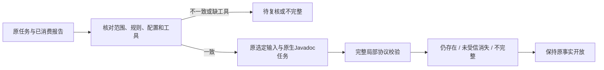

# Gradle 文档原任务复检内部服务验收（2026-10-06）

对应同一 OpenSpec change 的15.3/15.6及native-tool-adapters原输入复检场景。此记录只验收内部服务，不是公开命令、可信关闭或四核心生产资格。

`gradle_javadoc_task_recheck::run`读取已消费的首次报告和工作区收据，验证任务身份、范围、规则与选定输入。仅允许Java源码修复；构建输入变化返回规则待复核，已知Gradle/JDK摘要变化停止运行，缺工具保持不完整。固定init脚本不从报告读取自由命令；原生报告由既有Gradle服务生成。输入/工具摘要可再次核验；原始工具身份不完整时不得把后来提供的工具当作已确认的原始上下文。

反例测试先出现两项失败，并在追加反例中发现删除投影数组会掩盖原生诊断：任务范围/规则被改动仍可进入复检；只有native_status的残缺扫描被分类为候选消失。修复后按集合比较原生与投影定位，拒绝删减/添加及重复投影，并核对任务checker/kind/path/rule，要求完整封闭扫描身份、原生字段/规则/状态及数组；残缺或伪造完整覆盖不形成消失结论。构造原报告用于边界单元测试，不计真实诊断精度。

实测使用本机已有Gradle8.10.2、JDK21，固定选定settings/build/单个Java源文件，未安装工具或插件：

| 观察 | 原生结果 | 内部分型 | 原事实 |
|---|---|---|---|
| 首次原生检查 | 2条缺注释 | 初次问题投影与消费 | open |
| 原输入复检 | 2条缺注释 | still_present | open |
| 补齐类和构造函数注释 | 0条诊断 | candidate_absent_unverified_policy | open |
| 明确取消请求 | request_cancelled，不启动质量扫描 | incomplete | open |

修改源码后旧输入绑定不再有效。原事实未关闭；修复观察没有写入新的消费记录或历史尝试，因为这些公开接线尚未实现。实测原始四份报告及当前相关源码摘要见[evidence](evidence/gradle-javadoc-task-recheck-service-2026-10-06.json)，封闭内部协议见[schema](../../schemas/gradle-javadoc-task-recheck-v0.1.schema.json)。

验证：默认/WASM四个相关目标各17 passed、0 failed、5条件忽略，两个构建相同用例不相加。实际已有工具条件测试另显式运行1 passed，包含上述四次观察（取消不启动原生扫描）。420份schema元定义、3份真实内部复检报告及5种伪造反例通过；默认/WASM全目标Clippy、分层、OpenSpec strict及定向格式检查通过。此前真实条件测试第一次因测试事实文件路径错误失败，修正为findings/<id>/finding.json后重新运行通过；未把首次失败写成通过。

仍缺：公开task verify参数和调度、复检报告首次导入验证、失败尝试/租约/历史接线、next复检观察及输入变化撤回、可信政策/覆盖与关闭/复发。当前公开check反馈0.65、next预览0.22和not_integrated不变；这个内部协议不能冒充公开命令实现。完整详细文档、所有语言/版本/构建器/平台/宿主、精度与发行验收均未完成，15.3/15.6及其他父任务保持开放，0/32正式grammar资格不变。
