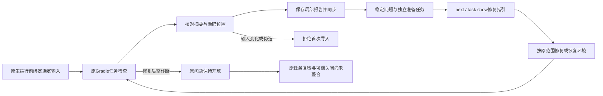

# Gradle Javadoc持久任务和修复指引

对应introduce-rust-codeguard-cli/native-tool-adapters的工作台要求，延续15.3/15.6，父任务仍未勾选。开发CLI的check java/all --gradle-javadoc现在将原生检查前捕获的选定输入用于局部报告绑定，已初始化工作区自动保存并同步。未初始化不隐式创建工作区；输入缺失或检查期间变化不导入旧诊断。无新原生调用，仍是一个调度任务的一次Gradle模型/Javadoc运行。



独立gradle_javadoc_workbench_observation0.1封闭报告包含工作区/run、原选定输入、局部原生报告和重算后的问题/准备投影。首次导入核验工作区、文件名/run、全部字段、当前输入与原生快照及投影；相同run不同字节拒绝。已消费历史报告按原字节收据读取，避免源码已修复后重新导入旧诊断。源码身份沿用投影基础的行锚点约束，不承诺完整符号身份。

存储发现并修复跨状态准备任务冲突：投影中的执行未完成/覆盖未验收仍保留，事实存储使用稳定gradle_javadoc_preparation_required，具体诊断单独记录。取消、执行失败和恢复后无诊断不会创建新准备任务或身份冲突。next只读取最新已消费且摘要/收据/工作区/任务身份匹配的局部观察，先按运行序列选取再读取一份报告，不重复加载全部历史；修改诊断但不匹配原报告会拒绝指引。恢复后改为规则/覆盖政策核验，而非继续安装工具；源码问题与准备任务分开。

任务Markdown包含问题证据、规则依据、允许范围、修复步骤、复检命令、历史尝试和关闭条件。重复扫描追加在稳定记录内；删除Markdown可从事实恢复，删除或勾选不能关闭。next和task show提供相同选定输入的check java --gradle-javadoc参数，工具路径是要求复核的占位，不执行报告自带命令。原任务task verify仍not_integrated，不能冒充已完成复检关闭。

check反馈0.65独立保留gradle_javadoc_tasks；next指引0.22保留Gradle检查器、原生规则和范围。普通Java检查读取历史Gradle指引时也使用0.65，tasks字段为null，不能表示本次执行Gradle。显式请求的tasks对象计数表示整次工作区同步，并非专属Gradle；summary_scope明确为workspace_sync。原生报告不添加工作台字段，旧0.64/0.63协议不修改。人类输出包含同步状态、问题/准备计数和任务指引，质量/覆盖结论保持未验收。

以下摘录不是完整协议输入：

```json
{
  "schema_version": "0.65.0",
  "gradle_javadoc_tasks": {
    "status": "synced_partial",
    "new_findings": 2,
    "new_blockers": 1,
    "summary_scope": "workspace_sync",
    "task_verify_status": "not_integrated"
  }
}
```

API缺失时新测试未解析prepare而RED；另历史Java检查因未选择Gradle指引返回0.61而RED，补齐该明确路径后GREEN。构造报告测试覆盖重复导入、五类首次导入篡改、Markdown恢复、历史Java指引，以及失败→取消→恢复空诊断三个状态保持准备任务身份并更新动作。最新观察诊断被篡改时next返回3并拒绝指引。构造报告沿用原生模板改写，不计真实原生运行或独立精度样本。

默认六相关目标25通过、0失败、8条件忽略；WASM四Gradle目标19通过、0失败、7忽略，与默认重叠。真实已有Gradle8.10.2/JDK21一个条件测试三次公开调用：check java首次2条缺注释、check all复扫2条且任务复用、补齐注释后check java无诊断；均退出3，原问题事实仍open。实际保存的三份工作台报告同时留档，不以构造报告替代持久化证据。见[实际公开调用/存储报告](evidence/gradle-javadoc-workbench-native-2026-10-06.json)、[构造同步记录](evidence/gradle-javadoc-workbench-fixture-2026-10-06.json)、[准备状态转换](evidence/gradle-javadoc-preparation-transitions-2026-10-06.json)及[源码绑定摘要](evidence/gradle-javadoc-workbench-2026-10-06.json)。

419份schema元定义、14份报告及八种伪造/旧消费者拒绝通过；默认/WASM CLI全目标严格Clippy、分层、OpenSpec strict与diff通过。没有执行受保护Erlang草稿或完整工作区回归，没有安装、下载、npm/插件/市场发布或合并，也不声称远端CI通过。原任务原工具复检、可信关闭/复发、完整详细文档规则、源码/配置/JDK闭包、多项目/custom doclet和57语言四核心生产验收继续未完成，正式语法资格仍0/32。
