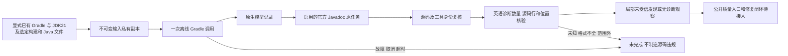

# Gradle 原生 Javadoc 局部应用服务验收

对应 `introduce-rust-codeguard-cli` / native-tool-adapters 的原生 Gradle Javadoc 要求及任务 6.x、8.x、15.3。新增应用服务，不改变当前公开 check_feedback 0.62 配置模型契约，不勾选父任务。适配器 API 测试先因能力缺失 RED；真实空标签描述的解析测试另经历行为 RED，再实现映射。



任务选择依据实际 Java/java-library 插件、启用状态及官方 `org.gradle.api.tasks.javadoc.Javadoc` 实现基类；普通同名任务不能冒充。任务使用完全限定路径，并强制重跑、禁用构建/配置缓存。原模型与 Javadoc 共用一次调用，避免重复启动 Gradle。固定私有 init 脚本只选择原任务和固定诊断 JVM 语言，不替换 doclint/doclet/访问范围/源集。用户构建脚本中配置的缺注释检查是本批样例前提，不声称所有原项目都配置了完整规则。

首次实测发现 `options.locale=en_US` 不能固定 Javadoc 诊断语言，中文诊断被保守拒绝，报告保持未完成。改为给原任务追加诊断 JVM 的 `user.language=en`/`user.country=US` 后，真实 Gradle 8.10.2/JDK21 四组观察如下。一个条件测试运行四组样例；不是四个独立精度测试，更不是独立 holdout。

| 真实样例 | 原生规则和数量 | 局部报告 |
|---|---|---|
| 无类型/构造/方法注释 | JavadocMissingComment ×3 | findings_observed_unverified |
| 有用途但缺参数及返回标签 | JavadocMissingParam、JavadocMissingReturn 各1 | findings_observed_unverified |
| 参数/返回标签无说明 | JavadocEmptyParamDescription、JavadocEmptyReturnDescription 各1 | findings_observed_unverified |
| 完整用途/参数/返回说明 | 0 | empty_output_unverified |

断言逐条核对规则计数和相对文件身份，核对原源码未变化；参数/返回空说明仅扩展新 Gradle 协议，不改变历史独立 Javadoc 协议。stderr 分块的诊断总数、源码原文/caret 位置、未知消息和范围外位置均严格核对。未知输出拒绝整个局部结果，不部分发布源码问题。

闭合报告协议为 [gradle-javadoc-probe-v0.1.schema.json](../../schemas/gradle-javadoc-probe-v0.1.schema.json)，实际完整报告见 [八份报告](evidence/gradle-native-javadoc-reports-2026-10-06.json)。下面仅摘录报告字段，省略身份摘要，不能作为完整协议输入：

```json
{
  "report_type": "gradle_javadoc_probe",
  "native_status": "findings_observed_unverified",
  "reason": "selected_sources_and_complete_documentation_rules_unverified",
  "task_paths": [":javadoc"],
  "findings": [{"path":"src/main/java/Sample.java","rule_id":"JavadocEmptyParamDescription","line":6,"column":8}],
  "rule_configuration_complete": false,
  "coverage_proven": false,
  "authority": "local_unverified",
  "delivery_decision": "not_evaluated"
}
```

实际报告中的位置为原生源码核验结果；以上摘录的行列必须与实际空标签报告一致。无诊断仍不能证明所有适用详细注释规则、配置/源码范围或任务完整执行。

本批默认适配器四目标 15 通过、0 失败、2 条件忽略；CLI 四目标 18 通过、0 失败、5 条件忽略。显式已有 Gradle/JDK 的条件测试 1 通过、0 失败，四组诊断 3/2/2/0。默认前提故障测试输出四份实际应用服务报告（缺工具、提前取消、已过期、缺根构建输入），无源码发现或原生 stdout 身份。四原生和四前提报告均通过 schema；九类覆盖/规则/交付/未知字段/未知规则/未来协议/矛盾状态伪造被拒绝；413 份 schema 元定义通过。

WASM 构建相同两个 Gradle 目标 8 通过、0 失败、4 条件忽略，与默认用例重叠，不累加为独立样本。默认及 WASM 的 CLI/适配器全目标 Clippy 通过；分层、OpenSpec strict 和 diff 检查通过。详见 [同批摘要](evidence/gradle-native-javadoc-2026-10-06.json)。本批未安装下载工具、未发布 npm、未执行用户 Erlang 草稿。

未完成：公开质量入口/智能体反馈、修复任务及原工具复检关闭、完整 JDK 闭包、原项目完整源码及配置范围、自定义 doclet、多项目实际质量任务、故障/取消下完整后代清理验收、详细 throws/字段/行为契约及所有语言覆盖。前后核对 Gradle 完整树与 JDK 入口/release 不等于供应链信任或完整 JDK 绑定。当前父任务、语言生产资格和32份语法正式资格均不由这批局部结果升级。

后续批次已接通公开质量检查，见 [公开入口验收](gradle-public-javadoc-check.md)；本文件描述内部服务批次的证据范围。修复任务闭环仍未完成。
