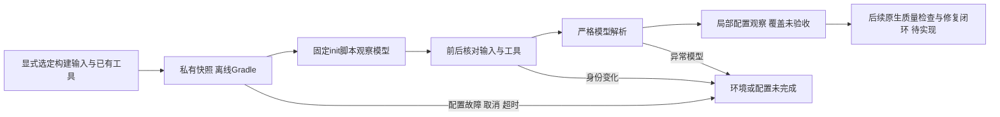

# Gradle原生模型局部采集

对应introduce-rust-codeguard-cli / native-tool-adapters、6.x、8.x、15.5。本批增加Rust应用服务`gradle_model_probe::observe`，不是新的公开CLI指令，也未连接detect/config explain等只读入口。调用方显式选择构建文件与已有Gradle/JDK；不安装插件，不运行质量任务。

固定init脚本由真实Gradle读取插件ID及任务继承链，归一化官方任务基类；根/子项目、目录和enabled事实保留。模型仅描述选定输入副本，不声称完整原项目配置：未选文件、外部插件缓存、全JDK及受信身份尚未验收，报告使用`local_unverified`、`selected_project_files`、`coverage_proven=false`。同名普通任务不能获得OWASP身份，相关任务缺失不代表所有其它检查器不存在。

Rust创建私有工作区并离线执行Gradle，清空继承环境，使用独立HOME、Gradle user home、固定脚本和全新输出路径；原生stdout/stderr仅落私有日志，不注入公共报告。前后核对选定源文件、脚本、整个Gradle制品目录、Java入口及release；输入变更、异常退出、超时/取消、缺报告、重复/未知字段、输出越界或未覆盖composite build均保持incomplete。临时目录采用时间值加原子序列，以避免同进程并发命名碰撞。



以下仅是报告字段节选：

```json
{"schema_version":"0.1.0","report_type":"gradle_model_probe","native_status":"model_observed_unverified","input_scope":"selected_project_files","authority":"local_unverified","jdk_closure_verified":false,"project_sources_complete":false,"coverage_proven":false,"delivery_decision":"not_evaluated"}
```

测试先暴露缺失API（同时存在测试未声明tempfile依赖，随后改用已有标准库临时目录模式）；不把该编译失败当作行为RED。首轮实际进程测试因日志目录不满足runtime私有权限契约而失败，设置0700后复跑。默认覆盖未启动取消/过期/缺输入、进程失败与脱敏、受控成功仍未受信、伪造字段/composite拒绝、私有源码变更与原始源码保留、缺输出及原生超时。真实条件测试使用已存在Gradle8.10.2和Microsoft JDK21，分别采集Groovy多子项目与Kotlin DSL；识别Javadoc/Checkstyle/PMD任务和禁用PMD，同名OWASP普通任务保留实际类名，未授予漏洞能力。

本批不证明OWASP插件原生扫描、依赖图/漏洞库时效、详细注释规则合规、P3C或其它开发规范运行，也不证明稳定任务修复关闭。父任务及四核心生产资格仍开放；全工作区/远端CI/声明平台验收不能由局部结果代替。

当前默认三目标9通过、0失败、2条件忽略（新模型服务4项与既有Java混合归属5项）；显式提供已有工具后两项原生条件测试均通过，不重复计数此前开发运行。实际12份报告通过封闭schema；六类覆盖/JDK/源集资格、未知字段和执行状态伪造被拒绝，410份schema元定义通过。WASM与默认CLI全目标Clippy -D warnings、分层、OpenSpec strict及diff检查通过。受保护Erlang草稿未编辑或执行，仅参与Clippy编译。报告包见[evidence](evidence/gradle-native-model-probe-reports-2026-10-06.json)。远端CI不作为本批完成证据。
