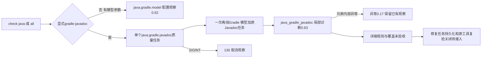

# Gradle原生Javadoc公开项目检查验收

对应 `introduce-rust-codeguard-cli` / native-tool-adapters 的公开 Gradle Javadoc 要求及6.x/8.x/15.3。新公开任务用例先RED（未知参数退出2），接线后返回未完成3并保留原生反馈。新增参数不会将配置观察当作质量检查。

```bash
codeguard check java . --gradle-javadoc \
  --gradle-bundle /absolute/gradle --java-home /absolute/jdk21 \
  --gradle-project-file settings.gradle --gradle-project-file build.gradle \
  --gradle-project-file src/main/java/Example.java --format json
```

`check all`支持同一显式范围；根settings/build和Java源文件必须显式提供。缺前提、重复文档开关、跨语言参数与lint-only范围在原生运行之前退出2。现有仅模型请求仍产生java.gradle.model/check_feedback0.62，不增加文档任务。



复用统一任务图、资源、deadline和取消；不额外启动模型探针。原服务固定脚本、源码位置校验和工具前后身份边界见[服务验收](gradle-native-javadoc.md)。新增闭合check_feedback0.63仅接受Java/all普通检查，并使用独立java_gradle_javadoc槽位；check_aborted0.17保留兄弟异常前的文档结果，0.62/0.16历史消费者不更改。人类输出列出原生规则/位置和同工具复检提示，JSON保留可读诊断，尚不自动生成或关闭工作区修复任务。

真实已有Gradle8.10.2/JDK21公开Java检查条件测试1通过，两次运行分别缺注释3条、完整注释0条；状态findings_observed_unverified/empty_output_unverified，均退出3、coverage_proven=false、rule_configuration_complete=false，无额外模型槽位。不是独立精度语料或完整原项目验收。

默认两个Gradle目标11通过、0失败、5条件忽略；帮助/语言选择/lint范围/SARIF四目标18通过、0失败、1条件忽略。五项异常聚合单元通过；新增单元使用真实服务报告构造兄弟异常，并验证SARIF保留3条诊断、executionSuccessful=false且不泄露源码路径，**不是整个CLI的实际内部故障注入**。公开SIGINT用例先确认受控原生进程启动，再发送信号，实际退出130且任务cancelled，无源码诊断；未声称全部后代清理或真实Gradle异常路径已经验收。

WASM构建相同Gradle目标11通过、0失败、5条件忽略，与默认重叠。五份实际CLI报告（Java/all缺工具、两次真实原生、SIGINT）及一份单元构造异常报告见[报告包](evidence/gradle-public-javadoc-reports-2026-10-06.json)，分别通过0.63/0.17；七类交付、跨语言、覆盖、规则、额外模型、未来协议及状态矛盾伪造被拒绝，0.62旧消费者拒绝新报告。415份schema元定义有效。默认/WASM CLI全目标Clippy、分层、OpenSpec strict与diff检查通过，见[摘要](evidence/gradle-public-javadoc-2026-10-06.json)。未安装下载工具、发布npm、合并或执行/改动用户Erlang草稿。

剩余：自动修复任务持久化及同原工具复检关闭、完整详细注释规则、完整源码配置/JDK闭包、多子项目/自定义doclet及完整取消清理、Maven/Gradle双路径和57语言四核心生产资格。父任务15.3保持未完成，正式语法资格仍0/32；本批没有新的全工作区、远端CI或发布验收证据。

后续0.64修正了此批次Java注释类别仍误报未配置的问题，见[类别归属修复](gradle-javadoc-category-attribution.md)。本批次记录保留0.63原始证据。
