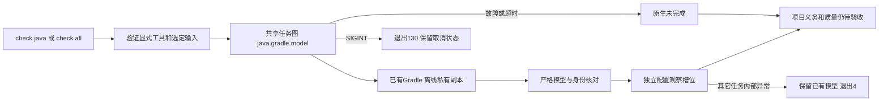

# Gradle模型接入统一项目检查

延续introduce-rust-codeguard-cli / native-tool-adapters的Gradle模型要求，以及6.x/8.x/15.5。新公开用例先RED：`check java --gradle-bundle ...`因不支持参数退出2；接通后返回项目检查未完成的3，并独立保留配置观察。不是新的命令，也不更改detect/config explain的只读职责。

```bash
codeguard check java . --gradle-bundle /absolute/gradle-8.10.2 --java-home /absolute/jdk \
  --gradle-project-file settings.gradle --gradle-project-file build.gradle \
  --gradle-project-file app/build.gradle --format json
```

使用实际Groovy或Kotlin文件，根settings/build均须显式选择。`check all`接受相同参数；重复输入、越界/非普通相对路径、缺参数、跨语言选择在执行前拒绝。`lint all`拒绝模型参数，已有lint-only范围不变。未提供Gradle参数时不增加模型任务或新报告字段，旧协议保持原样。



check_feedback0.62仅适用于Java/all普通检查；`native_results.java_gradle_model`保存0.1模型观察，执行任务状态不授予质量通过。新增check_aborted0.16可保留模型及其它已有局部观察；schema校验发现旧15版本仅支持all，故新16明确允许Java/all，不修改旧版本。原配置类别仍未解析，不以选定副本升级原项目checker身份、源码覆盖或CVE结果。

默认三目标12通过、0失败、3条件忽略；帮助/lint范围/语言选择/SARIF四目标18通过、0失败、1条件忽略。真实已有Gradle8.10.2/JDK21公开检查1通过，仍退出3、CVE配置未解析且无CVE结果；另外两个独立服务条件测试本批未重跑，保留此前批次证据，不累计。四项聚合异常单元测试通过，其中新模型保留用例使用本轮实际模型构造兄弟任务异常，**不是实际故障注入到整个CLI**。

公开SIGINT用例先确认原生进程启动，再发送信号，验证退出130、模型任务cancelled和原生request_cancelled。未声称本批另外验收所有后代进程清理。三份实际CLI报告（原生失败、实际模型、SIGINT）与一份单元构造异常报告分别通过封闭schema；七类交付/覆盖/未知字段/未来协议/状态/跨语言伪造及旧消费者误用被拒绝。412份schema元定义有效。见[正常报告包](evidence/gradle-public-model-check-reports-2026-10-06.json)和[取消及单元异常包](evidence/gradle-public-model-check-additional-reports-2026-10-06.json)。

WASM构建同一模型入口目标7通过、0失败、3条件忽略，与默认用例重叠，不累计独立样本。默认/WASM CLI全目标Clippy、分层、OpenSpec strict及diff检查通过；用户Erlang草稿不编辑、不执行。完整原项目配置、完整JDK、真实质量工具/规则、依赖图/漏洞库及任务修复关闭仍待完成；父任务与四核心生产资格不勾选，npm/远端CI/平台宿主不由此验收替代。
