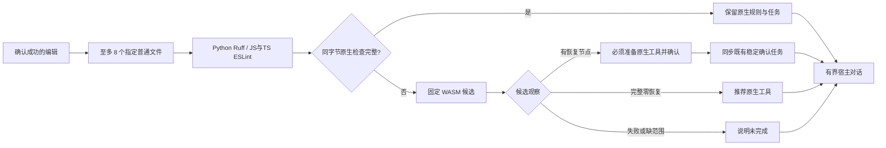

# 编辑事件原生优先与 WASM 候选反馈

日期：2026-10-03。对应既有 OpenSpec S11.17、S14.9、S14.14 的实现进展，不关闭这些父任务。

## 执行行为

- 入口为 `hook execute ROOT --timeout=5s --format=json` 与 `hook claude post-tool-use ROOT --timeout=5s --format=json`，stdin 协议分别为规范化事件和 Claude 事件。编辑允许 `--ruff-tool`、`--node-tool` 显式指定工具；原有复检参数范围不放宽。
- JS/TS 复用模块本地 ESLint 10/flat config 与 Node 观察，结果同步沿用现有稳定任务；重复检查不重复建任务。Python 复用选中文件 Ruff 路径，其局部报告仍不冒充完整工作台报告。
- 快检预选拒绝链接路径、非普通文件和超过 1 MiB 文件；被拒目标逐项可见，不扩大到其他文件。WASM 路由复用 `check all` 的同一函数，不重新遍历项目，最多两个隔离 worker，共享事件截止时间。
- Python/Ruff 指定范围现在只读取源码路径和祖先配置，不枚举目录；最近链接或不可读配置保持 unknown，不退回父配置；并非所有文件系统 I/O 都已经受硬截止时间控制。大型项目的发现成本、缓存与冷启动性能仍须完善和验收，不能由本轮小样例推导固定延迟。
- 除 Python、JS/TS 以外的原生编辑快检尚未接线，在 `native_unwired_files` 明示；WASM 候选不隐去此缺口。32 份 grammar 均保留未验收身份。
- 外层 `hook_execution_feedback` 升为 0.7.0，0.5/0.6 原件留存；`hook_fast_feedback` 0.2.0 包含原生、候选、未执行范围和后续动作。
- Claude 摘要有 1200 字符上限，只投影受限规则 ID、计数和稳定任务 ID；提示 `task show` / `task verify`，不执行任务正文。同步失败提示保留诊断，不虚构任务 ID。宿主普通反馈退出 0，不代表质量通过。

## 实际验证与边界

- JavaScript 原生快检接线测试先失败于旧 `not_run`，修复后通过。
- 稳定任务指引测试先失败于摘要缺少任务 ID，修复后显示真实本地任务及复检命令；重复扫描新增 finding 为 0。
- `check_all_eslint` 使用受控 Node/ESLint 协议替身验证原生优先、规则反馈、稳定任务、缺工具回退、链接拒绝和同步失败；不是一次新执行的真实 ESLint 验收。
- 真正运行内置 WASM：`check_all_grammar_candidates` 将 31 份合法文件分四批送入 `hook execute`，观察语言并集与 manifest 的 32 份资产完全相同（含 Zig、Dart、TSX 与 CFQuery 标签体）。每份观察无恢复、无截断且未跳过；额外未选中的坏 JavaScript 没有被解析。这是最小语法样例的运行证据，不是精度验收。
- 错误 JavaScript 实际 WASM 观察产生恢复节点，摘要要求原生确认；合法样例推荐安装。失败写入、错误宿主事件、越界路径、Stop 循环等既有测试保持回归。
- 实际 CLI JSON 用封闭 schema 验证，并拒绝外层 allow、局部 coverage_proven 和嵌套原生 coverage_proven 伪造。

完整测试终态见同 change 的 verification 追加记录。当前只验证 CLI 宿主协议输入/输出；默认插件 Hook 仍未切换，也没有用真实安装的 Claude Code/Codex/Gemini 自动触发验收。候选恢复发现的稳定任务同步已接入既有工作台；能力匹配原生确认后自动关闭仍待实现。

## 2026-10-04 指定范围发现与候选任务

源码编辑快检现将有恢复节点的固定 WASM 候选同步到既有 `.codeguard/` 工作台：按工作区/文件/语言稳定归并，Python 与 JS/TS 复用原有确认或准备身份。报告保存固定 grammar、源码 SHA-256、已知限制和原字节疑似位置；导入拒绝身份或坐标失配、重复 JSON 键。只有实际同步成功才给出任务 ID；零恢复不创建新的必需任务，也不能关闭旧任务。对话提供 `task show` / `task verify`，缺原生确认 adapter 明确反馈能力缺口。外层 Hook 协议为 0.7.0，局部为 0.2.0；通用 `next` 简报用 0.3.0，已有检查器仍返回 0.1.0。默认插件 Hook、能力匹配关闭和真实宿主验收仍未完成。

实际 Zig 编辑确认任务、重复归并、零恢复不关闭、持久化失败、Python 旧确认身份复用、JS/TS/TSX 稳定准备身份及 Claude 协议上下文见 `hook_syntax_tasks`。后者是实际 CLI 消费宿主形状的事件，不是已安装 Claude Code 自动触发证明。被篡改 grammar、越界坐标和重复 JSON 键不新增任务事件。
