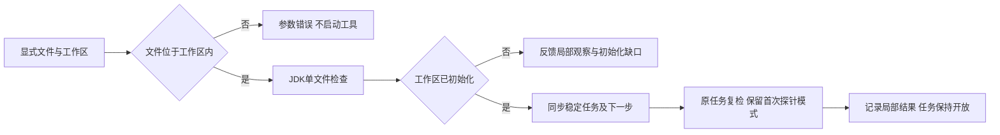

# 显式 Java 文件工作台局部验收

延续 introduce-rust-codeguard-cli 的 C15、6.x 和 9.x，`comments java File.java --workspace ROOT` 将显式单文件原生 Javadoc 观察归入已初始化工作区。工作区外文件在启动工具前拒绝，未初始化工作区不被自动创建；无需 POM，不自动借用父目录项目配置。



公开包装升级0.4，工作台观察0.2、复检容器0.2、修复简报0.3及公开复检0.27；旧schema保留。`observation_scope` 区分 explicit_file_probe 与 configured_project_probe。显式文件只有一行来源且配置引用为空，项目模式的完整观察要求绑定配置。原任务复检从摘要绑定的首次观察恢复模式，不因后来新增POM切换为项目检查。human反馈显示真实任务、模式和复检参数，缺JDK生成准备任务而不指责源码。

TDD最初两项新增用例因尚未接受 --workspace 参数失败。首次实现后复检容器遗漏新增字段的严格键清单，导致同步未完成；补齐清单后通过，没有放宽严格解析。

八个受影响回归目标最终90通过/0失败/29条件忽略，包含参数边界、稳定任务、缺工具、human反馈、旧Javadoc项目模式、任务租约、复检、同步、跨类别及帮助入口。真实已有JDK21另行显式执行四个条件用例，4通过/0失败/0忽略，和前述忽略项重叠，不重复计数。新真实场景经历缺注释、原问题仍在、新增无效POM、补齐类及构造函数文档后局部消失，原任务始终保留开放。没有安装或下载工具。

```bash
cargo test --offline --locked -p codeguard-cli --test java_comments_cli --test java_checkstyle_workbench --test work_sync_contract --test work_sync_cross_category --test status_show_contract --test task_verify_contract --test task_lease_contract --test help_command_contract
CODEGUARD_TEST_JAVA_HOME=/absolute/existing/jdk21 cargo test --offline --locked -p codeguard-cli --test java_comments_cli actual_jdk_ -- --ignored
```

五份新schema元定义及真实文件/项目包装、修复简报、保存观察、公开复检和原生容器通过校验；伪造完整覆盖和文件模式配置引用被拒绝。CLI默认全目标严格Clippy、分层和OpenSpec strict通过。用户Erlang草稿摘要未变，未执行或纳入提交。

未完成：可信关闭与复发、Maven多文件工作台、完整项目覆盖和真实宿主、跨平台验收。9.x等父任务仍开放，本次结果不代替完整工作区或WASM精度验收。
