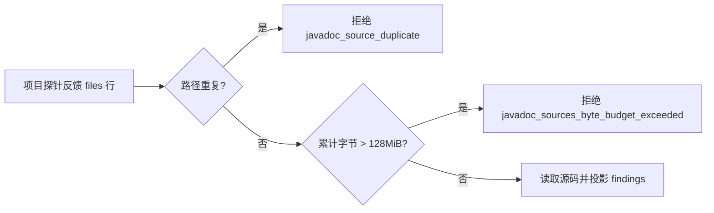

# Javadoc 生成代码范围、文件预算与重载反例验收

对应 `introduce-rust-codeguard-cli` 的 6.3/15.3。本批补齐 Java 文档规范垂直闭环里仍缺的四类反例证据：生成代码范围、文件/字节预算、重载区分、中文注释真实运行；并修复 JDK 工作台缺少的总量字节预算与重复路径拒绝。不授予任何生产资格，父任务不勾选。

## 实现前盘点（不重复实现）

已实现并保持不动：五条缺失规则（`JavadocMissingComment`/`JavadocDefaultConstructorMissingComment`/`JavadocMissingParam`/`JavadocMissingReturn`/`JavadocMissingThrows`）与五条详细描述规则（`JavadocEmptyComment`/`JavadocMissingMainDescription`/`JavadocEmptyParamDescription`/`JavadocEmptyReturnDescription`/`JavadocEmptyThrowsDescription`）的 JDK/Gradle/Maven 解析与稳定任务链路；`project_finding` 锚点+序号身份（跨 Maven/Checkstyle/同步复用，本批不改其语义）。

真缺口（本批处理）：

1. JDK 项目工作台 `javadoc_workbench::prepare` 不拒绝重复路径行，也不限制跨文件总字节——Maven 工作台有 `maven_input_duplicate`/`maven_inputs_byte_budget_exceeded`，同步侧 `work_sync/javadoc_report.rs` 有 `javadoc_source_duplicate`，但进入保存前的入口没有对称防线。
2. 必测反例中的「生成代码」「超出文件预算」「重载」在整个 javadoc 测试族中没有任何用例（grep 证实）。

## RED→GREEN 证据

RED：新用例 `duplicate_project_rows_are_rejected_instead_of_duplicating_findings` 在旧实现下实际失败——重复行被原样接受，报告里出现两份完全相同的 `Bad.java` sources（见运行输出）。`project_rows_beyond_the_total_byte_budget_are_rejected` 同样失败（9×15MiB 稀疏文件被全量接受）。

GREEN：`prepare` 循环内新增 `javadoc_source_duplicate` 与 `javadoc_sources_byte_budget_exceeded`（128MiB 总预算，与 Maven 工作台一致；超限整体拒绝，不裁剪输入）。预算内 8×15MiB 仍可导入，由同用例断言。

## 必测反例覆盖表

| 反例 | 证据 | 结果 |
|---|---|---|
| 生成代码不误报 | `maven_javadoc_probe` 单元：`target/generated-sources/Gen.java`、`src/test/java/Gen.java`、`Gen.java` 三种路径 | `main_java_source_scope_invalid`，零诊断，未设置 `native_plan_sha256`（从未启动原生） |
| 超出文件预算（条目数） | Maven 探针 2002 源+POM > 2001；Gradle 探针 132 选定输入 > 128 | 分别 `source_snapshot_unavailable`、`selected_inputs_unavailable`，均不裁剪、零诊断 |
| 超出文件预算（总字节） | Maven 工作台 9×15MiB（既有防线回归）；JDK 工作台同规格（本批新增） | `maven_inputs_byte_budget_exceeded` / `javadoc_sources_byte_budget_exceeded` |
| 重载不误报且逐个定位 | 真实 JDK21：`add(int,int)` 已文档化 + `add(long,long)` 未文档化 | 恰好 3 条（2×`JavadocMissingParam`+`JavadocMissingReturn`）全部锚在第 11 行（long 重载），int 重载 0 条；补齐文档后 clean |
| 重载身份区分 | `project_finding` 单元：同规则同行两次、不同行各一次 | 同行序号区分、跨行锚点区分，重复调用身份可复现 |
| 中文注释不误报 | 真实 JDK21：完整中文类/构造器/方法文档 | `clean_scope_unproven`，零诊断 |
| 合法继承文档/record/Lombok | 既有真实用例保持（本批未改动，复跑通过） | `{@inheritDoc}`、record 参数、Lombok 类路径缺失行为不变 |
| 无注释/空注释/缺用途/空 param/空 return/空 throws/坏配置 | 既有十规则与解析反例（前批次验收），本批复跑全部通过 | 保持 |

真实 JDK 运行（已装 Microsoft OpenJDK 21.0.12.1，未下载安装）：
`CODEGUARD_JAVA_HOME=... CARGO_PROFILE_TEST_DEBUG=0 cargo test --offline --locked -p codeguard-cli --features wasm-precheck --test java_javadoc_cli real_jdk21_javadoc_missing_and_documented_examples -- --ignored --exact` → 1 passed（13.13 秒）。

## 回归结果（实际命令与输出）

- `CARGO_PROFILE_TEST_DEBUG=0 cargo test --offline --locked -p codeguard-cli --features wasm-precheck --lib` → **144 passed; 0 failed; 6 ignored**（6 项均为需要外部工具的条件用例，未运行）。
- `--lib javadoc` 过滤 → 9 passed / 0 failed（含 RED→GREEN 两项与既有 parent-POM 反例）。
- `--test gradle_javadoc_probe` → 6 passed / 3 ignored；`--test java_javadoc_cli` → 5 passed / 1 ignored；`--test java_comments_cli` → 19 passed / 5 ignored（验证 `prepare` 收紧未破坏 comments/任务复检链路）；`--test maven_javadoc_input_stability` → 6 passed；`--test maven_javadoc_detailed_descriptions` → 4 passed / 2 ignored；`--test gradle_javadoc_projection` → 5 passed / 1 ignored；`--test gradle_javadoc_task_recheck` → 11 passed / 2 ignored；`--test gradle_javadoc_work_sync` → 3 passed / 1 ignored。

证据文件：[evidence/javadoc-scope-budget-overloads-2026-10-07.json](evidence/javadoc-scope-budget-overloads-2026-10-07.json)（含真实 JDK 四组报告、受控反例清单与二进制 SHA-256；注意并行构建共享 target 目录，摘要为本次运行时刻的实际二进制）。

## 尚未完成

- 同步侧 `work_sync/javadoc_report.rs` 自身仍无总量字节预算（本次只在入口 `prepare` 收紧；伪造已保存报告路径仍需共享文件补防线——已列入 needsSharedFiles，未修改）。
- Maven 插件详细描述真实扫描仍缺离线缓存（既有阻塞，不变）；Gradle/CVE 等其它链路未动。
- 可信关闭/复发、完整规则/源集/有效模型、逐语言独立误报评测与平台/宿主/发布验收继续开放；6.3/15.3 及父任务不勾选，正式资格不变。
