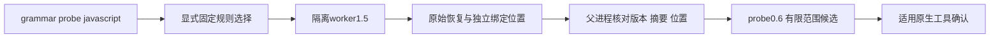

# JavaScript 直接绑定候选的公开probe接线

日期：2026-10-06。对应syntax-precheck / Explicit probe exposes a bounded duplicate binding candidate及14.4/14.9/14.17/14.19，父任务保持未完成。

公开入口实际RED：`const x=1; const x=2;`原先返回零恢复且没有结构候选。Rust adapter新增固定规则包摘要和四种AST节点配置；显式probe选择同一runtime扫描器的规则阶段，通过受控worker运行。私有1.5与公开0.6新增版本，保留原始恢复、未验收grammar、native未运行、交付未评估和退出3，不伪造ERROR/MISSING。

仅有明确重复直接简单lexical绑定时输出0.6及structural_rule_scope=direct_simple_lexical_names_only；合法嵌套、var、文本与顶层return不猜成候选。零结构观察沿用旧0.1或原未完成协议。Unicode/CRLF位置和128记录截断保持可见。父进程拒绝规则ID/摘要、语法资产/源码摘要、位置、旧/未知版本及未选择该规则的消费者；八种篡改与旧读者上下文负例实际通过。三份实际0.6报告通过封闭schema，九种虚假权威/范围/规则/版本/截断变体拒绝。

新公开目标初次2项1通过/1失败，修复后四项通过；追加范围字段后最终四项再次通过，3.56秒。相关六目标42通过/0失败/2条件忽略，与新目标重叠不累加；范围字段追加只影响新JavaScript协议，该目标已按最终源码复检。此前runtime实际Node16轮对照见[事实验收](javascript-direct-binding-facts.md)，不冒充本批重新执行原生工具。[实际重复绑定报告](evidence/javascript-binding-probe-2026-10-06.json)仅来自合成测试源码。

本批没有升级check/lint、Hook、任务同步或原生差分报告到新规则。它们暂沿用同一worker的原规则选择与旧协议，避免未升级消费者接收不认识的结构；下一阶段必须补齐这些入口的规则选择、schema、稳定确认任务与真实对话/复检，才能关闭完整任务。已知原始parser FN及既有组合统计不改写；顶层return仍需要CommonJS/ESM上下文。未修改WASM字节、npm或插件锁，不宣称32语言资格、完整项目覆盖、可信关闭或发行通过。

最终默认/WASM两种CLI及adapters全目标严格Clippy、所改Rust文件定向fmt、OpenSpec strict、crate分层和diff检查通过。三份最终0.6报告的schema校验在范围字段及最终源码目标复检后执行。未执行完整workspace/358例重放或未提交Erlang草稿，不把局部通过升级为完整验收。
