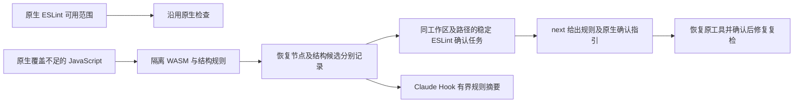

# JavaScript 直接绑定候选的项目与任务接线

范围：既有 OpenSpec 14.9、14.10、14.11、14.19。公开 grammar probe 的直接简单 let/const 名称重复候选，现在复用项目原生优先计划之后的隔离 worker，接入 `check all` 和确认写入的编辑 Hook。

候选不输出标识符内容，不伪造 ERROR/MISSING。直接顶层简单 lexical 绑定以固定规则包、源码与 grammar 摘要及 UTF-8 字节位置绑定；嵌套作用域、var、字符串及 CommonJS 顶层 return 不扩大为违规。报告最多展示8条位置，原worker记录/访问预算和不完整状态仍保留。

新协议：项目反馈0.54、候选确认观察0.13、编辑反馈0.15/外层Hook0.27、JavaScript下一步简报0.20。旧协议及 schema 文件不改；结构身份及跨语言版本由Rust导入读者验证，schema本身不替代字节核验。项目报告包含新简报时使用0.54，即使本轮已无结构候选，避免新消费者字段落进旧协议。

同工作区、路径与ESLint准备身份只保留同一任务。重复项目检查与编辑检查追加观察，不生成源码finding。下一轮候选干净、安装工具或任务勾选都不能关闭；必须沿原生能力匹配和可信策略契约完成关闭。候选报告不可当作ESLint原生准备报告读取，next明确要求检查原JavaScript方言与原配置。

验证：新增端到端测试先失败于项目未投影结构候选，修复后验证重复项目扫描/编辑事件共用ID、四种伪造导入拒绝、源码改为合法嵌套作用域后任务仍开放。测试开发期间保留两次Hook参数夹具修正；受影响旧TypeScript测试揭露任务引用兼容文案，已恢复同时指向observations/syntax_evidence。实际JSON校验还发现next封闭协议和Hook最新原生字段缺口，已补新版简报与显式null槽位。

本轮不证明真实Claude/Codex/Gemini宿主触发、独立 `lint typescript` 结构接线、全部32语言精度、独立holdout、可信政策提供者或公开发行；语言资格仍0/32，父任务继续未完成。受保护Erlang草稿保持原字节，不执行或提交。

最终受影响八目标：79 passed/0 failed/3 ignored；条件忽略不计真实原生验收。此后新增Claude CLI输出摘要断言，端到端目标再次1 passed；两者重叠不累加。365 schema元定义、5份实际新协议输出及5个语义伪造变体通过；Rust导入另拒绝四种身份/位置/版本篡改。实际产物见[合成工作区报告](evidence/javascript-binding-workbench-2026-10-06.json)。Clippy初次暴露报告版本选择的重复条件，合并等价条件后复检；完整默认工作区/完整358样本/真实宿主未在本批运行。

WASM/默认两种CLI全目标Clippy `-D warnings`最终均退出0；格式、分层、OpenSpec strict及diff检查通过，旧schema未修改。报告版本条件合并后最终契约回归结果另补，不将前批全套或远端CI作为本批证据。

最终源代码下新增端到端与next/work sync契约三目标：27 passed/0 failed/2 ignored。与前述目标有重叠，不累加为整体覆盖。
