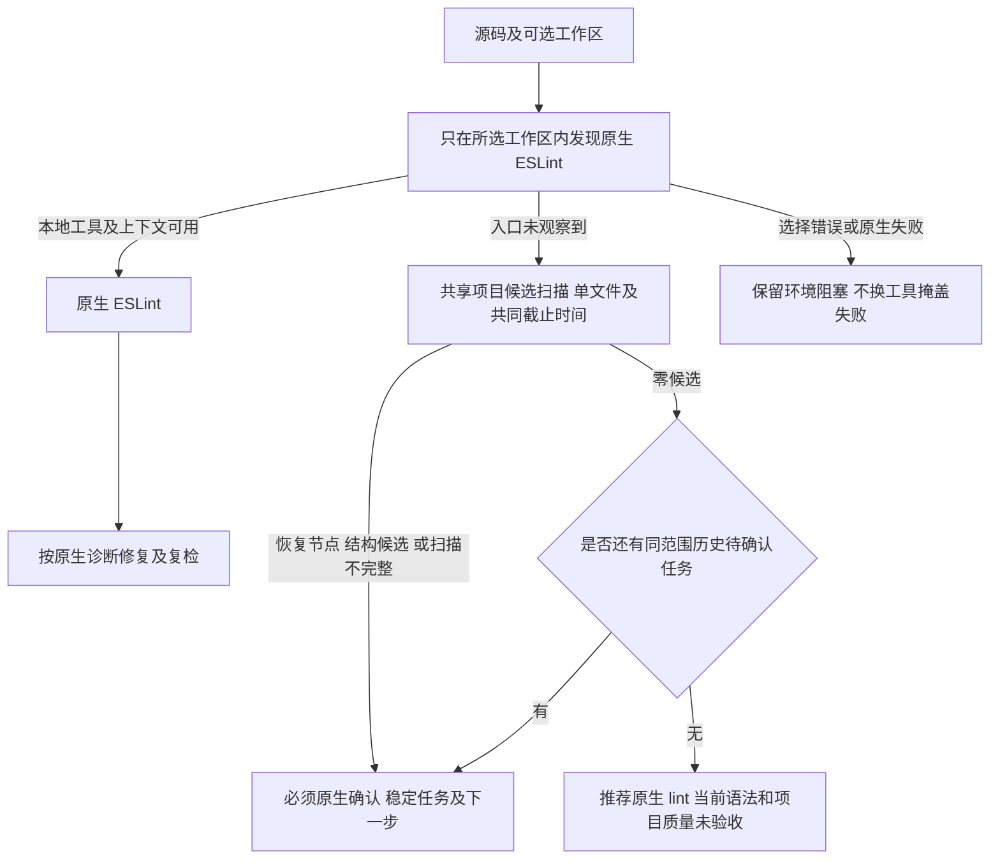

# JavaScript 独立 lint 的原生优先与候选修复指引

关联既有 OpenSpec 2.1、2.7、14.5、14.6、14.9–14.11、14.19。`lint typescript` 是当前 ESLint 统一入口；它对 `.js`、`.mjs`、`.cjs`、`.jsx` 使用 JavaScript grammar，对 TypeScript/TSX 保留对应 grammar，不靠命令名称误用 TypeScript 解析器。



```bash
codeguard lint typescript /absolute/project/app.js \
  --workspace /absolute/project --format=json
```

无任何显式工具上下文且没有可用本地 ESLint 时才使用回退观察；明确选择的原生入口失败不能换成 WASM 并抹掉失败。新候选反馈0.6复用项目候选报告及稳定任务同步；不保存第二套结构证据、不重复解析同一输入。JSON原始恢复和结构候选分别记录；human显示有界位置及规则，不输出标识符或源码片段。原生义务、工作区覆盖与语言资格仍未证明，退出3。

无历史待办的完整有界零候选观察给出 `setup.requirement=recommended`。历史同范围任务仍开放时保留其ID，并显示 `native_confirmation_still_pending` 和 `required`；不因本轮初检没再发现问题而隐藏原生确认要求。重复独立/project检查复用ESLint身份；安装、任务勾选或WASM零候选不关闭。

协议schema `eslint-local-feedback-v0.6`保持旧0.5及更早版本字节不变；跨语言结构、伪造完成/发现、推荐与当前候选矛盾、待确认任务无ID均被schema拒绝。任务导入的源码/grammar/规则身份仍由共享Rust读者核验，schema本身不授予关闭权威。

测试过程：初始公开测试暴露等号格式参数缺口，解析器独立RED后实现统一等号/分隔写法，混写重复、空值和未知参数均拒绝；候选规则与任务接线随后通过。旧TypeScript用例原来预期JavaScript无回退，已保留其“不误用TS grammar”意图并验证新JavaScript观察。另一个实际副作用RED证明独立原生发现越过子工作区启动父工具；修复后复用既有有界发现，不执行父工具或工作区外源码。

覆盖：四种JavaScript扩展、重复扫描/project同ID、后续合法嵌套作用域仍保留历史确认、CommonJS顶层return/重复var/字符串、相对路径、原生优先和所选失败不回退、工作区未初始化、报告目录symlink、外部源码以及human脱敏。原生优先的脚本工具是受控协议夹具，不作为真实ESLint验收；本批没有重跑完整默认工作区、358样本、全部32种精度、真实宿主或发行验收。受保护Erlang草稿不执行/提交，资格仍0/32。

上轮ead1514的CI37401747231终态：MSRV成功、gate失败；gate在源码审计前因插件提交dec5f9d远端不可达退出。该阻塞没有跳过或换源规避；本批CI按新提交另核验。

最终源码的四组WASM定向回归：34 passed/0 failed/0 ignored；参数协议独立目标1 passed（其他库测试被过滤，不计入覆盖）。默认/WASM CLI全目标Clippy `-D warnings`均退出0，格式/分层/OpenSpec strict及diff检查通过。366份schema元定义、19份实际0.6反馈和7个伪造/矛盾变体通过；[五种实际反馈](evidence/javascript-lint-candidate-2026-10-06.json)包含同ID的原候选及后续待原生确认、无待办推荐、同步失败和范围阻塞。新测试中原生工具为脚本夹具；真实宿主和真实ESLint不借用这些结果。默认原生入口回归结果另补。

默认原生入口三目标最终8 passed/0 failed/6 ignored；6项真实工具条件未执行，不计原生验收。默认参数单目标1 passed，与特性参数目标是同一行为，两者不累加为独立覆盖。最终Erlang草稿SHA-256保持 `2e3a296072e6a3aa34b561799c18c7d8b621d00f8786301d2612cee8cdab85b6`。
