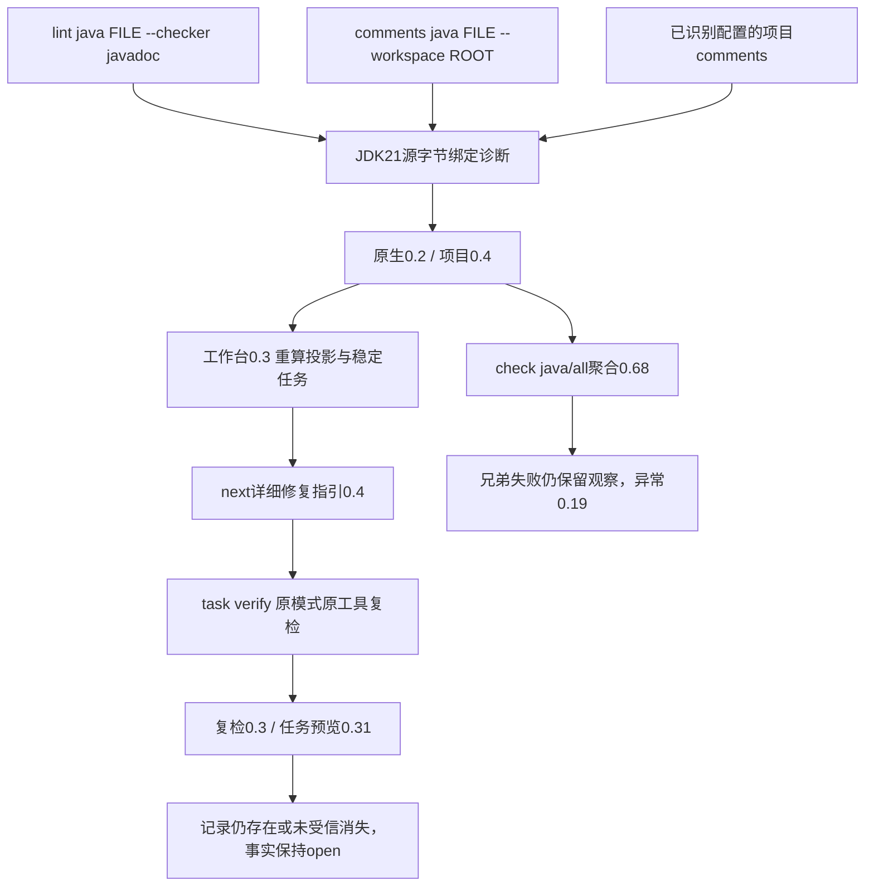

# 独立JDK21详细Javadoc诊断验收

对应 `introduce-rust-codeguard-cli` 的15.3/15.6，继续补齐原生规则到修复任务的公开路径；不授予完整Java文档或57语言生产资格。

## 问题与实现

JDK21 `-Xdoclint:missing` 会对空注释、缺主描述及裸参数/返回/异常标签发出warning，退出码仍可为0。旧独立JDK解析器把这些消息当未知格式，无法生成源码修复任务。`empty comment`回归先RED，再新增 `parse_detailed_javadoc_output`；旧 `parse_javadoc_output` 保持原五项缺注释/标签契约，Maven继续调用旧入口。

| 原生消息 | 规则 |
|---|---|
| `empty comment` | `JavadocEmptyComment` |
| `no main description` | `JavadocMissingMainDescription` |
| `no description for @param` | `JavadocEmptyParamDescription` |
| `no description for @return` | `JavadocEmptyReturnDescription` |
| `no description for @throws` | `JavadocEmptyThrowsDescription` |

固定英语消息、隔离文件路径、原源码行、caret和汇总数逐项核验。未知消息、错误、错位置、残缺块保持未完成；不根据注释文字存在或长度猜测契约充分。

## 公开执行路径



文件模式不借用后来新增POM；配置项目模式保留原配置摘要及既有主源码范围。Maven多文件模式仍独立，不回退到JDK单文件。新版comments文件反馈0.7、工作台反馈0.8；原Maven反馈版本保持。聚合检查不因此获得完整交付资格。

## 实际已有工具验收

使用本机Microsoft JDK21.0.12.1，不安装工具。条件测试 `actual_jdk_detailed_descriptions_file_and_configured_project` 显式执行，两种模式各运行四组受控样例：

| 样例 | 显式文件 / 配置项目诊断 | 原任务复检 |
|---|---:|---|
| 空类型、构造器、字段、方法注释 | 4 / 4 | 每张原任务仍存在；完整修复后候选消失，仍open |
| 裸参数、返回、异常标签 | 3 / 3 | 每张原任务仍存在；完整修复后候选消失，仍open |
| 只有标签，没有用途 | 1 / 1 | 原任务仍存在；完整修复后候选消失，仍open |
| 详细中文说明及合法`inheritDoc` | 0 / 0 | 无源码任务需要复检；零诊断仍不证明覆盖 |

实际8次comments、16次存在复检、16次修复后复检、4次直接lint和4次check，共48次JDK质量调用；`next`查询不计原生执行。16张原任务逐项复检并记录事件。保留实际源码、摘要、原生/工作台/任务反馈和CodeGuard二进制SHA-256，运行结束复核同一二进制；见[实际证据](evidence/jdk-javadoc-detailed-descriptions-native-2026-10-06.json)。受控样例不是独立精度语料，不用重复调用扩充TP/FP数量。

## 协议和回归

新协议全部独立新增，430份历史schema逐字节不变。首次schema检查发现旧JDK brief误复制了Checkstyle运行编号格式，纠正新版契约后102份实际报告和1份[构造兄弟失败反馈](evidence/jdk-javadoc-detailed-descriptions-aborted-2026-10-06.json)通过。构造反馈仅验证诊断保留，不声称兄弟故障真实发生。440份schema元定义、7种伪造和6个旧消费者拒绝验证见[协议证据](evidence/jdk-javadoc-detailed-descriptions-schema-2026-10-06.json)。

运行时首次导入测试拒绝外层、内层及双层降级三种伪装，不增造任务。复检容器与内层版本配对，不把新详细规则藏进历史协议；规则身份、源码摘要和稳定投影仍复核。未知输出、缺配置/工具、配置变化、失败尝试/预算、历史任务及Maven独立上下文回归保留。

默认CLI最终11个相关目标116通过、0失败、30项工具条件忽略；适配器三个目标13通过、0失败、2项Maven条件忽略。聚合版本断言首次失败后已按新版JDK观察更新并重跑。条件忽略不计验收；实际JDK条件测试另1通过，兄弟失败单元另1通过，不相加为全工作区验收。WASM构建五目标61通过、0失败、15项条件忽略，与默认构建重叠用例不相加；定向格式、分层及OpenSpec strict通过。默认/WASM全工作区全目标严格Clippy通过；未执行受保护的用户Erlang草稿测试。

## 仍未完成

Maven详细描述规则、Checkstyle描述/摘要模块、所有源集/模块/JDK/doclet及详细行为契约、依赖与工具闭包、独立误报评测、可信关闭/复发重开、完整宿主与平台验收仍未完成。任务父项15.3/15.6保持开放，语法正式资格仍0/32；此批未发布npm、插件或市场，未合并PR。


复现实际条件测试（`CODEGUARD_TEST_JAVA_HOME`指向已有JDK21，不安装工具）：

```bash
CARGO_PROFILE_TEST_DEBUG=0 cargo test --offline --locked -p codeguard-cli   --test java_comments_cli   actual_jdk_detailed_descriptions_file_and_configured_project -- --ignored --exact
```

WASM构建使用项目实际feature `wasm-precheck`，不要求Node解析器或tree-sitter-cli。
