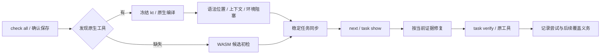

# Kotlin 首次原生扫描局部验收

日期：2026-10-04。对应既有 introduce-rust-codeguard-cli 的 syntax-precheck 场景及语言适配、修复闭环、宿主反馈任务；父任务保持未完成。本记录不代表 Kotlin 完整语言资格、可信关闭或公开发行。

`check all` 与确认保存的 `file_changed` 对普通 `.kt` 先选择显式工具，否则调用环境绝对 PATH 的首个 kotlinc。最多 64 份文件顺序调用，共用请求截止时间；`.kts` 不进入此原生单文件编译。只有工具缺失才回退候选 WASM，已选择入口的版本、执行或上下文失败保留原生事实。编译器限定 Kotlin/JVM 2.4.10；身份目前仍仅绑定 launcher，不证明 JAR/JDK 身份。

实际编译器记录：[首次原生报告](evidence/kotlin-native-first-2026-10-04.json)。包含首次/重复扫描、原生来源任务复检、显式工具保存 Hook、修复后的零诊断、混合语法与上下文、缺工具候选回退，以及当前 next 简报。同一任务身份持续复用，修复后的任务保持 open；没有伪造语法 grammar SHA，也没有以单文件零诊断替代完整项目门禁。报告里的任务 ID 和绝对临时路径来自实际执行，不能照抄到其它项目。

新协议：扫描0.1/0.2、原生来源事实0.4.0、复检0.6.0、任务反馈0.17.0、首次原生简报0.10.0、聚合0.42.0、保存 Hook0.11.0。已有 Kotlin WASM 来源及其它语言维持旧报告版本。旧 schema 文件必须逐字节不变；旧消费者拒绝新版本。

本轮先复现三个首次扫描缺口、human 位置缺口、显式保存参数路由错误和预算计数遗漏，再补实现。实际 schema 校验另发现新的执行任务 ID、候选原因与首次报告引用需要独立协议，未放宽旧定义。回归范围包含 Kotlin、原生首次 Erlang、Erlang 任务及 Hook；未宣称全 workspace 复跑。

剩余：完整项目 lint/注释/类型/依赖/安全/CVE、编译器与 JDK 信任身份、更多版本和平台、独立质量语料、真实宿主市场安装、可信关闭及发行。32 种 grammar 完整资格仍为零，不能以本记录勾选完整语言或发行父任务。

## 本轮最终验证

- 首次 Kotlin 集成：5 passed；原生未观察范围偏好：1 passed。
- 受影响 WASM 目标最后一轮：Erlang 聚合11 passed/1 ignored、Kotlin 独立9 passed、Kotlin 任务3 passed；之前 Hook/Erlang 任务与工作区目标均通过。各轮有重叠，不合计为全量规模。
- 默认目标：Erlang 聚合11 passed/1 ignored、Kotlin 独立9 passed。真实编译器操作单独执行，不借 ignored 目标宣称执行。
- 新实际协议5 tests、旧 Kotlin 任务协议5 tests、旧单文件协议4 tests通过；225份 schema 元定义、217份旧 schema 字节不变、OpenSpec strict、分层、fmt、默认及 WASM Clippy通过。
- 上一提交40388ba的 CI 37207892698 已成功；本批新提交的远端结果需独立等待。公开 npm/插件锁未更新。

实际报告 SHA-256：`a635af4e905167ca4a8fd0e5550ec8d2fd162916ea3177b8ff41b098a9e35c3d`。

日志身份：

- `/tmp/codeguard-kotlin-first-red.log`：`07f0f20bba036cffc88bea598503666c5d3d2b6e739bd44523f7a77be8a2cf94`。
- `/tmp/codeguard-kotlin-first-human-red.log`：`06d3fb0d86216ed45875fcf038ac62476fd40610ec65676da735ba8c6c9c6f11`。
- `/tmp/codeguard-kotlin-explicit-hook-red.log`：`a1dde53c8fba964a8ceb378b5490998659356c60c91a96b8176921d14047899f`。
- `/tmp/codeguard-kotlin-first-budget-red.log`：`e7d43bdca54b46e2a318a2ef33405301e471111b404c8db76b08a395f150e4f5`。
- `/tmp/codeguard-kotlin-first-unobserved-red.log`：`b88e5cc49bc391a7fb84b23052a99c0559c614fccb1e55ecf6f87488dd194e71`。
- `/tmp/codeguard-kotlin-first-unobserved-green.log`：`5a1467c7524b8ae4635cc58b0d65c2ed237205cae6624d75a7ba0cff531f7ac1`。
- `/tmp/codeguard-kotlin-first-final-regression.log`：`c8633a4f3d1a200e6a0cf09a7f95c8ccbb0ec7779309de78cb6fa2f7ecf8f30c`。
- `/tmp/codeguard-kotlin-first-default.log`：`581eb89e0ef5f3e4ba19db18c38856904b6454baf8dfc349d8add0a95c5046e8`。
- `/tmp/codeguard-kotlin-first-final-clippy.log`：`405c904d020cd2f7c832f65abe273df8526bc638e1d02dadf5e742c3c69dd332`。
- `/tmp/codeguard-kotlin-first-schema.log`：`944afeae0db2b8bb200fc27f1b29365a87febf7a0d978df4b31c058a5ebbb393`。
- `/tmp/codeguard-kotlin-first-actual.log`：`14ec6f246cd39eabac048941a214c5c27202e11b48f481ad7024612e85cd78bf`。
