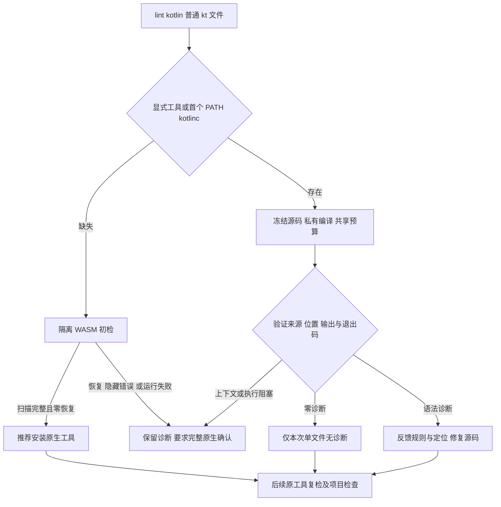

# Kotlin 原生优先单文件检查验收

日期：2026-10-04；对应 OpenSpec 8.7/8.8、9.9、14.4/14.10/14.19 的局部实施。完整父任务保持开放。

已实现 `codeguard lint kotlin FILE.kt [--kotlinc-tool ABS_PATH] [--timeout DURATION] --format human|json`。显式入口优先，未指定时选择调用环境绝对 PATH 的首个普通可执行 kotlinc。已选择工具的版本/执行失败保持原生阻塞；只有工具缺失时使用固定 Kotlin WASM。没有下载、安装或运行项目构建脚本。

原生命令为冻结输入加 `-nowarn -Xrender-internal-diagnostic-names -d PRIVATE/classes`，类产物不执行。编译器官方参数见 [Kotlin compiler reference](https://kotlinlang.org/docs/compiler-reference.html)。`[SYNTAX]` 单独归类，未解析引用等语义信息保留在上下文列表；同位置同规则归并，最多32项。编译器列单位实际为 UTF-16，转换后字节列与原列并存。只接受冻结绝对路径或实际私有 renderer 的 `Sample.kt`，不接受其它文件。

## 本机真实工具证据

本机已安装 Kotlin/JVM 2.4.10；[六例完整报告](evidence/kotlin-native-single-file-2026-10-04.json)包含程序摘要、原文报告摘要和源码未变检查。证据 SHA-256：`0b53d8d9394b0a9bd53d7e5792e3fbe0baf7da0670f777397c0f4f7108dbb74b`。

| 场景 | 原生状态 | 语法数 | 上下文数 | 必须进一步原生确认 |
|---|---|---:|---:|---|
| missing_type | diagnostics_observed | 1 | 0 | False |
| valid_object | completed | 0 | 0 | False |
| unresolved_type | incomplete | 0 | 2 | True |
| unicode_missing_expression | incomplete | 1 | 1 | True |
| missing_tool_hidden | incomplete | 0 | 0 | True |
| missing_tool_zero | incomplete | 0 | 0 | False |

缺类型位置为1:10。含 emoji 的缺表达式原生列为 UTF-16 32、字节列34。合法 object 原生零诊断，避免直接按 WASM 隐藏错误改源码；未解析类型保留2项上下文，不造语法错误。所有反馈退出3、完整交付未评估；没有把工具环境故障变成代码违规。

## 回归与边界

默认入口9项、WASM入口9项、纯解析4项通过；crate边界7项以及相邻 next/status 共11项通过。默认/WASM 全目标严格 Clippy 通过。真实六例报告及伪造权威、错误语法规则、未完成却取消确认要求共4项 schema 测试通过。原有210份 schema 字节不改；新协议单独定义。目标失败测试先暴露原生未完成被推荐跳过、双后端缺失和终端缺定位，再修正实现。

- `/tmp/codeguard-kotlin-inconclusive-setup-red.log`：SHA-256 `8d6af8a0241722d1917963d83a8fe0f8b9afef3d62302d1ac430719a34aba850`。
- `/tmp/codeguard-kotlin-human-red.log`：SHA-256 `50a1e1705b13be7700d1cc63b780123c8d3f3d793e36a9e997e84bd95d363e70`。
- `/tmp/codeguard-kotlin-no-backend-red.log`：SHA-256 `8ae47ee177431d046530627b0020195b764e47f596fc06a1dcbea5195ecb2a33`。
- `/tmp/codeguard-kotlin-current-default.log`：SHA-256 `3226b911fcacd28acea2b6afbd76188936e75f200d8bfcb037d4533df5a15d0e`。
- `/tmp/codeguard-kotlin-current-wasm.log`：SHA-256 `da41abd372a3708d82346c7f6bafe58af38c0a9b412d0bba7632db419fbcd851`。
- `/tmp/codeguard-kotlin-parser-current.log`：SHA-256 `8f58ff4205203246d4a38732f3a66ff10ceae524bd2238061ffd9d7008a509d7`。
- `/tmp/codeguard-kotlin-neighbor-current.log`：SHA-256 `26527a244a09c8254775fccea0e0ffe31d1bbd573087d04fd0495faa99a88365`。
- `/tmp/codeguard-kotlin-clippy-default-current.log`：SHA-256 `96698b739543cda7aacd36c9307bbc81ae9db2b9e30f9daf9e017e1a7c5df6f6`。
- `/tmp/codeguard-kotlin-clippy-wasm-current.log`：SHA-256 `9d1f77c7385c8d8ab04db309e7a36353842d23078868e8b5517dc63f271c3678`。

## 未完成验收

此入口只观察单一冻结 kt 文件；只绑定 launcher，没有完整绑定编译器 JAR/JDK。聚合 check、Hook、持久任务 task verify 尚未接通该 adapter；完整 Kotlin lint/注释/CVE/依赖、跨版本、独立 holdout、性能和发行验收尚未完成。完整 Kotlin 和 WASM 父任务不得勾选；32种 grammar 全语言资格仍为0。公开 npm0.1.4不包含此源码增量。下一步应接通现有稳定任务的原生复检，而非将完成状态改成通过。
