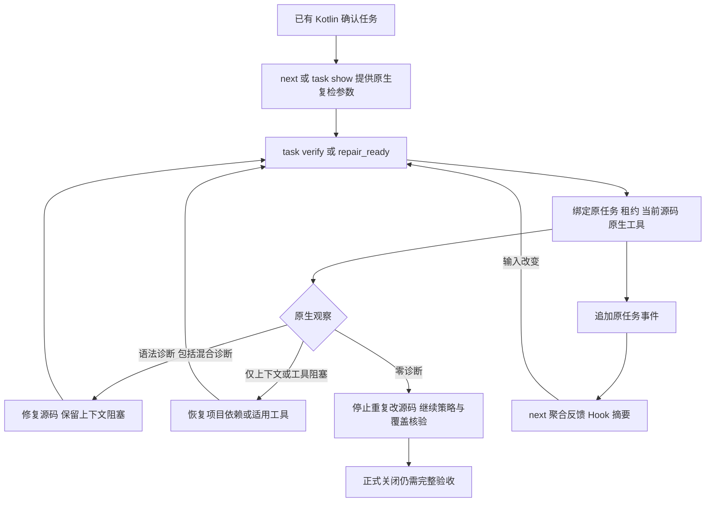

# Kotlin 稳定任务原生复检验收

日期：2026-10-04；对应 OpenSpec 9.9/9.10、14.4/14.10/14.19 的局部实施，完整父任务保持开放。

独立 lint 的实际 Kotlin/JVM2.4.10 冻结编译现在用于已有 `syntax.native_confirmation` 任务。`task verify ID . --kotlinc-tool ABS_PATH --format=json` 和 `repair_ready` 接入同一租约、原报告、稳定任务与追加事件；未显式选工具时复用调用方绝对 PATH 的首入口规则。错语言、相对或重复工具参数在原生启动及租约取得之前拒绝。首次 `next` 不再声称 Kotlin adapter 缺失；`task show` 外层动作保留工具选择参数。



## 真实本机证据

[完整反馈](evidence/kotlin-native-task-confirmation-2026-10-04.json)绑定程序摘要 `930c93ab0404c84bded3601e6da2b3b293b7689e75fd25658ad263d80a2db00c`；记录在开发基线 `e6413aba529d051338c6ff618728438f8957e661` 之上的未提交接线，不能解释为该基线已包含新功能。证据文件 SHA-256：`396529cd8c1bc27f14177bf5937ce4235acce01daa0bf048afc7efd71e1fb798`。本机已有编译器2.4.10；没有安装工具、改宿主设置、发布包或实际加载市场插件。

| 场景 | 任务观察 | 原生状态 | 语法数 | 上下文数 |
|---|---|---|---:|---:|
| bad | still_blocked | diagnostics_observed | 1 | 0 |
| fixed | candidate_absent_unverified_policy | completed | 0 | 0 |
| context | incomplete | incomplete | 0 | 2 |
| mixed | still_blocked | incomplete | 1 | 1 |
| missing | incomplete | incomplete | 0 | 0 |

一个稳定任务复用修复前、修复后、源码变化、缺工具和上下文记录。源码变化后 `next` 撤销旧位置；修复后零诊断仍保持 task open。真实混合样例含 emoji：语法位于字节列34/UTF-16列32，上下文位于字节列31/UTF-16列29。混合结果的操作为 repair-source，同时保留未完成上下文；仅上下文则不授权语法修改。`repair_ready` 和聚合报告均持有当前有界位置及报告引用。

报告字段摘录（不是可独立通过完整 schema 的报告）：

```json
{"observation":"still_blocked","native_scan":{"native":{"status":"incomplete","reason":"kotlin_project_context_unresolved","diagnostics":[{"line":1,"column_byte":34,"column_utf16":32,"rule_id":"kotlin.syntax"}],"context_diagnostics":[{"line":1,"column_byte":31,"column_utf16":29,"rule_id":"kotlin.context.VARIABLE_WITH_NO_TYPE_NO_INITIALIZER"}]}}}
```

## 已执行检查

Kotlin任务3项通过；独立入口默认/WASM各9项、解析4项和历史身份/坐标2项通过；crate边界7项、next/status11项通过。相邻 Erlang13、Swift7、通用语法任务8项通过（共4项显式工具用例未运行）；旧 Erlang 草稿保持原字节，不纳入本提交。新真实报告 schema5项、既有 Kotlin独立报告4项通过；217份schema元校验，旧211份原字节保留。默认/WASM全目标严格Clippy、fmt、分层和OpenSpec严格校验通过。

原始目标失败先暴露缺参数/错误能力决策、混合诊断不进入修复以及 task show 外层缺工具选择。真实报告验收又发现 mixed 的 action_id 错误，修正后重新归档最终构建并通过 schema。纯验证器移到 adapters，没有通过放宽 CLI 分层门禁处理。

- `/tmp/codeguard-kotlin-task-red.log`：SHA-256 `ec3fd4cddde51a9d29fd9ba4f445710061197c1b16b57d3245016354c5df9930`。
- `/tmp/codeguard-kotlin-mixed-task-red.log`：SHA-256 `74b434972d469fa9027107d8e1cc38d960f075931f49037af2fab5173045be6c`。
- `/tmp/codeguard-kotlin-initial-show-red.log`：SHA-256 `11f7f5e7744a454344fd4eaa52f491373a78f97ee9849146ce59d0b84695ff4b`。
- `/tmp/codeguard-kotlin-task-regression.log`：SHA-256 `78e93d0c305730764e730d4b68376e28cef169e4b0df8f3c93ab3a0c71d24c71`。
- `/tmp/codeguard-kotlin-native-shape-final.log`：SHA-256 `fecf5ea5c875b3e337abc85a02b56d45a4f1a4246cc938d7f01059a2d22d23da`。
- `/tmp/codeguard-kotlin-task-default-final.log`：SHA-256 `4411eb8a248bdec0ddbba1338d8c09f73a6e977103d540d17f8fd81c0eebd117`。
- `/tmp/codeguard-kotlin-task-wasm-final.log`：SHA-256 `01854e85e2e72d6551322adee833db574474a72b6da02646b44e1dbeaa63018e`。
- `/tmp/codeguard-kotlin-task-clippy-default-final.log`：SHA-256 `6f86c834eba8e6fc88d12c15dd79beb85516816db2e99899a6881f5f2559e515`。
- `/tmp/codeguard-kotlin-task-clippy-wasm-final.log`：SHA-256 `bd26b65e5a2a379681dae520be111c746ff65dc46307c6020eaba4c6b14d2181`。
- `/tmp/codeguard-kotlin-task-actual-final.log`：SHA-256 `c6dc86f975a742605ef2967aeb95a1f193f0835955d51ff445120ea07e3ce0fb`。
- `/tmp/codeguard-kotlin-task-schema-final.log`：SHA-256 `1331eb27b2fa236183659a52b4a93ed9e2f99bebe81e963b5aad7d89ffb0cc01`。

## 当前边界

首次 check/file_changed 尚未自动调用 Kotlin 原生 compiler；本轮聚合只验证已有任务反馈投影。完整 Kotlin lint/注释/CVE/依赖、JAR/JDK完整工具身份、跨版本、独立精度/预算、Kotlin可信关闭与复发以及实际宿主/发行验收仍未完成。市场插件和npm0.1.4不包含本增量；此命令级 Hook 调度不是实际 Claude 安装验收。WASM资格仍为0。后续应接通首次原生优先调度及完整项目义务，不把任务文本勾选或局部零诊断当作关闭。
