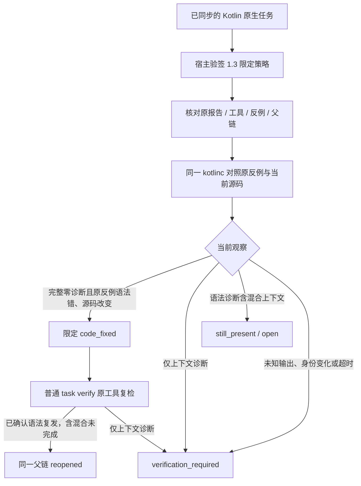

# Kotlin 限定语法任务关闭、上下文阻塞与复发

对应已有 OpenSpec `introduce-rust-codeguard-cli` 9.7、9.10、9.11、12.7、14.10/14.11。不创建第二份规格，不因局部 SDK 接线勾选完整父任务。



## 接口与身份

新 `KotlinTaskResolutionRequest` / `verify_kotlin_task_resolution` 复用原生扫描、租约、尝试、签名验证和追加父链。原生规则固定 `kotlin.syntax`，版本 `kotlinc-jvm 2.4.10`。策略1.3.0/脱敏证据0.4.0，收据/事件继续0.1.0。首次原生任务保留 null grammar；旧语言 schema 原件不改写。原反例坐标按 UTF-16 与 UTF-8 的实际映射验证，不能以普通 column 字段代替。

关闭仍要求原反例和当前源码的检查完整。混合上下文只允许保留已确认语法问题及重开，不能从没有语法诊断推出检查完成。问题存在和执行完整性分开；上下文诊断不会变为新的语法发现。

## RED → GREEN

- API缺失的编译失败：`/tmp/codeguard-kotlin-resolution-api-red.log`。
- 原生双坐标被旧通用列读取拒绝，合法修复停在verification_required：`/tmp/codeguard-kotlin-resolution-coordinate-red.log`。
- 已关闭任务混合语法复发未追加reopened：`/tmp/codeguard-kotlin-resolution-context-red.log`，预期5条生命周期记录而实际4条。修正后同一测试通过。
- 默认受控新服务5 passed / 0 failed / 1条件忽略；条件忽略另以真实编译器显式执行。覆盖关闭/幂等/复发/再次关闭、原样本反证、输出未完成、签名与工具身份、上下文-only及混合语法复发。

## 实际编译器

本机现有 kotlinc-jvm2.4.10 / JRE26.0.1实际运行：原样本 `fun f(x: ) = x`、修复 `fun f(x: Int) = x`、上下文样本 `fun f(x: Missing) = x`、混合样本 `fun f() { val x: Missing = }`。显式测试1 passed / 0 failed / 0 ignored，耗时66.05秒；这是整个多次对照链路时间，不是产品性能达标证据。没有安装或升级工具。

| 实际当前场景 | 语法数 | 上下文数 | 原生完整性 | 限定任务状态 | 处置 |
|---|---:|---:|---|---|---|
| 修复 | 0 | 0 | completed | resolved | code_fixed |
| 缺项目上下文 | 0 | 1 | incomplete | verification_required | native_incomplete |
| 语法复发且缺上下文 | 1 | 1 | incomplete | open | still_present / 已重开 |

三份完整实际输出保存在[修复](evidence/kotlin2410-resolution-2026-10-05-fixed.json)、[上下文](evidence/kotlin2410-resolution-2026-10-05-context.json)、[混合复发](evidence/kotlin2410-resolution-2026-10-05-mixed.json)。包含策略、收据、脱敏原生证据及追加事件；签名和信任根仍是测试夹具，不证明实际市场宿主已批准。4项实际 schema/身份与反例检查通过。

## 复现与持续验收

```bash
cargo test --locked --offline -p codeguard-cli --test kotlin_task_resolution_service
CODEGUARD_KOTLINC_BIN=/absolute/path/to/kotlinc cargo test --locked --offline \
  -p codeguard-cli --test kotlin_task_resolution_service \
  real_kotlin2410_resolution_context_and_recurrence -- --ignored --exact
```

CI 的 WASM阶段新增三个语言的 SDK服务目标；默认 suite 不涵盖所有 Erlang/WASM首次来源，不能以默认绿替代。本批受影响WASM、严格Clippy及远端CI终态完成后追加，旧提交成功不作为本批证明。

## 剩余边界

工具身份当前仅launcher，JAR/JDK、构建配置/依赖上下文、完整Kotlin类型/lint/注释、默认插件可信策略提供者、实际安装宿主自动闭环、跨平台、性能、全项目门禁及公开发行仍缺。SDK可关闭的是已限定的语法任务，收据仍delivery_decision=not_evaluated；本地历史不授予可信关闭或交付。32grammar资格保持原状态，未改插件锁或发布npm。

## 本批最终检查

- 受影响WASM八目标65 passed / 0 failed / 4条件忽略；真实Kotlin另1显式通过，忽略不算原生验收。
- 默认/WASM workspace/all-targets严格Clippy `-D warnings` 均退出0，fmt、分层、OpenSpec strict、12个新增本地链接及diff检查通过。
- 241 schema元定义有效，239历史原件字节不变；Kotlin4项实际输出协议/状态反例及Swift4项历史实际协议回归通过。
- 本批未重跑完整默认suite；旧1288通过不作为新源码全套结果，新提交CI单独核验。

实际修复收据（完整0.1协议实例）：

```json
{
  "authority": "host_context_verified",
  "delivery_decision": "not_evaluated",
  "event_ref": ".codeguard/findings/CG-B-0eba564680c4a5aedd4a406e7a49a62d/events/lifecycle-event-4863ffbc6b0a49699309dc211e8b8a8f0dcd6bd11a8fdeace38c5f158acf13f0.json",
  "evidence_ref": ".codeguard/state/resolution_evidence/fb7d93bc6939d866f2631ba05db046418d6eb25e4d1cdceb94e5fb8b2b3a26a2.json",
  "evidence_sha256": "fb7d93bc6939d866f2631ba05db046418d6eb25e4d1cdceb94e5fb8b2b3a26a2",
  "identity": {
    "checker_id": "syntax.native_confirmation",
    "scope": "App.kt",
    "task_id": "CG-B-0eba564680c4a5aedd4a406e7a49a62d",
    "workspace_id": "ws-2ff50295f3b571511914189a54e20221"
  },
  "outcome": "code_fixed",
  "policy_revision": "p1",
  "policy_sha256": "6748c0943917ccf6098c8f399c4382af913e7b9ea773e924deed64b36ec2d8a1",
  "report_type": "task_resolution_receipt",
  "schema_version": "0.1.0",
  "state": "resolved"
}
```

日志摘要：

- `/tmp/codeguard-kotlin-resolution-coordinate-red.log`：SHA-256 `42ba6a1a9909cb1cdb47072df509b48be51e795211d3a8f6a65ea60913029e15`。
- `/tmp/codeguard-kotlin-resolution-context-red.log`：SHA-256 `bed6608c7cfd9096da8e26b58c6440f063c46d5f06f78f06e5ae641b0cf395b7`。
- `/tmp/codeguard-kotlin-resolution-default.log`：SHA-256 `b9f080624edac7c6bc7956a35dd592542a9c6390eb65dad526c8f2bfd0c4a9d9`。
- `/tmp/codeguard-kotlin-resolution-real.log`：SHA-256 `6e33bdd087f2b5510d9e54d301f3c6339f0369f0ee9e1b0f882baa198fa2fc75`。
- `/tmp/codeguard-kotlin-resolution-wasm.log`：SHA-256 `821e0c96f431e3df96b41da203c299d3636a4d73aafffe9ee2e43668873e584f`。
- `/tmp/codeguard-kotlin-resolution-clippy-default.log`：SHA-256 `ae8274823f8be72b21364680701b2fcb82a085b19b88bf14f96ba21cd57ef365`。
- `/tmp/codeguard-kotlin-resolution-clippy-wasm.log`：SHA-256 `5524a4fa4d69cb29f3f220d208bde1b167512bb1dea2db874ca769d74b54c960`。
