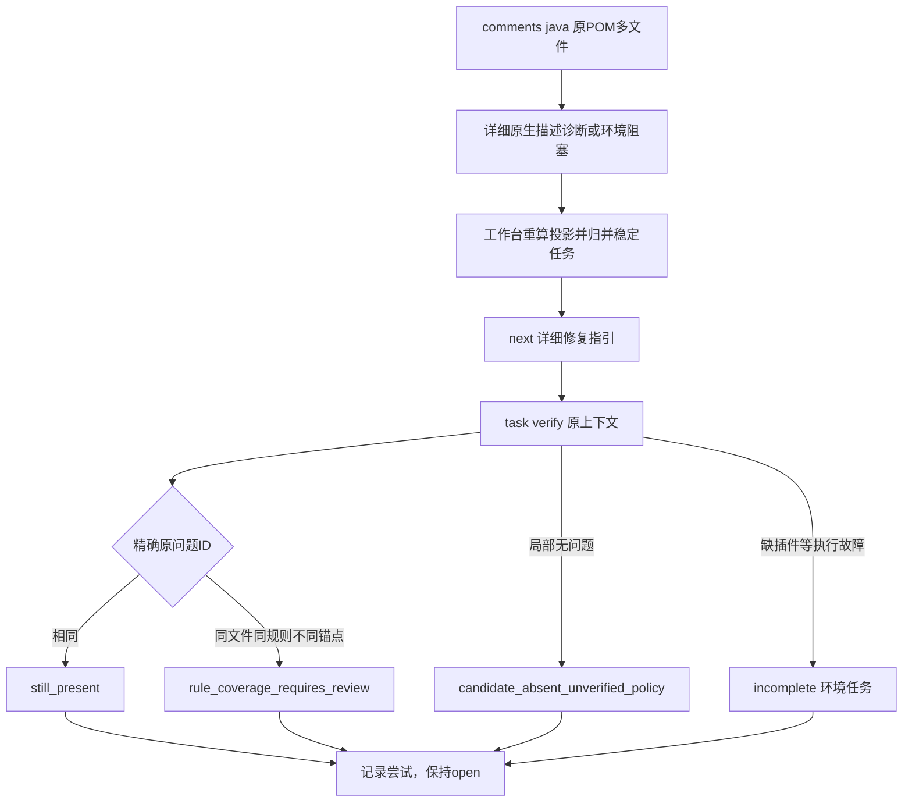

# Maven详细Javadoc描述、任务身份及离线缺插件验收

对应 `introduce-rust-codeguard-cli` 的15.3/15.6。这是原POM多文件公开检查和任务复检的源码增量；真实插件详细描述与生产资格保持待验收。

## 实现和RED证据

旧Maven解析器不认识空注释、缺主描述及裸参数/返回/异常说明，新规则测试先失败。新增独立 `parse_detailed_maven_javadoc_output` 使用源字节绑定的详细JDK解析器；历史解析入口保留原五规则。成功退出中的warning和警告导致的失败退出均保留诊断，源码行/caret、位置和汇总不匹配或未知格式保持未完成。

新锚点回归先RED：同文件、同规则但不同稳定问题ID曾被判still_present。修正为精确ID匹配，其他身份要求rule_coverage_requires_review。首次证据为复检包裹报告的新任务支持原工具复检，核验首次报告摘要、已消费收据和原任务范围/规则。局部零诊断仍不能关闭。



新增独立协议：原生/工作台/复检0.2、项目0.5、未绑定comments0.9/工作台comments0.10、内brief0.6/预览0.3、任务预览0.32、聚合0.69及异常0.20。新规则不藏入旧协议；首次导入拒绝外层、项目、原生及全层降级四种伪装。

## 三种证据分别计数

| 证据 | 当前结果 | 能证明什么 |
|---|---|---|
| 受控Maven输出来回归 | 五规则×两退出状态，检查/重复归并/复检/修复后观察通过 | CLI路由、解析、任务、协议；不是实际插件诊断 |
| 真实已有Maven3.9.16/JDK21空离线库 | 实际检查及环境任务复检共2次，均缺Javadoc3.12.0插件；0源码问题/1环境阻塞 | 缺插件不会误报源码违规；不证明插件正常扫描 |
| 已有完整缓存的真实插件条件测试 | 未执行，缓存未发现；4/3/1/0案例×failOnWarnings两配置待运行 | 完成后才可证明所选原插件路径，仍非独立精度或完整生产资格 |

受控输出见[fixtures](evidence/maven-javadoc-detailed-descriptions-fixtures-2026-10-06.json)，真实环境证据见[native](evidence/maven-javadoc-offline-missing-plugin-native-2026-10-06.json)。真实证据保存CodeGuard二进制SHA-256并结束复核；两次原生调用不扩大样本数。独立JDK/Gradle已有实际描述证据仍分开保留，不用它们代替Maven插件执行。

## 协议与回归

450份schema元定义通过，440份历史schema逐字节不变；100份受控输出来回归报告、1份未绑定反馈、3份真实环境反馈与1份构造兄弟故障反馈独立验证。7类伪造和5个旧消费者拒绝。构造兄弟故障仅验证已有观察保留，不称真实故障；见[异常](evidence/maven-javadoc-detailed-descriptions-aborted-2026-10-06.json)与[协议检查](evidence/maven-javadoc-detailed-descriptions-schema-2026-10-06.json)。首次检查脚本误用了不存在的历史schema文件名，修正为实际历史消费者后通过，未更改旧协议。

默认相关CLI九目标91通过/0失败/27条件忽略，另真实缺插件条件1通过及构造兄弟故障单元1通过。三目标适配器16通过/0失败/2条件忽略；首次误写Gradle测试目标名导致Cargo拒绝启动，改为实际gradle_javadoc目标后通过。WASM三目标49通过/0失败/13条件忽略（与默认重叠，不累计）；定向格式、分层、OpenSpec strict和默认/WASM全目标严格Clippy通过。聚合项目协议版本断言首次失败后随新版本更新，历史失败保留。受保护Erlang草稿未修改、执行或提交。

## 尚未完成

实际Maven插件详细描述正常/警告失败扫描及修复复检、Checkstyle描述模块、所有Java规则/源集/有效模型/模块/doclet、可信关闭/复发、逐语言独立误报评测和平台/宿主/发布验收继续开放。15.3/15.6与父任务不勾选，Rust OpenSpec66完成/288待完成，正式WASM资格0/32。此前CI的MSRV任务已成功；gate因固定插件源dec5f9d远端缺失失败，不跳过该审计且不宣称CI通过。本批不安装下载或发布npm/插件，不合并PR。

实际缺插件条件复现（环境变量指向已有Maven/JDK21）：

```bash
CARGO_PROFILE_TEST_DEBUG=0 cargo test --offline --locked -p codeguard-cli \
  --test maven_javadoc_detailed_descriptions \
  actual_maven_missing_offline_plugin_is_only_an_environment_task -- --ignored --exact
```

缓存完备后另运行 `actual_cached_maven_detailed_comments_preserve_original_tasks`，必须提供 `CODEGUARD_JAVADOC_MAVEN_REPO`；该测试尚未实测，不属于当前验收通过项。
