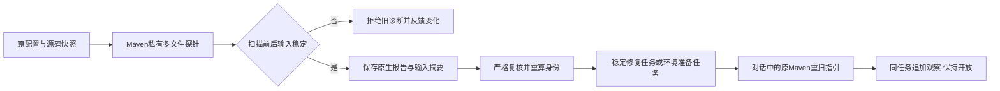

# Maven Javadoc 多文件工作台局部验收

延续 introduce-rust-codeguard-cli 的C15/6.x/9.x。已初始化工作区的 `comments java` 显式Maven上下文接通扫描前有界源码/POM快照、原生多文件观察、稳定任务、准备任务及下一步反馈。快照变化不保存诊断；导入重新核对输入摘要、构建根及原POM归属、工具观察身份、规则位置和重算指纹，Maven与JDK身份分别归并。



Maven包装0.5，观察0.1，内部修复简报0.4；旧JDK包装、schema及复检保留。报告原始Maven协议未变，不新增可信工具或完整项目权威。任务含问题证据、规则依据、范围、步骤、原Maven重扫参数、历史和关闭条件。`task_verify_status=not_integrated` 明确Maven原任务复检仍缺，不能借用JDK单文件复检或局部零诊断关闭。

TDD初始目标因工作台未集成而失败；新增接线后通过。边界回归最初把work sync顶层failed_reports误读为summary字段，修正测试字段。随后源码变化反例发现已消费Maven报告仍重演当前输入，额外导致两份历史报告失败；将新报告类型纳入原摘要收据早期确认后，旧历史保留，仅未消费的新过期报告拒绝。没有放宽当前输入校验。

最终七个回归目标88通过/0失败/22条件忽略。新增Maven目标5项覆盖：原有源码/POM/JDK元数据漂移、有效诊断接线、缺前置只建准备任务、重复扫描不重复建任务、指纹篡改和伪造coverage拒绝、源码变化拒绝新旧混用，事实保持open。实际原生进程为受控夹具，不是本轮真实Maven插件验收；条件原生测试未执行。未安装或下载制品。

```bash
cargo test --offline --locked -p codeguard-cli --test maven_javadoc_input_stability --test java_comments_cli --test check_all_java_p3c --test work_sync_contract --test work_sync_cross_category --test status_show_contract --test task_verify_contract
```

三份新schema元定义通过，实际诊断/准备两组包装、保存观察和修复简报均通过schema，伪造coverage拒绝。CLI全目标严格Clippy、分层、OpenSpec strict、diff检查通过。用户Erlang草稿摘要不变，未执行或纳入提交。当前验收不代替完整工作区、WASM、跨平台、真实宿主或发行证明。

未完成：Maven原任务复检、工具与规则可信政策、完整生效模型及复杂项目、可信关闭/复发、真实Maven新工作台验收和宿主接线；六项WASM差异仍开放。父任务不勾选。
