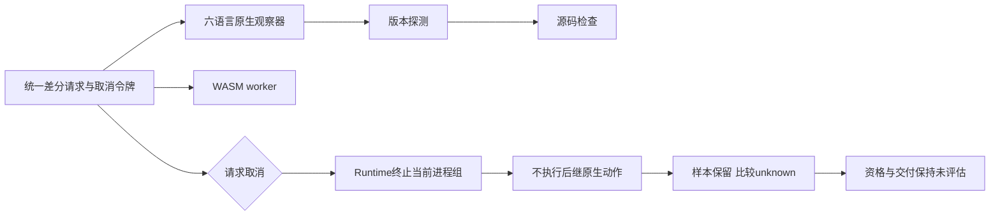

# 六语言原生差分的共同取消令牌

日期：2026-10-05；对应OpenSpec 3.1、12.11、14.17、14.19的局部实现与验收，父任务不勾选。

## 缺陷与修复

JavaScript新观察器已经使用请求令牌，但GrammarNativeChecker的Existing/Python分支没有传递它；Zig、Erlang、Swift、Kotlin、Ruff各自创建AtomicBool(false)。调用中的取消只能等原生动作自行结束。新增反例先RED：Zig版本进程实际启动后取消，仍等待2秒sleep结束，耗时2.602秒，超过1秒取消验收阈值。随后所有六语言的版本与源码阶段共12种情形均通过。

原生观察器新增共享实现与取消参数；既有产品调用签名保留为包装入口，仍响应runtime的全局SIGINT，开发差分则传递调用者AtomicBool。两个阶段用同一绝对截止时间，不重置预算或开启自动重试。Python测试限定目标助手保持测试用途，正式py312开发差分直接传递令牌。文件摘要读取仍是有界同步I/O，不声称它可被硬中断；SIGINT、平台和完整源集仍须各自验收。



## 实际反例与报告边界

单元反例在每种语言的版本/源码进程写入启动标记后才发出取消，要求观察incomplete、无伪造语法诊断且不等待2秒命令完成。统一差分的Python反例在版本完成、源码检查启动后取消，确认native_attempted=true、原生失败原因、native/wasm分类与两种比较均unknown、组合unknown_count=1、compared_count=0；样本仍为1、库存仍为32、资格仍为0、交付未评估。这个受控外壳是取消/编排测试，不冒充真实Ruff或语言语义验收。

真实Ruff18样本和Node18样本另外重跑，输出单独保留，避免覆盖27d4956及更早提交的报告字节。Python原始6TP/0FP/2FN/10TN、组合8TP/0FP/0FN/10TN；JavaScript原始与组合均5TP/0FP/2FN/11TN。两个JavaScript上下文漏检及原始Python两个漏检没有被本次取消修复消除。报告分别为[Python实际对照](evidence/python-native-structure-differential-cancellation-2026-10-05.json)、[JavaScript实际对照](evidence/javascript-native-grammar-differential-cancellation-2026-10-05.json)及[JavaScript同字节输入](evidence/javascript-native-grammar-input-cancellation-2026-10-05.json)。新增协议验证2项核对新报告schema、原始/组合分类与源码身份未改、分母和权威限制，以及历史报告逐字节保留。

## 验证命令

```bash
cargo test --locked -p codeguard-cli --features wasm-precheck --lib
CODEGUARD_RUFF_SYNTAX_BIN=/opt/anaconda3/bin/ruff \
  cargo test --locked -p codeguard-cli --features wasm-precheck \
  --test grammar_native_differential -- --include-ignored --test-threads=1
CODEGUARD_NODE_BIN=/Users/wandl/.nvm/versions/node/v24.18.0/bin/node \
  cargo test --locked -p codeguard-cli --features wasm-precheck \
  --test javascript_native_differential -- --include-ignored --test-threads=1
cargo test --locked -p codeguard-cli --features wasm-precheck \
  --test zig_lint_cli --test erlang_lint_cli --test swift_lint_cli \
  --test kotlin_lint_cli \
  --test task_resolution_service --test python_task_resolution_service
```

不重跑或借用完整358样本回放、全部语言原生工具验收、发布验收；前一提交的CI37273013548只用于对应提交，不能证明本轮变更通过。受保护Erlang草稿保持原摘要与未提交状态。

## 本轮结果

WASM CLI单元65通过、0失败、3条件忽略；包含六语言两阶段12种取消反例。原生差分8通过、0失败、0忽略，25.45秒；实际Node对照3通过、0失败、0忽略，40.30秒。六个产品lint/任务服务目标43通过、0失败、4条件忽略；忽略的真实工具项不计入验收。双配置全目标严格Clippy、定向rustfmt、OpenSpec strict、分层与diff检查通过；未重跑完整默认工作区或完整358语料。CI显式增加grammar_native_checker单元目标，待新提交的Linux结果独立验收。
