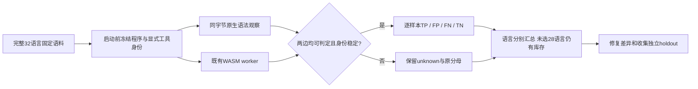

# 显式原生/WASM 开发差分验收

对应 OpenSpec S12.11、S14.17、S14.19，父任务保持未完成。此入口复用现有 grammar corpus 校验、原生适配器和 Rust 隔离 worker。语料仍是回归集，原生适配器亦被产品复用，不能声称独立 holdout 或完整语言验收。



开发期命令（先完成构建，再回放；不与其它 Cargo 构建并发）：

```bash
cargo build --locked --offline -p codeguard-cli --features wasm-precheck --bin codeguard --example evaluate_native_grammars
target/debug/examples/evaluate_native_grammars "$PWD/target/debug/codeguard" tests/fixtures/grammar_regression_v0_2.json 1200 zig=/opt/homebrew/bin/zig erlang=/opt/homebrew/bin/erl swift=/usr/bin/swiftc kotlin=/opt/homebrew/bin/kotlinc
```

四种显式已有原生工具对应78例。所有32语言留在库存，未选工具与没有差分适配器明确区别。参数、空选择、相对路径或不支持的语言在执行前拒绝；不执行隐式安装。预算/取消未准入样本仍保留unknown。原生执行中取消尚未保证，取消仅用于样本准入及WASM运行。工具更换后不再调用更换后的制品；批次末工具/入口变化撤回对应原生分类，程序变化撤回全部WASM分类。

报告固定 `status=incomplete`、`authority=development_native_differential_only`、`native_adapter_reused=true`、`independent_holdout=false`、`grammar_qualified_count=0`、`delivery_decision=not_evaluated`；正常输出退出3。仅上下文/运行失败及隐藏WASM恢复保留unknown，不从现有回归标签补出原生结果。Kotlin混合结果中的严格已定位语法诊断仍判为invalid，原生执行状态保持incomplete；不能因上下文阻塞丢掉已确认语法证据，也不能据此证明检查完成。比较仅限双方可判定样本，fixture与原生不一致另列。工具摘要目前覆盖入口制品，不证明Kotlin JAR/JDK或Swift完整工具链闭包。

受控测试验证真实worker正反例、全部库存保留、空/错参数拒绝、预算/取消不执行工具、身份变化后不执行替换制品及撤回分类。没有写工作台任务、白名单或关闭事件。

Erlang终止符10项漏检和VB.NET未缩进1项误报的grammar修复仍未完成。缺少Tree-sitter生成器授权及VB.NET原生编译器时，保持具体缺口，不将报告生成当作修复。

## 2026-10-05 实际回放

最终源码重新构建后执行上述命令，退出码3、stderr为空，原始输出按字节保存为[78例实际报告](evidence/native-grammar-differential-2026-10-05.json)。程序与四个工具入口的批次身份均稳定；全部32语言库存保留。逐样本原生和WASM阶段耗时相加为183.334022秒，不包含全部报告、散列与调度开销，也不是冷暖启动、内存或性能门槛验收。

| 语言 | 样例 | 双方可判定 | TP | FP | FN | TN | 原生未知 | WASM未知 |
|---|---:|---:|---:|---:|---:|---:|---:|---:|
| Zig0.16.0 | 12 | 12 | 4 | 0 | 0 | 8 | 0 | 0 |
| Erlang/OTP28 | 38 | 36 | 6 | 0 | 10 | 20 | 2 | 0 |
| Apple Swift6.4 | 14 | 13 | 4 | 0 | 0 | 9 | 0 | 1 |
| Kotlin/JVM2.4.10 | 14 | 12 | 4 | 0 | 0 | 8 | 0 | 2 |

5例未完成对照：Erlang的`conditional_forms`与`macro`需要原生项目/预处理上下文；Kotlin的`missing_parameter_type`、合法`object`以及Swift的`bad_param`在WASM侧不能可靠判断。合法Kotlin object不能被隐藏恢复误算成源码无效。`kotlin-missing_expression`原生同时包含严格定位语法诊断和上下文诊断，执行仍为incomplete，语法分类invalid，与WASM共同判为true_positive。

此处TP/FP/FN/TN比较原生语法判断与WASM判断。双方可判定的fixture标签未观察到与原生不一致；没有据此推广独立oracle、28种未选择语言或产品总体误报率。Erlang10项漏检保持缺陷，不把原生工具可发现它们当作grammar已经修复。

验证：受影响WASM `grammar_evaluation` 与 `grammar_native_differential` 两目标合计13通过、0失败、2个完整回放测试忽略；实际78例通过上述开发命令另行执行，不将退出3计成产品通过。实际报告协议及篡改负例2通过；261份schema元定义有效、260份历史schema保持原字节。默认和WASM workspace/all-targets严格Clippy、改动Rust文件rustfmt、OpenSpec strict、分层与1523处本地文档链接检查通过。本轮没有重跑完整workspace suite。前一提交ed1180a的[CI 37239895522](https://github.com/full-stack-plugins/codeguard/actions/runs/37239895522)已完成且两个job成功，仅证明该提交的CI范围，不能替代本轮或剩余父任务验收。
