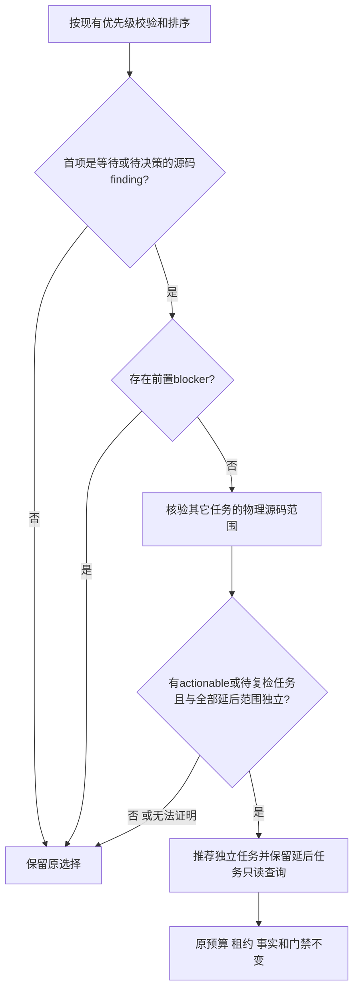

# 独立源码任务继续推进验收

对应OpenSpec introduce-rust-codeguard-cli / remediation-workflow 的 Repair briefs SHALL guide bounded progress without changing authority，涉及9.7、9.9、9.26；这些父任务仍未完成。

原缺陷：预算耗尽或有开放attempt的源码finding被赋予最高优先级，next反复返回该项的needs_decision/waiting，使另一份可独立修复的源码得不到指引。RED通过两个真实本地任务及两次no-change尝试复现。



当前只推进不同物理源码范围的finding。规范路径须处于工作区内、是普通文件；目录包含、路径别名及同dev/ino均不能算独立。每个范围只读取一次。已有attempt输入校验也拒绝硬链接，调度不得弱化该保护。存在任何前置blocker、失败报告或损坏事实时，原有保守分流保留；完整依赖图尚未实现，不声称所有跨模块任务均可独立运行。非Unix不启用这项物理身份选择。

延后任务仍保留在findings/tasks，状态与预算不变。next_actions仅提供codeguard task show的只读查询引用，human/JSON均显示；不执行这些查询，不生成修复授权，不签发门禁，不将等待或待决策任务关闭。现有报告字段和版本不变，历史schema保持原件。

真实Ruff0.16.8在app.py与other.py分别发现F401。对原优先任务连续两次记录no-change后，next推荐另一项；task show保留原no_progress_count=2及needs_decision，原事实和事件SHA均不变。lease正常释放，公开证据不保存可复用token。此验证不代表已安装宿主、可信关闭或独立精度holdout。

证据：[next-independent-work-2026-10-05.json](evidence/next-independent-work-2026-10-05.json)，SHA256 `2ec706fa6816696ed97bf59e967892bc96d86c542bfd8a109514747da95d776e`，基线15ea2e6上的未提交选择增量，记录实际程序与原生工具摘要。

实际完整next报告示例（局部只读查询，非交付通过）：

```json
{
  "authority": "local_unverified",
  "command_status": "complete",
  "delivery_decision": "not_evaluated",
  "disposition": "actionable",
  "exit_code": 0,
  "next_actions": [
    [
      "codeguard",
      "task",
      "show",
      "CG-51d2afe0f8e8b55fe53db2ca33214220",
      "."
    ]
  ],
  "operation": "next",
  "reason": "local_task_selected",
  "repair_brief": {
    "action_id": "repair-source",
    "authority": "local_unverified",
    "checker_id": "python.ruff",
    "closure_condition": "原生工具按相同受控策略完整复检并确认问题已解决；局部查询不能关闭任务",
    "constraints": [
      "仅修改目标源码",
      "不得忽略规则或将任务勾选当作复检"
    ],
    "disposition": "actionable",
    "evidence_ref": {
      "first_report_sha256": "0787f86ed37a049b5f8864d56481bde646c33bac2297b54b8c66448771890046",
      "first_run_id": "lint-86465-1791140315875962000"
    },
    "history": {
      "attempt_count": 0,
      "awaiting_verification": false,
      "budget": 2,
      "no_progress_count": 0,
      "open_attempt_id": null,
      "recent": []
    },
    "kind": "finding",
    "native_rule_id": "F401",
    "recheck_argv": [
      "codeguard",
      "lint",
      "python",
      "."
    ],
    "schema_version": "0.1.0",
    "scope": "other.py",
    "source_sha256": "c517577851c489e45abae2591256c40404a05c6d19cd4d5ae7fd22b0084cec6c",
    "step": "核对导入是否仍被使用；确认后仅修改目标文件导入",
    "task_id": "CG-9759c061d6dc3a6d2cad6e2ab9308a7f"
  },
  "report_type": "repair_brief_preview",
  "schema_version": "0.1.0"
}
```

验证：默认六目标62 passed、0 failed、12 ignored；WASM十目标97 passed、0 failed、13 ignored，含预算耗尽、开放attempt、同路径、硬链接拒绝、前置blocker及Hook回归。未执行的显式原生测试不计通过。当前完整工作区all-targets测试已退出0，230组、1288 passed、0 failed、113 ignored；没有重跑32 grammar语料、修改grammar资格或公共包/插件锁。

- `/tmp/codeguard-next-independent-red.log` SHA256 `4d37a089a9ffa1166236a5c5c8df2af9da40823c23dc0664a627787c11cd3dd3`。

- `/tmp/codeguard-next-independent-regression-final.log` SHA256 `93aca674d2e04960629f278a61238caea2bb3233480039e515883b19e6b4f0b8`。

- `/tmp/codeguard-next-independent-wasm.log` SHA256 `5da297e1326b82f9f659a3d341d5a41e8f12cee40efbc888c1ef93eb5d474746`。

最终实际采集显式使用60秒原生预算；一次后补10秒采集在调度前触及native deadline，仅保留部分诊断并生成环境完整性任务，未生成源码任务或伪造通过，不能将其作为本轮正例。Ruff探针多次复核21MB工具字节，当前debug CodeGuard为109MB；完整冷/暖启动性能和身份缓存仍需原S03/S14评测，不将调大采集预算当作性能修复。60秒采集复核findings及state内全部JSON摘要在next/task show前后相同，随后显式释放租约；仅公开摘要，不保存可复用token。查询引用的“.”指受检工作区根，应在该目录执行。

默认及WASM工作区all-targets Clippy -D warnings、fmt、OpenSpec strict、分层、237历史schema不变及790条本地文档链接检查通过。完整测试日志SHA256 `59b3c7a0e71f10c7e66744e71ff425516c0df69a59f32862b3d139f581e83f4f`。
