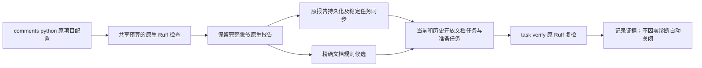

# Python 独立文档入口局部验收

对应现有 OpenSpec 7.2、15.3、15.6 的进展；57种语言的四核心要求和32份WASM的生产资格均不由此授予。

`codeguard comments python . --ruff-tool /absolute/path/to/ruff --format=json` 复用原项目 Ruff 扫描、生效设置审计、脱敏报告、稳定任务和原工具复检。项目范围是原扫描所观察的源集，不承诺全部依赖/目标覆盖或独立逐文件模式。没有项目配置时生成准备任务，不执行已选工具；未初始化的项目不创建 `.codeguard/`。不会安装工具、改变配置或用WASM替代文档规范检测。



新封装 `python_comments_feedback` 0.1 引用现有 `python_lint_feedback` 0.12 对话报告；保存的是原0.9扫描事实。其他开发规范诊断保留在 `native_report`，封装顶层 `next` 只选择 Ruff 文档任务和准备阻塞。原始子报告的通用简报不替代这个文档选择。已存在任务在同输入零诊断后仍保留；身份或输入失效时需按实际简报恢复检查，不能沿用旧位置修复。分类沿用已有D###观察，以及精确七项 DOC102/201/202/402/403/501/502；未知DOC编号不取得适配资格。

完整文档规则启用集合尚未进入公开规则覆盖契约，所以固定返回 `documentation_rule_coverage=unverified` 和 `detailed_contract_qualification=not_granted`。`local_scan_complete=true` 仅表示本轮原生局部扫描完成。没有文档诊断也不能证明文档规则已配置、说明详细且正确或任务已关闭。退出3代表整体资格未完成，取消返回130；非法参数返回2。

本机已有 Ruff0.16.8 的七个 DOC 样例分别通过独立入口扫描、重复稳定身份、仍存在/noqa/真实修复后的原工具复检，事实仍open。默认及WASM构建的观察分别保存在[默认证据](evidence/python-comments-native.json)和[WASM构建证据](evidence/python-comments-native-wasm.json)。DOC502遇到隐式异常保留调查要求，不指导自动删除正确的异常说明。合法首句、None、stub及版本特定非stub抽象方法边界保持原生行为；未选择DOC规则不注入preview，见[真实边界证据](evidence/python-comments-native-boundaries.json)。

运输测试覆盖DOC与F401并存分类、历史任务、缺配置、未初始化、未知DOC、参数拒绝、超时、根目录不可用和SIGINT。受控工具仅验证运输/编排，不用于证明Ruff规则准确性。新增入口最初两项测试因缺少入口而RED，接线后GREEN。真实边界测试首轮因测试环境变量名错误在启动前失败，纠正为已有CODEGUARD_RUFF_BIN后通过，不计为产品缺陷。

仍缺完整Google/NumPy及语言版本契约、文档内容与实现语义一致性、所有规则合法反例、独立精度、跨平台、生产宿主自动注入、可信关闭/复发及发布验收。父任务保持未完成。协议及最终回归数量见本批次提交说明与[协议证据](evidence/python-comments-schema.json)。

以下为真实DOC201报告的字段摘录，省略预算、原生报告、稳定身份和简报；完整协议示例以上述证据文件为准。局部完成与整体未取得资格同时存在：

```json
{
  "report_type": "python_comments_feedback",
  "command_status": "incomplete",
  "exit_code": 3,
  "local_scan_complete": true,
  "documentation_rule_coverage": "unverified",
  "detailed_contract_qualification": "not_granted",
  "coverage_proven": false,
  "delivery_decision": "not_evaluated",
  "documentation_findings": [
    {
      "rule_id": "DOC201",
      "path": "app.py",
      "rule_summary": "文档缺少实际返回值说明"
    }
  ]
}
```

最终本地回归：默认与WASM构建各79项通过、17项条件忽略；其中独立入口8项均执行，SIGINT返回130。真实七DOC规则及合法边界两项原生测试分别在两种构建中显式运行，每次1项通过。476份schema元定义有效，17份真实/根不可用报告有效，12项伪造资格或协议变体被拒，既有475份schema字节不变。参考[WASM构建边界证据](evidence/python-comments-native-boundaries-wasm.json)。回归首轮的验收产物输出使用相对路径在package工作目录写入失败，改为绝对输出路径后同组全部通过；不把测试配置失败计为规则精度证据。
