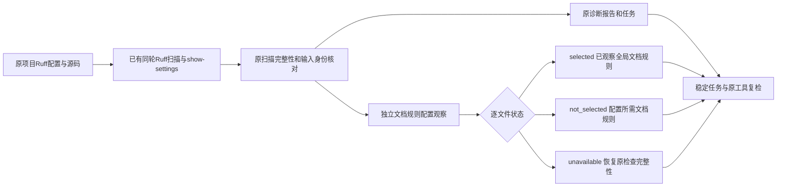

# Python 文档规则配置的同轮原生观察

对应现有OpenSpec 7.2、15.3、15.6。独立 `comments python` 升级为 `python_comments_feedback` 0.2，增加 `documentation_configuration`；历史0.1 schema、原0.12对话协议和工作台0.9扫描事实保持。旧消费者需要接受新封装版本；原工具task verify和任务身份不变。此项不授予详细注释、规则包或全语言生产资格。

配置观察直接来自扫描最终保留的原生设置对象；不再次发现或执行工具，不从配置文本、零诊断或DOC前缀推断。每个文件保留路径、config_ref和配置/源码/工具/设置SHA256。只有完成且保留有效设置的文件才计selected或not_selected；未完成的文件规则和身份均null，不能把旧设置当当前选择。多根/嵌套配置逐文件记录，不用根配置覆盖子配置。

`status=observed` 只说明这些文件的设置观察完整，可以同时有未选择文档规则的文件；它不等于合规。`partial`保留有效文件及未知文件，`unavailable`明确环境/输入阻塞，`no_python_sources`明确无被发现Python源码。selected/unselected/unavailable计数及逐文件列表构成当前局部观察。D###沿用原分类，DOC仅七项明确适配规则；未知DOC999/D1000不被纳入。per_file_ignores_present保留逐文件忽略的未解析边界，noqa由原扫描抑制审计保留。固定global_rule_selection_only/coverage_proven=false及原not_granted，不发完整规则覆盖证明。

human输出配置状态、计数、规则集合及操作建议，最多展开20个配置缺口，明确JSON含完整列表；原生finding继续独立反馈。规则全未选择时要求核对项目文档规范并明确配置，不自动启用preview或修改配置。缺工具/配置先恢复原工具环境，不能修改无关源码或把未知计为零问题。

TDD先复现旧0.1报告没有新字段；实现后验证无诊断但DOC201启用、仅F401启用、逐文件忽略、嵌套根规则缺口及原生规则/设置矛盾。运输调用次数与原lint入口逐项一致；旧设置序列化仍为四字段。早期运输断言错误假定一次version探测，实际原链为两次；改为对比真实原入口调用序列，不取消原身份核验。子根运输初始仍发未启用DOC诊断时准确partial，修正子根运输后可观察not_selected。运输用例不是原生语义资格。

真实已有Ruff0.16.8的七规则分别扫描、原工具复检、修复后的零诊断扫描；修复后仍selected，事实保持open。另有F401-only零诊断明确not_selected；合法样例及DOC502调查边界保留。证据为[默认七规则](evidence/python-documentation-configuration-native.json)、[默认边界](evidence/python-documentation-configuration-boundaries.json)、[WASM构建七规则](evidence/python-documentation-configuration-native-wasm.json)、[WASM构建边界](evidence/python-documentation-configuration-boundaries-wasm.json)。两种构建均运行原Ruff，WASM不是文档规范替代。

仍缺全部Python版本和Google/NumPy契约、文档语义准确性、逐文件忽略精确展开、完整项目源集、可信文档策略/关闭/复发、独立精度、五平台、宿主和发布验收。父任务与57×4义务保持开放，32份grammar资格0/32。

协议校验：477份schema元定义有效，50份默认/WASM真实与运输报告有效；逐文件身份与原生子报告对应，计数与列表一致。14项伪造资格、规则、身份或未知字段被拒，原476份schema字节不变。详见[协议证据](evidence/python-documentation-configuration-schema.json)。真实human入口另行验证DOC201零诊断仍显示selected，未初始化不建工作台。设置适配器8项通过；独立入口13项覆盖配置/规则/身份/嵌套/缺源/取消/超时，条件原生测试在两种构建各2项显式通过。
