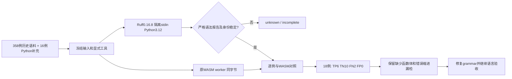

# Python 原生语法差分局部验收

对应 OpenSpec 12.11、14.17、14.19，父任务仍未完成。新增开发工具选择不修改 `TaskResolutionChecker` 的可信关闭范围；Rust 调用已安装 Ruff，不以 Python 脚本实现产品检查。



复现（已有 Ruff，无隐式安装）：

```bash
CODEGUARD_RUFF_SYNTAX_BIN=/opt/anaconda3/bin/ruff CARGO_PROFILE_TEST_DEBUG=0 \
  cargo test --locked --offline -p codeguard-cli --features wasm-precheck \
  --test grammar_native_differential \
  actual_python_syntax_corpus_keeps_non_syntax_lint_out_of_comparison \
  -- --ignored --exact --nocapture --test-threads=1
```

测试把 [358例历史语料](../fixtures/grammar_regression_v0_2.json) 和 [16例补充](../fixtures/python_syntax_regression.json) 原样合并，使用 Rust `serde_json::to_vec` 后冻结摘要；完整库存包含32种语言，但本次只执行18个Python样例。新测试保存[实际报告](evidence/python-native-grammar-differential-2026-10-05.json)，报告0.2、status=incomplete、资格0、独立holdout=false、交付not_evaluated。原四工具0.1报告和所有历史schema不修改。

固定调用为 `check --isolated --no-cache --ignore-noqa --select E9 --target-version py312 --output-format json --stdin-filename codeguard_input.py -`，受控runtime清空环境，工作目录为`/`。不加载项目配置，不启用修复，不执行被检代码；只有`invalid-syntax`、error严重性、预期stdin路径、有界行列和一致退出/JSON才形成语法诊断。公开报告不保留原始消息或路径。列标为`ruff_reported`，不擅自转换为编辑坐标；项目配置、注释、依赖和安全规则不是此入口的检查范围。

实际 Ruff0.16.8 对全部18例完成观察：10合法、8非法，与固定标签一致。WASM报告TP6、TN10、FN2、FP0，双方未知0。`unused_import`和`unresolved_name`保持语法合法；`noqa_cannot_hide`仍报告语法错误；类型别名、match、异常组、async和Unicode均保留独立样例。`empty_body`与`bad_indent`原生无效但WASM没有恢复节点，这两项保持漏检缺陷，不能断言成正确行为或用库存数代替验收。

本入口复用产品Ruff机器报告解析器和WASM运行时，语料是新增回归集，不是独立holdout。工具身份目前锁定入口制品；不证明所有语言/版本、性能、安装宿主或完整项目检查。Python任务确认与正式原生优先调度没有因这个开发入口自动完成。

验证：受影响WASM两个集成目标14通过、0失败、3忽略；真实Ruff18例的忽略测试另行显式执行1通过，耗时95.29秒。纯报告解析反例1通过，覆盖F401/E902、错路径、错位置、非error严重性及退出/JSON矛盾；实际Python及历史四工具协议辅助3通过。262份schema元定义有效、261份历史schema保持原字节。默认/WASM workspace/all-targets严格Clippy、改动Rust文件rustfmt、OpenSpec strict、分层及1535处本地文档链接检查通过。CI增加WASM解析反例目标，未把本机存在Ruff当作CI也已安装；本轮未重跑完整workspace suite、32语言完整原生对照或发布验收。
