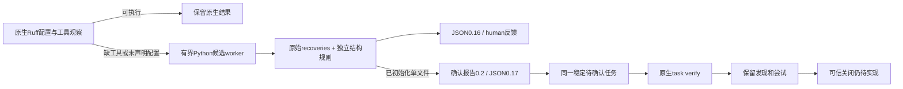

# Python结构初检进入lint与稳定任务

对应OpenSpec14.4、14.7、14.9、14.10、14.11、14.17、14.19；父任务均继续未完成。延续[显式探针](python-structure-probe.md)与[原始Python差分](python-native-grammar-differential.md)，不覆盖历史grammar FN2。

固定结构规则与坐标以独立 `structural_observations` 保存；包含原始零基字节坐标、basis、规则ID/版本/配置摘要、父节点、相对路径及源码摘要。原始 `observations` 数组保持ERROR/MISSING及原位置语义，不以结构规则替换。原始恢复和结构合计最多128记录，超额明确truncated。坏配置不启动兜底，原生诊断不被候选结果覆盖；缺工具/配置仍要求恢复原生条件。

存在结构观察时，未初始化反馈0.16、初始化反馈0.17；没有结构观察时仍使用历史0.14/0.15。单文件确认报告0.2新增封闭结构数组；旧0.1不修改。源码、固定grammar和规则配置摘要、坐标、语言、父节点以及字段形状在同步前复核；伪造摘要和越界位置拒绝导入，不生成源码finding。任务身份继续使用原工作区/检查器/源码范围指纹，不因结构规则观察增加第二张任务。任务文档说明两类证据、原生确认、报告摘要引用和关闭条件。

TDD：新链路测试首次因0.15而非所需0.17失败，接线后通过。重复扫描同一任务；源码改成合法pass仍为open；两份伪造结构报告均failed_reports，不新增blocker。JSON/human实际输出同时保留规则依据，封闭schema拒绝假allow、认证、旧版本、新数组为空及未知字段。Python辅助仅用于开发验收，不参与产品运行时。

本机实际Ruff0.16.8通过显式绝对路径执行task verify：缺函数体和错误缩进均保留原生发现，合法pass无原生发现；三轮任务仍open，因为可信策略和完整关闭契约尚未完成。不能把这一保守状态称为完整修复闭环。

验证：受影响Python兜底目标9通过/2忽略；实际Ruff新目标另显式1通过，三轮复检耗时13.88秒。实际公开lint/确认schema与human辅助1通过。其他验证见本轮收口记录。未重跑32语言全量原生差分、独立holdout、跨平台或真实宿主验收；聚合check及可信关闭仍缺，grammar资格仍0。

收口：原生lint CLI与work sync受影响回归37通过/7忽略，实际原生新目标单独执行；默认/WASM workspace/all-targets严格Clippy均通过。266份schema元定义有效、263份历史schema原字节不变；OpenSpec strict、差异空白检查及1565处本地Markdown文件链接检查通过，受保护Erlang草稿摘要未变化。远端0539af2 CI仍in_progress，不能声称本次源码CI已通过。
