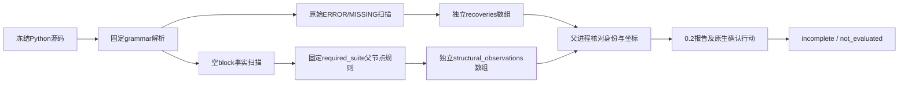

# Python 必需语句块的独立结构观察

对应 OpenSpec 14.4、14.7、14.17、14.19；父任务继续未完成。本增量将已有空块事实扫描接入 Rust 私有 worker 和显式 `grammar probe python`，尚未接入统一 lint、聚合检查、任务报告或原生确认关闭。

内置候选配置 `rulepacks/python/required_suite.json` 明确规则、版本、父节点范围及未认证状态。配置摘要仅标识这些配置字节，不能证明整个检查引擎身份或可信批准。结构观察记录 basis、rule_id、rule_version、rule_sha256、直接父节点与原始字节坐标；不能制造 ERROR/MISSING。父进程拒绝错误语言、规则、配置摘要、父节点、源码位置及超预算观察。私有协议1.0拒绝结构字段，1.1仅允许Python且非空结构数组；原始恢复与结构观察共用128记录上限，任何扫描截断保持未完成。

公开0.2协议只用于非空Python结构观察；其余原始探针保留0.1，历史schema不修改。`precheck.suspected_recoveries`仍只计原始恢复，`precheck_scope`明确这一范围；不能用这个原始计数忽略独立结构数组。新行动为 `confirm_candidate_structure_with_applicable_native_tool`。资格仍false、原生not_run、交付not_evaluated、退出3。

TDD记录：旧代码对缺函数体、未缩进分支、纯注释函数体的首个正例返回0.1，使新测试失败；接线后这三例保留原始recoveries空数组并产生独立结构观察。合法pass、ellipsis、docstring、有内容分支和仅注释模块五个反例均无结构观察，保持0.1。规则/语言/位置反例另独立验证。

验证：`python_structural_syntax` 2通过；受影响 `syntax_worker_candidate` 17通过；实际二进制公开报告schema辅助1通过，拒绝旧消费者、新报告伪造allow、认证、来源及未知字段。默认/WASM严格workspace/all-targets Clippy通过。Python辅助只用于开发验收，不进入产品运行时。

这不是Python grammar修复或语言认证：原始Python18例差分报告的FN2保留，尚未重跑独立原生对照。后续必须把结构来源接入lint/聚合报告与稳定任务，再由Ruff原生复检验证，不能勾选父任务或覆盖历史报告。
