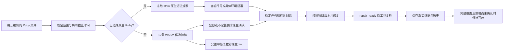

# Ruby 编辑与修复 Hook 验收

对应 `introduce-rust-codeguard-cli` 的 hook-protocol / binary-distribution Ruby 场景及 S09/S11/S14；局部接线不关闭全语言、真实宿主或发行父任务。

## 行为与失败先行

新增 Ruby Hook 目标初始 4 项全部失败：`--ruby-tool` 不被接受，PATH 原生 Ruby 编辑仍被列为未接线，Claude 形状反馈没有原生行号或任务。接线后四项通过；再增加缺工具初检及失败写入不运行检查器反例。

确认编辑只检查请求的 `.rb` 文件，共用 Hook 截止时间与取消状态，复用项目扫描器的输入/入口字节复核。显式绝对工具优先，其次调用方绝对 PATH；选定工具不可用或版本不支持不会改走 WASM，完全缺工具才保留候选。工作台复用 lint/check 的稳定确认任务；原生 Ruby 2.6.10p210 stdin `-c` 不执行源码/gems。

对话只提供当前原生行号、安全任务 ID 与原工具复检命令，明确列号不可用并要求核对项目版本。源码、工具消息及任意宿主输入不转成指令。`repair_ready` 消费原任务并保存真实复检报告引用，旧输入失效会撤回定位；零诊断保留 open，没有批准策略或完整覆盖证明。

## 协议与实际观察

新外层编辑反馈 0.19 / 内层 0.10，以及外层修复反馈 0.20 / 内层 0.6 使用封闭 schema；旧 schema 保持原件。实际 CLI 使用本机 `/usr/bin/ruby` 捕获 8 份报告：未初始化、已绑定、重复扫描、缺工具、显式无效入口、修复前与修复后。保存于 `tests/acceptance/evidence/ruby-hook-2026-10-05-*.json`。真实报告先揭示旧 Zig 原因枚举与 Go/Python 结构专用行动约束不适用于 Ruby；仅修正新协议，保留结构观察要求原生确认的约束。默认构建的实际反馈另揭示缺WASM的三字段未运行形状与聚合候选schema不同；新协议精确加入封闭的`wasm_feature_not_built`分支，不放宽为任意对象。schema 回归通过，拒绝未知版本、假交付许可、伪宿主阻断权威和猜测列号。

## 安装与限制

`tests/npm_pack_ruby_repair.test.mjs` 通过现有私有 packer 和独立 npm 离线缓存调用 Node launcher，覆盖编辑/重复编辑、项目检查、单文件 lint、next、Claude 形状、repair_ready、源码变化、零诊断及复发。受控 Ruby 工具只证明安装后的协议编排；不替代真实 Ruby 精度证据或实际已安装宿主验收。本机实际安装测试1通过/0失败/0跳过，约31.14秒；导出的10份输出中9份结构化报告按对应schema通过，Claude形状摘要另验1200字符上限、真实任务ID及拒绝源码/工具消息回显。固定观察见`tests/acceptance/evidence/ruby-npm-repair-2026-10-05.json`。

完整 RuboCop、Ruby3 版本适用性、注释/依赖/CVE/安全、可信任务关闭、真实 Claude/Codex/Gemini 自动触发及跨平台发行仍开放。公开 npm 0.1.4 与插件锁不因本批源码接线自动更新。远端 CI 按提交另行核验。

## 限定执行路径

WASM和原生观察都不能替代RuboCop、依赖/CVE或完整项目检查；选定工具失败不进入候选分支。

## 本批终态验证

- 默认全workspace/all-targets最终255个结果目标：1404通过、0失败、125忽略，日志`/private/tmp/codeguard-ruby-hook-workspace-default-final.log`。早先运行在新增失败写入夹具因遗漏必需--timeout处停止（942通过、1失败），修正夹具后完整重跑；不把该失败解释为产品跳过写入检查。
- WASM最终受影响9目标：85通过、0失败、4忽略，日志`/private/tmp/codeguard-ruby-hook-wasm-final.log`。未执行全WASM工作区，不将用户未提交Erlang差分草稿作为验收oracle。
- 默认/WASM全workspace/all-targets严格Clippy均成功；fmt、分层、OpenSpec strict、diff检查通过。
- 私有npm实际安装链路1通过、0失败、0跳过；8份Hook实际报告及9份结构化安装报告通过schema，2项协议回归含未知版本、假批准/allow/宿主权威、假列号和伪造候选completed反例。
- 前一提交aaa3879的Linux CI [37324440688](https://github.com/full-stack-plugins/codeguard/actions/runs/37324440688)已全部成功；此前Go变化测试失败本次未复现，根因仍未确认，不能称已修复。本批Hook与npm新增用例须按本批提交独立等待远端验收。

用户Erlang草稿SHA-256保持`2e3a296072e6a3aa34b561799c18c7d8b621d00f8786301d2612cee8cdab85b6`，不提交或更改它。父任务继续开放。
