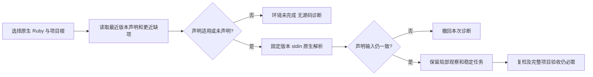

# Ruby 项目版本约束验收

对应既有 `introduce-rust-codeguard-cli` 的 native-tool-adapters Ruby 场景及 5.4、8.*、9.9、14.19；本批不关闭全语言、项目版本完整探测或发行父任务。

## 行为与反例

此前固定 Ruby 2.6.10p210 能对明确声明 Ruby 3.4 的源码产生诊断。项目声明不匹配、别名/歧义、链接声明与解析期间声明变化三类初始反例真实 RED；另一个初始失败是夹具错误地要求类别检查的 delivery_decision 为 incomplete，已改为验证不授予 allow，不将该夹具错误计为产品缺陷。

新增 `ruby_project_version` 统一约束单文件 lint、项目扫描、编辑 Hook 和原工具复检。最近声明为准，检查祖先到调用项目根的范围，64 层/4096 字节；只支持精确 2.6.10、2.6.10p210 和 ruby- 前缀。声明不适用/歧义/不可读取分别返回环境原因，不启动原生版本探测或源码解析。观察前后保留声明原始字节和更近缺项，变化撤回诊断。无声明仍未批准，不推断 Gemfile、JRuby/RVM 或执行项目代码。

嵌套 Gemfile 隐藏外层工作台 pin 的独立反例先 RED（误产生 ruby_native_syntax_diagnostics），后修正根选择优先级为最近工作台、最近 Git 根、最近 Gemfile。模块自身的最近版本声明仍覆盖祖先声明，兄弟模块失败不吞掉已取得诊断。保存位置遇到当前声明不适用时撤回；不宣称保存的报告具有完整配置身份签名。

## 本地验证

- 新目标 9 项涵盖不匹配、匹配、别名/链接、运行期变化、next/verify、lint/Hook、模块优先级、新增缺项及嵌套 Gemfile。
- 默认受影响 7 目标：63 通过、0 失败、4 忽略，日志 `/private/tmp/codeguard-ruby-version-default-v2.log`。
- WASM 受影响 8 目标：90 通过、0 失败、5 忽略，日志 `/private/tmp/codeguard-ruby-version-wasm-v2.log`。未运行用户 Erlang 草稿的 WASM 差分。
- 默认和 WASM 全工作区/all-targets 严格 Clippy 均通过；初轮 type_complexity 失败已用有语义的 VersionInputs 别名修正，未抑制 lint。
- 实际 `/usr/bin/ruby` 下分别声明 3.4.0 和 2.6.10，捕获环境阻塞与原生行号诊断，两份原始反馈保存于 `evidence/ruby-project-version-2026-10-05-{mismatch,matching}.json`，通过 check-feedback0.51 封闭 schema。不启动的断言由受控工具标记证明，真实 Ruby 报告本身不用于证明未启动。
- Ruby Hook/离线安装及版本报告协议回归 3 项通过；OpenSpec strict 和分层检查通过。系统 Python 缺 jsonschema，使用已有 Python3.13 验证环境，未安装依赖。

完整项目版本约束、完整 Ruby lint、可信任务关闭、精度独立 holdout、真实宿主及发行仍开放；没有修改历史 schema 或 grammar 资产。用户 Erlang 草稿 SHA256 仍为 `2e3a296072e6a3aa34b561799c18c7d8b621d00f8786301d2612cee8cdab85b6`，不纳入本批提交。

最终默认全工作区/all-targets 256 个结果目标：1413 通过、0 失败、125 忽略，日志 `/private/tmp/codeguard-ruby-version-workspace-v2.log`。这是本批源码的默认构建验收；WASM 仅执行上述受影响目标，远端 CI 仍须按本次提交独立核验。
