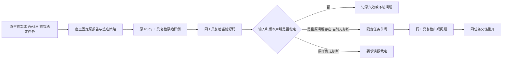

# Ruby 原工具任务关闭与复发验收

对应 OpenSpec：`introduce-rust-codeguard-cli` / remediation-workflow 的 Ruby 原工具限定修复要求；关联 S09、S14.11。此项是源码 SDK 与局部修复链路验收，不代替 Ruby 完整 lint/comments/dependencies/security/build、真实宿主策略来源或发行资格。

## 执行路径

`verify_ruby_task_resolution(&RubyTaskResolutionRequest)` 延续已有宿主签名策略要求。策略 1.9.0 / 证据 0.10.0 绑定原任务、报告、源码、Ruby 制品和适配器。原生首次来自 0.9.0 确认报告且 grammar=null；WASM 首次来自 0.1.0/0.7.0 候选报告且保留原 grammar。原样本与当前样本共用 deadline；版本声明及其缺项在请求前后复核。无列号的原生诊断不制造 column。原生零诊断的反例要求误报裁定；未修改源码、坏报告或失效输入不能完成关闭。

## 实际验证

- 新 SDK 入口缺失时，新增验收目标编译失败；实现后受控闭环通过。
- 11 个共享服务/Ruby 目标：81 passed / 0 failed / 9 ignored。原生/WASM 起点、原工具变更、签名与上下文拒绝、父链恢复及其它语言协议保留回归。
- 当前 Ruby SDK 目标：7 passed / 0 failed / 1 ignored；借用租约及已完成尝试分别验证两种来源，不释放宿主持有租约。
- 默认构建的 Ruby SDK/公开检查/项目/Hook 五个目标：35 passed / 0 failed / 2 ignored。Ruby 原生首次关闭不依赖 WASM feature。
- 显式选用本机 `/usr/bin/ruby`，实际版本 `ruby 2.6.10p210`；真实测试 1 passed / 0 failed / 0 ignored，分别验证原生与 WASM 首次的修复、幂等及复发。4 份结果见 [真实工具证据](evidence/ruby-task-resolution-real-2026-10-06.json)。签名密钥、时钟、政策来源仍是独立测试夹具，不证明默认插件可信关闭。
- [受控证据](evidence/ruby-task-resolution-controlled-2026-10-06.json) 保留原生反证和版本声明变化；均未关闭。无效输出另由实际受控测试拒绝。
- 新策略、证据和收据的 JSON Schema 验收：3 tests / 0 failure；覆盖异语言规则、伪造列号、错误版本、未知字段与虚假 code_fixed。
- 默认和 WASM 两种 CLI 全目标严格 Clippy 通过；OpenSpec strict、crate layering、所改文件格式与 diff 检查通过。CI 已加入 Ruby SDK 的 WASM 回归目标，远端结果须独立观察。

## 完成范围

没有改动普通 CLI 的关闭权限；没有发行 npm 新版本；没有执行或修改未提交的 Erlang 原生差分草稿。当前首次报告只提供已有版本适用性观察，不证明完整项目环境与独立宿主的批准权威。运行时环境、真实宿主接入、跨平台原生工具和完整 Ruby 规则验收仍需完成；父任务保持未完成。
