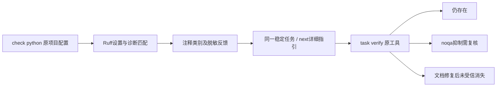

# Ruff DOC 详细文档契约验收

对应同一 OpenSpec `introduce-rust-codeguard-cli` 的 7.2、15.3、15.6。Rust 调用既有 Ruff，保留原生规则、配置和位置；不重写 Python 文档语义。本文是固定版本的局部原生验收，不是完整 Python 文档或逐语言生产资格。

## 原生范围和修复边界

本机已有 Ruff 0.16.8，制品摘要在实际反馈的 `tool_sha256` 中。`ruff rule --all --output-format json` 确认以下七项均为 preview；项目原配置明确启用 `preview=true`、选定规则、Google 约定和 `ignore-one-line-docstrings=false`，CodeGuard 不注入预览参数。

| 原规则 | 原生含义 | 指引与限制 |
|---|---|---|
| DOC102 | 文档出现签名外参数 | 核对实际签名后修正文档，不改变参数签名逃逸 |
| DOC201 | 缺返回说明 | 补齐实际 Returns 契约，核查原生豁免 |
| DOC202 | 多余返回说明 | 核对真实 API 返回行为，不改变代码迎合文档 |
| DOC402 | 缺生成值说明 | 补齐实际 Yields 契约 |
| DOC403 | 多余生成值说明 | 修正说明，不添加虚假 yield |
| DOC501 | 缺直接 raise 的异常说明 | 说明实际异常类型及触发条件，隐式行为另查 |
| DOC502 | 文档异常没有直接 raise | 仅给调查指引，不自动删除真实隐式异常说明 |

原生依据：[Ruff 0.16.8 源码](https://github.com/astral-sh/ruff/blob/0.16.8/crates/ruff_linter/src/rules/pydoclint/rules/check_docstring.rs)、[DOC201](https://docs.astral.sh/ruff/rules/docstring-missing-returns/)、[DOC501](https://docs.astral.sh/ruff/rules/docstring-missing-exception/)、[DOC502](https://docs.astral.sh/ruff/rules/docstring-extraneous-exception/)。版本固定源码和本机实际观察优先于在线最新文案。DOC502 原生只检查直接 raise，完整调用链异常语义并未验证。

## 公开链路



DOC102 的公开实际测试先 RED：原生发现已进入 lint，comments 却显示 not_integrated，指引仍为通用调查。接通后七项原规则均进入 comments、具体说明、稳定任务与 next。原报告与本轮有效设置不一致时保持未完成，七项伪造报告反例拒绝可执行结论；DOC999/DOC101 等未知代码不凭前缀获得适配资格。原 D### 分类函数未扩张，七项新规则仍无受批准 CodeGuard rulepack 映射。

## 实际证据和兼容性

[七规则实际报告](evidence/ruff-documentation-native-2026-10-06.json)逐项覆盖首次检查、重复检查同一任务、next、原任务存在、noqa 抑制需复核、修正文档后未受信消失；事实均 open。测试期间核对同一 CLI 二进制摘要，原工具身份、配置、源码摘要由反馈保留。没有模拟 Ruff 或把受控运输夹具当原生精度。

WASM构建的同一路径另存[七规则](evidence/ruff-documentation-native-wasm-2026-10-06.json)和[边界](evidence/ruff-documentation-boundaries-wasm-2026-10-06.json)，与默认重叠，不累计成独立标注语料。

[合法及约定边界](evidence/ruff-documentation-boundaries-2026-10-06.json)包括 Google Return/Yield 首句、None 返回/生成、stub、抽象 stub 六项原生零诊断；另保存非 stub 抽象方法仍被本机原生报 DOC201 的边界、真实除零隐式异常被 DOC502 报告但只给调查指引，以及未选择 DOC 时不产生额外规则。初版测试错误期待非 stub 抽象方法自动豁免，实际失败保留并改为明确记录该版本行为；未修改原检查器或改代码让它假通过。

原协议本来允许原生规则 ID、脱敏摘要及指引字符串，本次无新增字段或批准映射；check 0.45、Python反馈0.12、next0.1、task verify0.9 的实际输出由原 schema 校验。默认/WASM两种构建共148份实际报告及三种伪造反例经原schema核验，全部458份历史schema保持原字节；协议证据见 [报告校验](evidence/ruff-documentation-schema-2026-10-06.json)。JSON合法性不证明文档语义正确或生产资格。

## 验证及剩余任务

默认受影响八目标87通过/0失败/33工具条件忽略，适配器两目标17通过；WASM四目标44通过/0失败/15忽略，与默认重叠不累计。WASM初轮墙钟预算断言失败；保留原100ms预算及2秒断言，串行复跑通过，没有放宽要求。新真实工具条件测试默认/WASM各显式2通过，不包含在上述普通回归通过数内；两种构建重叠不当独立精度样本。默认/WASM全工作区全目标严格Clippy、定向格式、分层、OpenSpec strict、架构文件名及diff检查通过。

真实完整参数规范、NumPy/reST风格、async/重载/继承与每项配置组合、用途和说明内容准确性、独立标注误报/漏报、正式规则策略批准、可信关闭/复发重开、全平台和宿主仍未完成。父任务不勾选，Rust任务66完成/288待完成，WASM正式资格仍0/32。

既有 b352f06 的 CI 37478034597：MSRV成功，gate在固定插件审计源检出阶段失败，后续质量检查跳过；不将本地结果称为远端全通过，不绕过审计源门禁。

重跑真实工具测试（不自动安装）：

```bash
CODEGUARD_RUFF_BIN=/absolute/path/to/existing/ruff \
CARGO_PROFILE_TEST_DEBUG=0 cargo test --offline --locked -p codeguard-cli \
  --test ruff_documentation_contract -- --ignored
```

现有项目命令示例（不是完整文档或交付通过承诺）：

```bash
codeguard check python . --ruff-tool /absolute/path/to/existing/ruff --format=json
codeguard next . --format=json
codeguard task verify CG-original-id . --ruff-tool /absolute/path/to/existing/ruff --format=json
```
