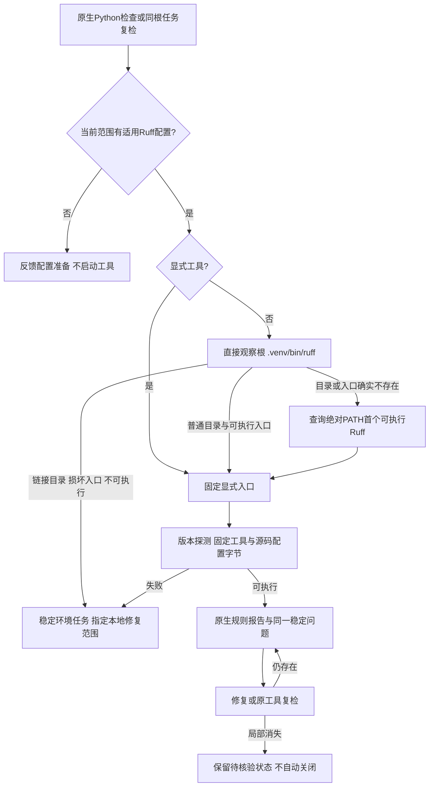

# 受检根本地 Ruff 发现与环境修复验收

日期：2026-10-04；规格事实源仍为 `introduce-rust-codeguard-cli`，关联 7.1、9.3、14.5、14.6、14.10。原有Ruff已经支持PATH，本次没有重复实现全局发现；修复的是已配置根内`.venv/bin/ruff`不在PATH时未被定位，以及损坏本地环境被全局工具掩盖。

## 选择与修复路径

只针对明确受检根的固定目录进行元数据观察，不读取/执行虚拟环境激活脚本，也不安装工具。普通父目录中的最终可执行文件链接可解析并固定目标；目录链接和损坏本地入口不能被全局Ruff掩盖。显式参数优先，所选版本/执行失败不换工具。无配置或指定源码无适用配置时不启动。

Ruff官方区分项目及全局安装，并提供原生可执行入口（[安装说明](https://docs.astral.sh/ruff/installation/)）；原配置文件及逐文件设置以原生语义为准（[配置说明](https://docs.astral.sh/ruff/configuration/)）。本地入口优先级由Codeguard选择，不把它误称为Ruff原生配置发现规则。

## TDD与实际工具

- 新九项受控入口测试先3 passed / 6 failed；修复后9 passed。证明原问题确实存在，显式坏工具、原PATH发现、无配置不启动三个旧边界保留。
- 新环境任务测试再单独RED：原简报和文档只给通用检查提示，未指明`.venv/bin/ruff`。补充限定指引后，同一阻塞任务跨重复扫描保留；复检still_blocked，不使用全局工具绕过。
- 最终专用目标15项显式运行全部通过，包含真实已有Ruff 0.16.8。原生测试仅将现有二进制复制到测试临时根，核对实际原生规则及配置；未执行安装命令，临时目录自动删除。
- 真实F401经重复扫描ID不变、新增finding0；原工具复检still_present，修复为pass后candidate_absent_unverified_policy，问题再次出现回到still_present。本地任务从未被宣布正式关闭，不把这个开放状态误称为已验收重开闭环。
- 控制测试还验证显式好工具可覆盖损坏本地环境、普通父目录中的最终文件链接、bin目录链接与损坏链接拒绝；确认写入Hook只检查app.py、不检查untouched.py。Hook命令重放不等于实际宿主对话验收。

主要实现：[工具选择](../../crates/codeguard-cli/src/ruff_tool_selection.rs)、[原生准备接线](../../crates/codeguard-cli/src/python_lint_command.rs)、[下一步](../../crates/codeguard-cli/src/next_command.rs)、[任务投影](../../crates/codeguard-cli/src/work_sync.rs)。测试：[本地Ruff](../../crates/codeguard-cli/tests/ruff_local_discovery.rs)。

## 剩余范围

逐模块不同虚拟环境、其它环境管理器、完整配置/工具依赖闭包、可信规则批准、正式关闭与复发重开、真实智能体宿主、多平台及独立精度仍缺。现有协议与历史schema不变，grammar资产、资格、插件锁和公开npm不改；预先存在Erlang RED草稿保留。完整OpenSpec目标和父任务继续开放。

## 实际报告与最终验证

[同一WASM二进制的原始报告](evidence/ruff-local-discovery-2026-10-04.json) 归档空PATH下真实本地工具的lint/check、重复扫描、单文件Hook、still_present/修复待核验/再次出现、任务详情与human输出；另一组为不可执行的原生本地副本、同一环境任务及still_blocked复检。现有工具与临时副本SHA-256相同，捕获开始和结束二进制摘要一致。真实宿主和产品精度仍未评估。

- 默认全工作区/all-targets：219组，1234 passed / 0 failed / 113 ignored，进程退出0。
- 受影响WASM CLI library+九集成目标：10组，149 passed / 0 failed / 30 ignored，退出0；专用15项显式目标15 passed / 0 failed / 0 ignored，包括14受控和1真实原生用例。各组有重叠，不相加，ignored不作为原生验收。
- 默认及WASM全工作区/all-targets Clippy `-D warnings`、fmt、分层、OpenSpec strict与双语架构命名通过。
- 201 schema元定义、12实际完整报告通过；36个伪造权威/交付/未知版本变体被拒，历史schema原件未改。修改文档链接通过，最终数量见验证日志。
- 初次WASM命令误写不存在的next_contract，未执行任何测试，不计通过；纠正为实际next_command_contract后执行上述完整目标。保留失败日志，没有改变验收断言。
- 不运行已知Erlang RED的完整WASM suite、不重复358例语料；不据本批测试认定grammar、独立精度、多平台、真实宿主或发布完成。

RED、命令目标更正及最终日志留存：

| 日志 | SHA-256 |
|---|---|

| `/tmp/codeguard-ruff-local-red.log` | `c066a13171831ec129b536c9b1d4e95d0dfa110a0b4c08fd13d4b2485442ad60` |
| `/tmp/codeguard-ruff-local-green.log` | `bbb744df07ec2859c434af1c961addd9bfd2879bfcc4cff6bbea705a60017fc9` |
| `/tmp/codeguard-ruff-local-task-red.log` | `76ff24102421331831b3d8e72a06b52cb7d8a34f8b154afcf246b2f4a74783f6` |
| `/tmp/codeguard-ruff-local-targets.log` | `fd1a94dff111dfbe0d09bd89bfc11b429932624bc3ce648cb233ebe8bc85e0f4` |
| `/tmp/codeguard-ruff-local-real.log` | `9f64a724a7282b41e64f96c7ab30f7d197ddc7b5948bc71c08b0187c39f733fa` |
| `/tmp/codeguard-ruff-local-workspace.log` | `4e9108d7c8641fa859d0b77e50ccb43aa55b74f6116c35779fe3f3d6c9bb388f` |
| `/tmp/codeguard-ruff-local-default-clippy.log` | `d4a6bb0d4bb5563999c23680e64687a5ac885fc08fcc7dd7724244d664161bcb` |
| `/tmp/codeguard-ruff-local-feature-tests.log` | `98166055bc0ea164724b9c7224b81bccc38e636b3c6654bb21017f5a1378e129` |
| `/tmp/codeguard-ruff-local-feature-tests-final.log` | `d5b499591b061d9b1281827830498682f7b9c25c24ee422344af455f04220810` |
| `/tmp/codeguard-ruff-local-feature-clippy.log` | `23aafd103d5ab099dd655001861a8ff5d1c7f1b1fe132fcbf2c46b9bb08099cf` |
| `/tmp/codeguard-ruff-local-capture.log` | `ddcdf33bbe83bc80edbddd4b5582bd9c2fa0dc04f387e4b55ad52279765ab081` |
| `/tmp/codeguard-ruff-local-validation.log` | `1ec0fd51aab8bca52e583e2d83342db247f12bcefeadede287d81d09ea5c77eb` |
| `/tmp/codeguard-ruff-local-validation-final.log` | `58f62532cd316e7efdb9f00aaffe8a02d371fabdc78e93fb1b20a5fff87baf5b` |
